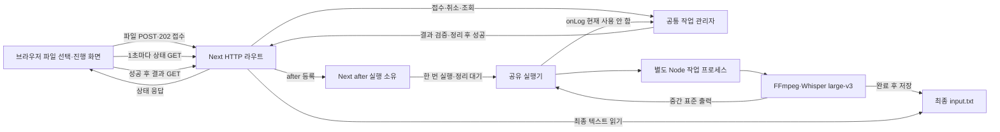
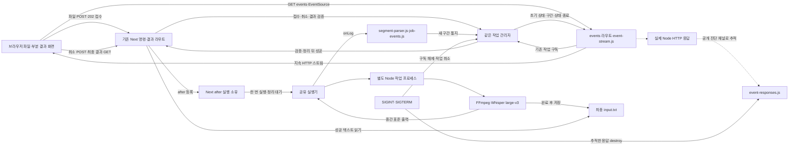
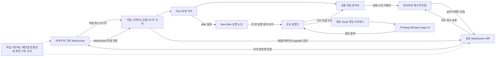
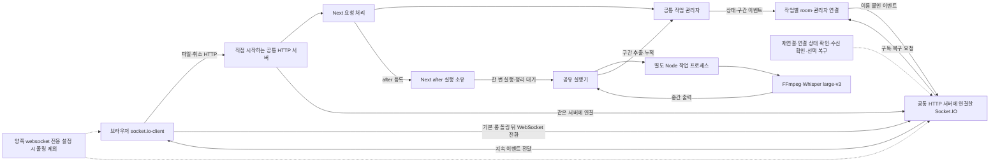

# 명령줄과 웹을 분리하고 Next 서버를 구동한다 - 임시 이슈

이 문서는 이번 이슈의 범위, 결정 상태, 구현 순서와 완료 조건을 관리한다. 구현 중에는 이 문서를 갱신한다. [전사 아키텍처 인수인계](전사-아키텍처-인수인계.md)에 SSE를 포함한 실제 구조·운영·검증과 미확인 범위를 기록하고 실행 절차를 대조했다. 운영자가 최종 내용을 확인하면 이 임시 파일을 삭제한다.

기준일은 2026년 10월 3일이다. 현재 브랜치는 `feat/cli-web-separation`, 1단계 구현 커밋은 `069bf51`, 계획 문서 커밋은 `b273433`이다. 현재 상태는 **1~4단계 구현·검증·커밋 완료, 승인된 애니메이션 운영 반영 완료, 5단계 인수인계 작성·절차 대조 완료, 운영자 최종 확인·임시 문서 삭제 대기**이다. 운영자가 같은 날 대화에서 1단계 커밋과 2단계 진행을 요청했고, 이후 「그럼 이제 3단계 진행해줘」라고 지시했다. 「그럼 이제 명세대로 구현을 진행해줘」 승인으로 4단계를 구현했고, 시안 확장과 파일별 무작위 표시를 승인한 뒤 「그럼 이제 운영에 반영하는 4단계 나머지 작업을 진행해」라고 지시해 새 운영 빌드를 반영했다. 이후 「그럼 기능 단위로 커밋을 컨벤션에 맞춰서 진행하고 다음 남은 작업이 있다면 진행하자. 문서화 해야지」라는 지시로 구현을 다섯 기능 커밋에 기록하고 5단계 문서 작업을 진행했다. 이 지시를 아직 작성 중이던 최종 인수인계 내용의 확인으로 기록하지 않는다.

이 문서에서 1단계의 설명은 `069bf51` 시점의 구현을, 2~4단계의 설명은 각 단계 기록 시점과 현재 작업 트리의 구현을 가리킨다. 단계별 검사 결과는 2026년 10월 3일 개발 중 실행한 기록이다. 2단계 상세 문서를 보강한 턴에는 검사를 반복하지 않았다. 3단계에서는 Next 의존성 추가 후 전체 린트·43개 회귀 검사·운영 빌드와 개발·운영 HTTP 응답을 확인했다. 대화 기록을 읽을 수 없는 다음 세션은 아래 현황과 해당 단계의 상세 기록을 먼저 읽는다.

| 단계 | 상태 | 산출물 · 커밋 |
|---|---|---|
| 1단계 | 구현·검증·커밋 완료 | CLI·공유 패키지와 pnpm 작업 공간 분리. 구현 `069bf51`, 임시 계획 문서 `b273433`. |
| 2단계 | 구현·검증·커밋 완료 | `2fa022e`에 공유 실행기·작업 프로세스·잠금·취소·정리·검사·기능 문서를 기록했다. |
| 3단계 | 구현·검증·커밋 완료 | `c764394`에 Next 서버·원본 모듈 로더·상태 확인·웹 명령·린트·잠금 파일을 기록했다. |
| 4단계 | 구현·운영 반영·검증·커밋 완료 | `e7e717c` 업로드·작업 API, `c39d713` SSE·파일 화면, `92643e3` 세 애니메이션. 기존 SSE 100개 검사와 실제 운영 검증을 별도 기록한다. |
| 5단계 | 인수인계 작성·절차 대조 완료, 최종 확인·삭제 대기 | 영구 문서와 기능 문서를 실제 구조·명령·검증 근거·구현 커밋에 맞췄다. 최종 내용을 운영자가 확인하면 임시 문서를 삭제한다. |

## 결정 상태

| 상태 | 대상 | 내용과 근거 |
|---|---|---|
| 확정 | 디렉터리 구조 | 운영자가 2026년 10월 2일 대화에서 제시한 `apps/cli`, `apps/web`, `packages/transcription` 구조를 따른다. |
| 확정 | 웹 프레임워크와 패키지 관리자 | 같은 대화에서 요청한 Next 웹 서버와 pnpm을 사용한다. 현재 `packageManager`의 `pnpm@12.5.1`을 기준으로 계획한다. |
| 확정 | 문서 수명 | 이 파일은 이번 이슈 진행 중에만 유지한다. 운영자의 2026년 10월 3일 지시로 영구 인수인계 초안을 지금 작성하며 최종 구현·검증에 맞게 확정한 뒤 임시 문서를 정리한다. |
| 확정 | 문서 이름 | 운영자의 앞선 요청에 따라 `docs`의 파일 이름은 기능을 드러내는 한글로 작성한다. |
| 완료된 선행 작업 | 엄격한 ESLint | `a653d64`에서 검사 명령과 규칙을 도입했다. 분리 후에도 경고를 실패로 처리하는 기준을 유지한다. |
| 완료된 선행 작업 | CLI 입력 경로 | `ddfe15b`에서 `--input`·`-i`, 파일·폴더 처리와 도움말을 추가했다. 해당 25개 회귀 동작은 이번 구조 분리에서도 유지했다. |
| 완료된 구현 | 1단계 작업 공간 분리 | 2026년 10월 3일 진행 승인에 따라 `@stt/cli`와 `@stt/transcription`을 연결했다. 공유 검사 17개·CLI 검사 15개와 엄격한 ESLint 검사를 통과했다. |
| 확정 | 전사 실행 경계 | 운영자가 2026년 10월 3일 대화에서 2단계 진행을 요청했다. 모델 준비·FFmpeg·전사 호출 전체를 별도 Node 프로세스에 맡기고 부모의 작업 폴더와 실행 흐름을 격리한다. |
| 완료된 구현 | 2단계 전사 프로세스 분리 | 공개 `runTranscription()`에 진행·로그·결과 전달, 취소·자손 종료와 작업 자원 정리를 연결했다. 기존 32개와 실행기 11개, 총 43개 검사와 실제 large-v3 전사를 확인했다. |
| 완료된 구현 | 3단계 Next 서버 준비 | 운영자의 2026년 10월 3일 진행 지시로 Next `16.3.8`·React `19.3.0`, 웹 실행 명령·검사·상태 확인·서버 전용 공유 진입점을 추가했다. 당시 빈 페이지는 이후 4단계 파일 전사 화면으로 확장했다. |
| 확정 | 웹 입력·응답·실행 수 | 운영자가 2026년 10월 3일 질문에 「추천 구성으로 진행」이라고 답했다. 브라우저에서 음성 파일 한 개 업로드·접수 뒤 상태와 결과 조회·한 작업 실행·실행 중 추가 요청 안내를 적용한다. 대기열은 두지 않는다. |
| 확정 | 화면 시안 작성 주체 | 같은 날 운영자가 「제가 시안을 만들고 사용자 확인받기」를 선택했다. 이후 세 애니메이션 확장·파일별 무작위 표시와 4단계 운영 반영을 승인했다. 승인 근거와 실제 화면 검증은 「파일별 전사 애니메이션」을 따른다. |
| 확정 | 접근 범위 | 같은 날 운영자가 「같은 네트워크의 다른 기기도 접속」을 선택했다. 웹 실행은 이 범위를 지원하고 임의의 외부 배포는 포함하지 않는다. |
| 확정·구현 완료 | 기존 파일 전사 명세 | 운영자가 2026년 10월 3일 「그럼 이제 명세대로 구현을 진행해줘」라고 승인했다. 상한·자료·상태·HTTP·종료 규칙과 대용량 대기 피드백을 구현했다. 후속 SSE는 아래 별도 명세를 따른다. |
| 확정·구현·검증 완료 | 전사 결과 스트리밍 | 운영자가 같은 날 「SSE로 최종 결정한 이유까지 적도록 하자」라고 지시했고 「반영했다면 다음 단계 작업을 진행해줘」로 구현을 승인했다. 반복 GET을 SSE로 바꾸고 실제 중간 전사·복구·종료를 검증했다. |
| 문서 작성 승인 | 대안 구조도와 영구 기록 | 같은 지시로 두 문서에 SSE·표준 WebSocket·Socket.IO의 비용·구조도·결정 이유를 남긴다. 인수인계 초안 작성이 전체 이슈 완료나 임시 문서 삭제 승인을 뜻하지 않는다. |

## 정할 때 볼 사실

### 현재 기능의 경계

| 현재 위치 | 현재 역할 | 후속 단계에서 유지할 조건 |
|---|---|---|
| `packages/transcription/src/index.js` | 공개 `runTranscription()`과 기존 변환기를 제공한다. 실행기는 절대 자료 경로·모델·진행·로그 함수·취소 신호를 받는다. | CLI와 웹의 전사 호출은 공개 실행기를 사용한다. 원본·기존 결과 보존과 성공·실패 규칙을 유지한다. |
| `apps/cli/src/index.js` | CLI 옵션·환경 변수 해석, 저장소 기준 경로 주입, 콘솔 안내·요약과 종료 코드를 담당한다. | `pnpm start`, `pnpm convert`, 입력 옵션과 실패 종료 코드 `1`을 유지한다. |
| `apps/web/src/app/api/`, `src/server/`, `src/client/`, `src/components/` | HTTP 상태 확인·전사 요청과 공유 실행기 연결·화면을 제공한다. | 웹 전사는 Node 전용이며 현재 입력·상태·결과·정리 규칙은 4단계 기록을 따른다. |
| 루트 `package.json`과 `pnpm-workspace.yaml` | CLI·웹 실행·전체 검사 명령과 앱·공유 패키지 목록을 관리한다. | `start`·`convert`는 CLI, `dev`·`build`·`web:start`는 웹이다. |
| `packages/transcription/test/converter.test.js`, `test/runner.test.js`, `apps/cli/test/cli.test.js` | 공유 검사 17개·실행기 검사 11개·CLI 검사 15개로 기존 동작과 패키지·경로·프로세스 경계를 확인한다. | 기존 32개 동작과 실제 프로세스 실행·취소·충돌 처리 11개를 유지한다. |
| 루트 `assets/`, `output/` | 기본 입력 음성과 생성된 전사를 저장한다. | CLI 진입점에서 절대 경로로 전달하므로 앱·외부 폴더에서 실행해도 같은 자료 폴더를 사용한다. |

### 경로와 프로세스에서 확인한 제약

| 사실 | 근거 | 계획에 필요한 처리 |
|---|---|---|
| 기본 입력·출력은 저장소 루트이고 상대 입력은 호출한 작업 폴더를 따른다. | `apps/cli/src/index.js`의 경로 주입과 공유 기능의 `getInputFiles()` | 웹도 자체 기준 경로를 정해 공유 기능에 절대 경로를 전달한다. 기본 자료 경로와 사용자 상대 입력의 기준을 구분한다. |
| 연결 라이브러리가 전역 작업 폴더를 변경한다. | 전사 의존성이 사용하는 `shelljs/src/cd.js`의 `process.chdir()`와 공유 기능의 호출 후 복구 처리 | 2단계에서 호출 전체를 별도 프로세스에 격리했다. 웹도 이 실행기를 연결해 부모 작업 폴더를 보존한다. |
| FFmpeg 변환은 현재 라이브러리에서 동기 실행된다. | 공유 패키지의 전사 의존성 `nodejs-whisper/dist/utils.js`에 있는 `shelljs.exec()` | 2단계에서 `nodewhisper()` 호출 전체를 격리했다. 4단계에서 실제 웹 전사 중 HTTP 응답을 확인했다. |
| 현재 모델과 실행 엔진은 의존성 패키지 안에 있다. | `nodejs-whisper/dist/constants`의 `WHISPER_CPP_PATH`, 공유 기능의 모델 경로 | 1단계에서 모델 3개를 보존하고 엔진을 실제 경로로 재빌드했다. 후속 설치에서도 모델·엔진 경로와 실제 실행을 확인한다. |
| 현재 macOS 엔진은 동적 라이브러리와 빌드 위치를 참조한다. | 설치된 `whisper-cli`의 동적 라이브러리·실행 경로 메타데이터 | 1단계에서 루트 링크 제거 후 연결 오류를 재현했다. CMake 재설정과 생성물 정리 후 다시 빌드해 기존 링크 참조를 제거했다. 재빌드 절차는 기능 문서에 기록했다. |
| 현재 연결 라이브러리에는 실행 출력 버퍼의 상한이 있다. | 설치된 `nodejs-whisper`의 출력 수집과 `shelljs` 설정 | 긴 파일의 제한 시간·출력 전달 범위는 실측 후 정한다. 참고 제품의 기기 명령 제한 시간을 그대로 적용하지 않는다. |

Node의 작업 스레드에서는 `process.chdir()`를 사용할 수 없다. 현재 라이브러리를 그대로 연결하기 위해 2단계에서 별도 Node 프로세스를 채택했다. 이 제약은 [Node.js 작업 스레드 공식 안내](https://nodejs.org/api/worker_threads.html#class-worker)에서 확인할 수 있다.

### 참고 제품에서 가져올 구성

참고 경로는 작업 공간의 `lift`, `ir-broadlink` 저장소 기준이다. 해당 제품의 파일은 이번 이슈에서 수정하지 않는다.

| 참고 파일 | 확인한 구성 | STT에 적용할 부분 |
|---|---|---|
| `~/workspace/lift/pnpm-workspace.yaml`, `~/workspace/ir-broadlink/pnpm-workspace.yaml` | `apps/*`, `packages/*`로 앱과 공유 패키지를 묶는다. | 같은 두 패턴을 STT의 작업 공간 목록에 사용한다. |
| 두 제품의 앱 `package.json`과 공유 패키지 `package.json` | `workspace:*`로 공유 기능을 연결하고 `exports`로 공개 진입점을 지정한다. | CLI·웹이 `@stt/transcription`의 공개 기능만 가져오도록 구성한다. |
| `~/workspace/lift/apps/web/next.config.ts`, `~/workspace/ir-broadlink/apps/web/next.config.ts` | 작업 공간 소스 변환, 루트 추적, Node 전용 외부 의존성을 설정한다. | STT 공유 패키지와 실행 자산의 실제 해석 경로를 확인한 뒤 필요한 설정만 적용한다. |
| `~/workspace/ir-broadlink/packages/broadlink-node/src/index.ts` | 실제 기기 실행을 별도 Node 프로세스에 맡긴다. | STT 전사 호출을 격리하는 경계로 참고한다. |
| `~/workspace/lift/eslint.config.mjs`, `~/workspace/lift/apps/web/eslint.config.mjs` | Node 코드와 Next 웹 코드의 검사 범위를 나누고 루트 명령으로 묶는다. | 기존 엄격한 규칙에 웹의 JSX·React·Next 검사를 추가하고 검사 누락을 막는다. |

### 버전과 실행 조건

pnpm 작업 공간은 루트의 `pnpm-workspace.yaml`에 패키지 목록을 두며, `workspace:*`는 해당 저장소의 패키지를 연결한다. [pnpm 공식 안내](https://pnpm.io/workspaces)

Next는 App Router의 `route.js`에서 HTTP 요청을 처리할 수 있다. 전사 서버 경로에는 파일 접근과 Node 프로세스 실행이 필요하므로 Node 실행 환경을 사용한다. [Next Route Handler 안내](https://nextjs.org/docs/app/getting-started/route-handlers), [실행 환경 안내](https://nextjs.org/docs/app/api-reference/file-conventions/route-segment-config)

2026년 10월 3일 확인한 공식 지원 정책에서 Next 16은 Active LTS다. 같은 날 npm 공식 레지스트리의 안정판을 확인해 Next `16.3.8`, React·React DOM `19.3.0`과 Next 플러그인 `16.3.8`을 고정했다. Next 자체의 최소 Node.js 버전은 20.9이며, 원본 모듈 로더 때문에 루트와 웹은 `^20.16.0 || >=22.3.0`을 선언한다. 실제 검증 환경은 Node `24.18.0`·pnpm `12.5.1`이다. [Next 지원 정책](https://nextjs.org/support-policy), [Next 설치 안내](https://nextjs.org/docs/app/getting-started/installation), [Node 내장 모듈 조회 안내](https://nodejs.org/api/process.html#processgetbuiltinmoduleid)

Next 16의 빌드는 ESLint를 자동으로 실행하지 않으므로 린트와 빌드는 별도 완료 조건으로 둔다. 기존 ESLint `9.39.4`와 Airbnb 설정은 유지하고 웹 플러그인의 실제 설정 실행을 확인했다. 기존 지원 종료 상태와 Airbnb의 선언된 호환 범위는 [설치·개발 검사 안내](../README.md)에 있다. [Next 검사 명령 안내](https://nextjs.org/docs/app/getting-started/installation#set-up-linting)

## 확정한 웹 구성

처음 제시한 입력·응답·실행 수·접속 범위 후보는 4단계의 승인된 구성으로 대체했다. 아래 표는 현재 결정을 설명하며 전사 결과 스트리밍의 대안 비교와 결정은 다음 절에 기록한다.

| 대상 | 현재 결정 | 구현·확인 상태 |
|---|---|---|
| 코드 언어 | 기존 JavaScript·JSX를 사용한다. | CLI·공유·웹에 적용했다. |
| 웹 입력 | 브라우저에서 한 파일을 업로드한다. | 최대 512MiB의 기존 입력 형식을 구현·검증했다. |
| 긴 전사 요청 | 접수 응답 뒤 같은 작업을 구독하고 중간 구간·상태를 SSE로 받는다. | SSE·자동 복구·최종 결과 읽기를 구현하고 반복 상태 GET 0회를 확인했다. |
| 실행 수 | 업로드·전사·정리를 포함해 한 작업, 추가 접수는 409로 안내한다. | 대기열 없이 구현·검증했다. |
| 접속 범위 | 같은 네트워크의 다른 기기도 접속한다. | 0.0.0.0 수신과 같은 서버의 LAN 주소로 확인했다. 별도 물리 기기 검증은 남아 있다. |

## 전사 결과 스트리밍의 결정과 구조

### 결정 상태와 근거

기준일은 2026년 10월 3일이다. 운영자는 대화에서 「SSE로 최종 결정한 이유까지 적도록 하자」라고 지시했다. **전사 상태와 중간 텍스트를 SSE로 전달하는 구현과 검증을 완료했다.** 문서 정리 뒤 같은 날 운영자가 「반영했다면 다음 단계 작업을 진행해줘」라고 지시했다. 작업 절차와 수치를 먼저 기록한 뒤 서버·브라우저를 구현하고 실제 large-v3·HTTP·종료·화면을 검증했다. 아래 SSE 경로·이벤트·구조도는 현재 소스를 설명한다. WebSocket·Socket.IO 구조도는 미채택 비교안이다. 이후 승인된 애니메이션의 운영 반영·화면 검증은 아래 「파일별 전사 애니메이션」에 기록하며, 전체 이슈 최종 완료 확인은 5단계에 남아 있다.

| 상태 | 대상 | 근거와 처리 |
|---|---|---|
| 대체한 이전 구현 | 1초 상태 조회와 성공 후 결과 읽기 | 브라우저의 반복 상태 GET을 제거했다. 이전 폴링 구조도와 과거 검사 기록은 당시 구현을 설명한다. |
| 구현·검증 완료 | SSE로 상태와 중간 전사 구간 전달 | `events` 라우트와 같은 작업 관리자의 구독을 연결했다. 브라우저 요청 기록에서 진행 중 상태 GET 0회·SSE 1회·최종 결과 GET 1회를 확인했다. |
| 유지 | 파일 업로드·한 작업 실행·취소·결과 저장 | 기존 HTTP 명령과 작업 관리자·공유 실행기의 소유권을 유지한다. SSE 접속이 전사를 새로 시작하지 않는다. |
| 비교 후 미채택 | 표준 WebSocket과 Socket.IO | 아래 비용·기능·운영 경계 비교를 근거로 이번 파일 전사에는 채택하지 않는다. 향후 재검토 근거로 구조도를 보존한다. |
| 승인·실행 완료 | 절차 반영 후 소스 구현·검증·기록 | 운영자의 2026년 10월 3일 진행 지시에 따라 명세 기록→독립 구현→통합 검증→문서 기록 순서로 진행했다. |

기존 폴링 추천은 SSE 선택으로 대체했다. 폴링이 불가피하다는 기술적 근거는 확인되지 않았다. 과거 폴링 구현·검증 기록은 당시 상태를 설명하며 SSE 완료 근거로 사용하지 않는다.

### 현재 코드에서 확인한 사실

다음 경로는 저장소 루트를 기준으로 한다. 설치 의존성의 파일은 모델과 엔진을 실행하는 연결 라이브러리의 원문이며 저장소 소스 수정 대상은 아니다.

| 위치 | 확인한 사실 | 구현에 미치는 영향 |
|---|---|---|
| `packages/transcription/src/runner.js`의 `monitorChild()` | 자식 표준 출력·오류를 UTF-8로 해석하고 `onLog({ stream, text })`에 전달한다. | 이미 해석된 문자열 조각을 줄 단위로 조립한다. 로그 전체를 그대로 결과 영역에 보내지 않는다. |
| `packages/transcription/node_modules/nodejs-whisper/cpp/whisper.cpp/examples/cli/cli.cpp`의 `whisper_print_segment_callback()` | 설치된 Whisper 엔진은 구간 콜백에서 시간과 텍스트를 출력하고 `fflush(stdout)`를 호출한다. | 모델을 교체하거나 입력 파일을 인위적으로 분할하지 않고 중간 구간을 받을 수 있다. 첫 구간의 실제 대기 시간은 별도로 측정해야 한다. |
| `packages/transcription/node_modules/nodejs-whisper/dist/whisper.js` | 전사 호출은 `async: true`, `silent: false`이며 종료 시 모은 표준 출력을 `logger.debug('Stdout:', stdout)`로 다시 기록한다. | 출력 조각 경계·일반 로그·종료 시 재출력을 처리해 같은 전사 구간이 중복되지 않게 한다. |
| `apps/web/src/server/job-manager.js`, `segment-parser.js`, `job-events.js` | `onLog`의 표준 출력을 구간으로 해석하고 같은 작업에 누적·순번·구독 통지를 연결한다. | 종료 시 `Stdout:` 재출력 블록만 제외한다. 원래 출력의 시간·문장이 같아도 각각 보존하고 최종 텍스트와 정리 결과로 성공을 정한다. |
| `apps/web/src/app/api/transcriptions/route.js`와 `job-manager.js`의 `acceptUpload()` | POST가 공식 Next `after()`에 실행과 정리를 등록한다. | SSE GET은 기존 작업을 구독한다. 구독·재연결마다 실행을 다시 등록하지 않는다. |
| `apps/web/src/server/transcription-jobs.js`, `event-responses.js`, `src/instrumentation.js` | 단일 관리자와 종료 신호를 사용한다. 공개 Node 진단 채널로 실제 SSE HTTP 응답을 추적한다. | 종료 때 추적한 SSE 응답을 파괴하고 구독·작업을 정리해 운영 Next의 HTTP 응답 대기가 끝나도록 한다. |
| `apps/web/src/client/use-transcription.js`, `transcription-stream.js`, `src/app/page.jsx` | `EventSource` 이벤트로 상태와 부분 텍스트를 반영하며 성공 후 최종 결과를 한 번 읽는다. | 재연결 중 텍스트를 보존한다. 닫힌 연결의 진단 GET은 한 번이며 수동 재시도는 같은 UUID를 구독한다. |

### 이전 폴링 구조도 - SSE로 대체

아래 그림은 SSE로 대체하기 전의 폴링 구조다. 당시에는 엔진 출력 전달이 존재했지만 웹이 중간 구간을 사용하지 않았다.



### 대안 비교와 비용 판단

SSE는 열린 HTTP 응답에서 서버가 UTF-8 텍스트 이벤트를 보내는 방식이다. 표준 WebSocket은 한 연결에서 양쪽이 텍스트·바이너리를 보내는 프로토콜이다. Socket.IO는 WebSocket 등의 전송 수단 위에 자체 이벤트 형식과 연결 관리 기능을 제공하는 라이브러리다.

| 비교 항목 | SSE | 표준 WebSocket | Socket.IO |
|---|---|---|---|
| 지속 전달 방향 | 서버에서 브라우저로 전사 구간·상태를 전달한다. 명령은 HTTP로 처리한다. | 양방향 텍스트·바이너리 전송을 제공한다. | 양방향 이름 붙인 이벤트·바이너리 전송을 제공한다. |
| 브라우저·서버 의존성 | 브라우저 `EventSource`와 Next `ReadableStream` 응답을 사용할 수 있다. | 브라우저 기본 API와 서버의 `ws` 등 공개 서버 구현을 연결한다. | 서버 `socket.io`와 브라우저 `socket.io-client`를 추가한다. |
| 현재 Next 통합 비용 | 기존 라우트·관리자에 구독을 연결하고 기본 실행 명령을 유지한다. 느린 HTTP 응답의 종료를 보장하기 위한 추적도 추가했다. | 공개 통합안 기준으로 직접 HTTP 서버를 시작하고 연결 전환을 처리한다. 실행·종료·개발 갱신·관리자 연결을 조정한다. | 같은 HTTP 서버에 라이브러리를 붙이며 표준 WebSocket과 같은 서버 실행 경계 변경이 필요하다. |
| 재연결 | 기본 수신 기능이 재연결하며 마지막 이벤트 식별자를 보낸다. | 재연결 간격·연결 상태 확인을 직접 구현한다. | 재연결·연결 상태 확인을 라이브러리가 제공한다. |
| 누락 복구 | 구간 보관·재전송·중복 제거를 앱이 구현한다. | 구간 식별자·보관·재전송·중복 제거를 앱이 구현한다. | 기본 설정은 누락 재전송을 보장하지 않는다. 선택 복구 기능의 보관 기간·실패 시 재동기화를 정해야 한다. |
| 수신 확인·구독 그룹 | 필요한 명령의 확인은 HTTP 응답으로, 작업 구독 분배는 앱에서 처리한다. | 메시지 규칙·수신 확인·구독 분배를 직접 구현한다. | 수신 확인과 작업별 `room` 같은 구독 그룹 기능을 제공한다. |
| 자원·유지보수 비용 | 지속 HTTP 연결·구독자·전송 대기량·구간 보관과 실험적 Node 진단 채널을 관리한다. | 지속 소켓과 같은 자원을 관리하며 연결 정책의 직접 구현 비용이 더해진다. | 자체 메시지 처리·연결 관리·전용 패키지 관리가 더해지고 직접 구현할 연결 코드가 줄어든다. |
| 외부 도구 호환 | 표준 HTTP 스트림을 읽는 도구로 접근할 수 있다. | 표준 WebSocket 클라이언트로 접근할 수 있다. | Socket.IO 프로토콜을 지원하는 클라이언트가 필요하다. |

이 표의 비용은 현재 코드와 공식 제공 기능에 따른 구조적 판단이다. 세 방식을 구현해 CPU·메모리·지연을 비교 측정한 결과가 아니며 작업 시간·금액·성능 배수를 산정하지 않았다. 세 방식 모두 기존 장비에서 운영할 수 있고, WebSocket·Socket.IO도 Next와 같은 프로세스·포트를 공유할 수 있다. 별도 프로세스를 선택하면 상태 공유와 프로세스 간 전달 비용이 추가되지만 이번 비교에서 필수 비용으로 계산하지 않는다.

구간 추출·순번·누적 텍스트·최종 결과 검증은 세 방식의 공통 비용이다. SSE를 골라도 이 작업은 필요하다. 전송량을 줄이려면 매 이벤트에 누적 전문을 보내는 대신 새 구간을 보내고, 초기 연결·복구 때 필요한 누적 상태를 제공한다. 느린 구독자의 전송 대기량과 보관 기간도 제한해야 한다. 스트리밍을 추가한다고 연결 라이브러리가 모으는 전체 출력의 메모리 사용과 상한 문제가 자동으로 없어지지는 않는다.

SSE의 HTTP/1 연결은 같은 브라우저·도메인의 일반 연결 제한에 영향을 받는다. Chrome·Firefox의 제한은 6개이며 HTTP/2에서는 스트림 수를 협상한다. 기본 `EventSource`는 임의 요청 헤더 지정도 제공하지 않는다. 이 요구가 생기면 한 연결로 구독을 합치기, HTTP/2 제공, `fetch` 스트림 수신, WebSocket을 비용과 함께 재검토한다. `fetch` 스트림은 HTTP 응답을 직접 읽는 수신 방법이며 스트림 해석·재연결 정책을 직접 구현해야 한다. [MDN SSE 안내](https://developer.mozilla.org/en-US/docs/Web/API/Server-sent_events/Using_server-sent_events), [EventSource 생성자 표준](https://html.spec.whatwg.org/multipage/server-sent-events.html#the-eventsource-interface)

Socket.IO의 기본 연결은 HTTP 롱 폴링 뒤 WebSocket 전환을 시도한다. 이 롱 폴링은 이전 구현의 1초 상태 조회와 별개의 전송 방식이다. 양쪽을 `transports: ["websocket"]`으로 제한하면 폴링을 제외할 수 있지만 WebSocket이 연결되지 않는 환경에서 HTTP로 연결하는 대안도 사라진다. 라이브러리의 자체 메시지 형식·연결 상태 확인·전용 클라이언트는 유지된다. [Socket.IO 전송 구조](https://socket.io/docs/v4/how-it-works/), [클라이언트 전송 설정](https://socket.io/docs/v4/client-options/#transports), [서버 전송 설정](https://socket.io/docs/v4/server-options/#transports)

재연결은 연결을 다시 여는 일이고, 누락 복구는 빠진 전사 구간을 채우는 일이며, 수신 확인은 상대의 처리를 확인하는 일이다. Socket.IO는 기본 설정에서 서버가 놓친 이벤트를 재전송하지 않는다. 선택 기능인 연결 상태 복구도 명시적으로 켜야 하며 실패 시 누적 상태 재동기화가 필요하다. [Socket.IO 전달 보장](https://socket.io/docs/v4/delivery-guarantees/), [연결 상태 복구](https://socket.io/docs/v4/connection-state-recovery/)

### SSE 채택안 구조도 - 실제 구현

브라우저의 업로드·취소·최종 결과 요청과 SSE 구독을 분리한다. `segment-parser.js`는 출력에서 구간을 추출하고, `job-events.js`는 누적·순번·구독을 관리한다. `event-stream.js`는 SSE 프레임과 응답 수명을 관리하며, `event-responses.js`는 서버 종료 때 실제 HTTP 응답을 닫는다.



### 표준 WebSocket 대안 구조도 - 미채택

이 그림은 Next와 WebSocket을 같은 HTTP 서버·프로세스·포트에 배치하는 비교안이다. 직접 작성하는 서버 진입점이 애플리케이션 경로의 `upgrade`를 담당하고 Next 개발 갱신 경로와 구분한다. 현재 Next 서버 라우트만으로 연결 전환을 처리하는 공개 API를 확인하지 못했으며 비공개 API를 전제로 삼지 않는다.



같은 프로세스에 배치해도 서버 진입점과 Next 번들 모듈이 같은 작업 관리자를 참조하는지 확인해야 한다. 현재 `server-only` 모듈을 일반 Node 진입점에서 그대로 가져오는 안은 사용하지 않는다. 작업 조회·구독 기능을 명시적으로 연결하고 기존 `apps/web` 기준 작업 폴더 또는 원본 로더 기준 경로를 유지해야 한다. 서버 진입점은 Next 컴파일 밖이므로 별도 재시작 처리가 필요하며 Next의 `standalone` 출력 방식과 함께 사용하는 제한도 검토한다. [Next 사용자 정의 서버](https://nextjs.org/docs/app/guides/custom-server), [ws의 HTTP 서버 공유 예제](https://github.com/websockets/ws#multiple-servers-sharing-a-single-https-server)

### Socket.IO 대안 구조도 - 미채택

이 그림도 Next와 Socket.IO를 같은 서버·프로세스·포트에 배치하는 비교안이다. 라이브러리가 이벤트 이름·재연결·수신 확인·구독 그룹을 제공하지만 전사 상태와의 연결 및 최종 정리 책임은 앱에 남는다.



수신 확인·재시도·여러 구독 그룹 요구가 많아지면 Socket.IO가 직접 작성할 연결 코드를 줄일 수 있다. 이 이득과 패키지·서버 통합·전용 클라이언트 비용을 함께 계산한다. 단일 서버인 현재 구성에 분산 전달 어댑터나 여러 서버의 세션 고정 비용을 필수로 넣지 않는다. [Socket.IO Next 통합](https://socket.io/how-to/use-with-nextjs), [구독 그룹](https://socket.io/docs/v4/rooms/), [여러 서버 운영](https://socket.io/docs/v4/using-multiple-nodes/)

### SSE로 최종 결정한 이유와 재검토 기준

| 결정 기준 | 현재 제품의 사실 | SSE 선택에 미친 영향 |
|---|---|---|
| 지속 전달의 방향·내용 | 업로드한 파일의 전사 구간과 상태가 서버에서 생성된다. | 서버에서 브라우저로 보내는 텍스트 이벤트가 현재 요구를 충족한다. |
| 기존 명령 흐름 | 업로드·취소·최종 결과 읽기를 HTTP로 제공한다. | 명령 경로와 실행 소유권을 유지하고 수신만 바꿀 수 있다. |
| 서버 통합·운영 | 현재 Next 기본 서버·Node 라우트·단일 작업 관리자를 사용한다. | 별도 서버 진입점과 HTTP 연결 전환 처리를 추가하는 비용을 줄인다. |
| 현재 필요한 연결 기능 | 한 작업 구독과 구간 복구가 필요하다. 여러 구독 그룹이나 연속 바이너리 입력은 현재 확정 범위에 없다. | Socket.IO가 제공하는 기능의 현재 이득보다 추가 통합 비용이 크다고 판단한다. |
| 표준 호환 | 결과를 다른 프로그램에 전달하는 사용 목적이 있다. 실제 다른 AI 연동 기능은 구현 범위에 없다. | 표준 HTTP 수신 경계를 유지한다. 다른 AI가 SSE를 지원한다고 가정하지 않는다. |
| 비용 판단의 범위 | 실제 세 안의 부하 비교 측정값은 없다. | 현재 구조의 통합·검증 비용을 근거로 선택한다. SSE의 CPU·메모리·지연이 항상 우월하다고 기록하지 않는다. |

| 재검토 조건 | 비교할 안 | 달라지는 판단 |
|---|---|---|
| 음성 바이너리와 텍스트를 양방향으로 계속 주고받는 요구를 운영자가 채택한다. | 표준 WebSocket·Socket.IO | 같은 연결에서 입력·출력을 처리하는 이득과 서버 통합 비용을 비교한다. |
| 수신 확인·재시도·여러 구독 그룹 관리 요구가 늘어난다. | Socket.IO | 직접 구현할 연결 코드의 절감이 패키지·통합·복구 검증 비용을 넘는지 확인한다. |
| 여러 탭·구독에서 HTTP/1 연결 제한이 실제로 발생한다. | 한 SSE 연결로 구독 통합·HTTP/2·WebSocket | 추가 운영 구성과 연결 정책 비용을 비교한다. |
| 임의 인증 헤더 또는 외부 도구의 특정 프로토콜 지원이 필요해진다. | `fetch` 스트림·표준 WebSocket·Socket.IO | 실제 호출 도구의 명세와 재연결·전용 클라이언트 비용을 확인한다. |
| 서버 재시작 후 구간·작업 복구 또는 여러 서버 운영을 채택한다. | 세 안 모두 | 현재 메모리 상태를 넘어 저장·상태 공유·재전송 소유권을 먼저 정한다. 프로토콜만 바꿔 해결된다고 보지 않는다. |

### SSE 구현 명세

아래 명세는 2026년 10월 3일 구현·검증한 동작이다. 상태·결과 API는 직접 확인과 다운로드에 유지하며 브라우저의 반복 상태 GET은 제거했다. 공개 작업 정보에 `eventsUrl`과 `streamNotice`를 추가했다.

| 대상 | 구현 동작 | 유지할 실패·소유 경계 |
|---|---|---|
| 경로 | `GET /api/transcriptions/<UUID>/events`, Node 라우트의 `ReadableStream` 응답, `Content-Type: text/event-stream`, `Cache-Control: no-store` | 연결 전에 UUID와 작업을 검사한다. 입력 `400`, 없는 작업 `404`, 서버 종료 중 새 구독 `503`. 이미 열린 스트림의 오류는 이벤트·연결 종료로 처리한다. |
| 구독 | 같은 관리자의 기존 작업에 등록하고 초기 상태·누적 구간·현재 순번을 보낸다. | 초기 상태 확인과 구독 등록 사이에 구간이 빠지지 않게 처리한다. 구독은 전사를 접수·재실행하지 않는다. |
| 구간 추출 | 표준 출력 조각을 완전한 줄로 모으고 검증한 시간·문장만 전사 구간으로 만든다. | 한글 조각·줄바꿈·구간 경계·일반 로그·종료 시 중복 출력·빈 텍스트를 검사한다. 원시 로그·서버 절대 경로는 전송하지 않는다. |
| 이벤트 순번 | 한 작업의 공개 이벤트에 증가하는 `seq`를 부여하고 SSE `id`에 같은 값을 넣는다. | `Stdout:` 재출력 블록을 제외한다. 원래 출력에서 같은 시간·문장이 다시 나오면 별도 구간으로 보존한다. 작업 식별자가 바뀌면 이전 작업의 수신 내용을 반영하지 않는다. |
| 복구 | 재연결의 `Last-Event-ID` 이후 보관 이벤트를 재전송한다. 새로고침·새 연결·보관 범위를 벗어난 경우 누적 상태로 다시 맞춘다. | 브라우저는 반영한 순번을 기준으로 중복을 제거한다. 복구는 조회·구독이며 새 POST를 만들지 않는다. 서버 재시작의 기존 작업 `404` 규칙은 유지한다. |
| 중간 화면 | 첫 구간 전에는 준비·전사 상태를 표시하고 구간 도착 후 읽기 전용 텍스트 필드에 추가한다. | 중간 결과는 최종 성공 텍스트와 구분한다. 복사·다운로드·초기화 버튼 상태와 시각 구성은 실제 시안에서 확인받는다. |
| 화면 반영 주기 | 이벤트가 도착하면 부분 텍스트를 반영한다. 별도 표시 지연 타이머를 두지 않는다. | 화면 갱신 타이머가 상태 GET을 만들지 않는다. 모델 출력 간격을 일정한 전사 진행률로 표시하지 않는다. |
| 성공 확정 | 기존 실행 결과·비어 있지 않은 최종 텍스트·자손과 자료 정리를 확인한 뒤 최종 이벤트를 보낸다. | 중간 구간이나 `file-completed`만으로 성공을 표시하지 않는다. 최종 파일을 한 번 읽어 중간 표시를 최종 결과와 맞춘다. |
| 실패·취소 | 최종 상태와 공개 오류를 보낸다. 부분 결과가 남으면 미완료임을 분명히 표시한다. | 실패·취소 부분 결과를 성공 결과나 다운로드 가능한 완료 파일로 취급하지 않는다. |
| 연결 중단 | `request.signal` 중단·`ReadableStream.cancel()`에서 같은 정리 함수를 호출해 해당 구독·리스너·유지용 타이머만 해제한다. | SSE 연결 종료가 작업 `AbortController`를 중단하지 않는다. 실제 작업 취소는 기존 취소 POST가 담당한다. |
| 느린 수신자 | 구독별 전송 대기량을 제한하고 전송 실패·상한 초과 연결을 닫아 재연결로 복구한다. | 브라우저의 처리 지연이나 전송 예외가 `onLog`를 막거나 전사 작업 전체를 실패시키지 않게 한다. |
| 작업·서버 종료 | 최종 상태에서 브라우저 `EventSource`를 닫고 서버는 남은 프레임을 전달한 뒤 닫는다. 서버 종료는 실제 SSE HTTP 응답을 먼저 닫고 새 구독을 막으며 기존 작업을 정리한다. | 자동 재연결이 끝난 작업을 계속 구독하지 않게 한다. 운영 서버가 열린 SSE를 기다리며 종료되지 않는 경계를 검증한다. |

| 이벤트 | 데이터와 역할 | 반영 규칙 |
|---|---|---|
| `snapshot` | `{ job, segments, seq }`, 현재 상태와 누적 구간 | 처음 연결하거나 복구 기준이 맞지 않을 때 누적 표시와 순번을 다시 맞춘다. |
| `state` | `{ job, seq }`, 상태·단계 변화 | 기존 상태·공개 오류·정리 필요 표시를 갱신한다. |
| `segment` | `{ jobId, seq, startMs, endMs, text }`, 새 전사 구간 | 작업 식별자와 순번을 검사한 뒤 추가한다. 시간은 음성의 구간 위치이며 전사 완료 백분율이 아니다. |
| `terminal` | `{ job, seq }`, 정리 후 최종 성공·실패·취소 | 연결을 닫고 성공일 때만 최종 결과 주소를 읽는다. 이미 끝난 작업에 연결해도 누적 상태와 최종 이벤트 뒤 닫는다. |

연결 유지용 주석은 15초마다 보내며 이벤트 순번을 올리거나 상태 GET을 만들지 않는다. 최근 이벤트는 작업별 1,000개, 누적 중간 텍스트는 UTF-8 바이트 기준 16MiB, 한 출력 줄은 64KiB, 진행 중 구독 전송 대기량은 1MiB로 제한한다. 16MiB는 텍스트 상한이며 구간 객체·JSON·프로세스 전체 메모리의 상한이 아니다. 초기 snapshot은 누적 자료 상한 안에서 한 번 대기량 제한을 예외로 적용한다. 재전송할 프레임 합계가 1MiB를 넘으면 snapshot 한 번으로 맞춰 재접속과 초과 종료가 반복되지 않게 한다. 중간 텍스트 상한에 닿으면 보관한 텍스트와 `streamNotice`를 유지하며 전체 전사는 계속해 최종 파일로 제공한다.

구독 등록과 초기 상태·재전송 선택은 동기적으로 처리해 그 사이 구간이 빠지지 않게 한다. 작업 이벤트 순번은 0에서 시작하며 최초 snapshot은 연결 시 현재 순번을 담는다. 순번 0의 snapshot도 유효하며, 종료된 작업의 snapshot과 terminal은 같은 현재 순번을 사용할 수 있다. 브라우저는 종료 상태 snapshot을 받으면 즉시 연결을 닫고 성공 결과를 한 번 읽는다. 이전 작업의 늦은 콜백과 이미 반영한 이벤트 순번은 무시한다. 최종 결과 요청은 요청이 끝날 때까지 살아 있고 작업 변경·화면 정리 때만 중단한다.

일시적 연결 오류에서는 `EventSource`의 자동 재연결 동안 부분 텍스트를 유지한다. 연결이 완전히 닫히면 상태 API로 한 번 진단하며 수동 재시도는 같은 UUID에 새 구독을 만든다. 결과 재조회와 경과 시간 표시도 주기적인 상태 GET을 만들지 않는다. 경과 시간 화면의 1초 타이머는 HTTP 요청을 하지 않는다.

### 종료와 구간 보존에서 확인한 경계

| 관측한 실패 | 원인 | 수정과 검증 |
|---|---|---|
| terminal 전송 뒤 읽지 않은 프레임이 남은 연결의 종료 소유권이 먼저 해제됨 | 최종 이벤트를 보냈다는 이유로 구독·요청 중단 리스너를 먼저 제거했다. | 큐를 비우고 스트림을 닫을 때까지 구독과 중단 리스너를 유지한다. 읽지 않은 최종 응답의 서버 종료·요청 중단 검사를 추가했다. |
| 약 6MiB 완료 응답의 TCP 수신을 멈춘 상태에서 운영 서버가 SIGINT 뒤 20초 안에 끝나지 않음 | Next가 `res.write(false)` 뒤 drain을 기다리는 동안 Web 스트림 중단만으로 실제 HTTP 쓰기가 끝나지 않았다. | `event-responses.js`에서 해당 SSE 응답만 추적·파괴한다. 최종 운영 빌드의 같은 조건에서 SIGINT 340ms·SIGTERM 319ms 안에 응답 EOF·자손·잠금·자료 정리를 확인했다. |
| 180초 실제 전사에서 최종 파일 20구간 중 부분 결과가 19구간으로 줄어듦 | 엔진 원래 출력에 같은 시간·문장의 정상 구간 두 개가 있었고 내용 기준 제거가 하나를 지웠다. | 시간·문장 중복 제거를 없애고 연결 라이브러리의 `Stdout:` 재출력 블록만 제외했다. 실제 large-v3 20구간과 최종 텍스트 일치를 확인했다. |

실제 HTTP 응답 추적은 공개 `node:diagnostics_channel`의 `http.server.request.start`를 사용한다. `GET /api/transcriptions/<UUID>/events`만 추적하고 응답 `finish`·`close` 때 제거한다. 서버 종료 때 채널 구독을 해제하고 추적한 `ServerResponse.destroy()`로 소켓을 닫는다. SSE 연결 단절은 전사 취소로 전달하지 않으며 취소 POST·서버 종료만 기존 작업의 취소 신호를 사용한다. Next 사용자 정의 서버·비공개 종료 훅·새 의존성은 추가하지 않았다. [Node 내장 진단 채널](https://nodejs.org/api/diagnostics_channel.html#built-in-channels), [HTTP 응답 파괴 API](https://nodejs.org/api/http.html#outgoingmessagedestroyerror)

Node의 내장 HTTP 진단 채널은 실험적 API다. Node 업그레이드 때 채널의 요청·응답 필드와 Next의 실제 HTTP 쓰기·종료 경계를 재검증한다. 선언된 최소 Node 20.16.0·22.3.0의 공식 소스에서 채널 존재를 확인했지만 이번 실행 검증은 Node 24.18.0에서 수행했다. 채널을 사용하는 비용과 유지보수 위험도 SSE 선택의 실제 비용에 포함한다.

| 완료 근거 | 방법 | 확인 결과와 한계 |
|---|---|---|
| 최종 코드 검사 | `pnpm lint`, `pnpm test`, `pnpm build` | 오류·경고 0개, 총 100개 검사, Next 페이지·API·events 경로 빌드 통과. |
| 실제 large-v3 | 약 11.34초 합성 한국어 샘플을 반복한 180초 WAV 5,760,078바이트, 접수부터 시각 기록 | 첫 구간 11,372ms, 성공 39,988ms, 원래 출력 구간 20회. 의도적 단절 1.5초 후 같은 작업의 Last-Event-ID 재연결에서 누락·중복 순번 없이 이어졌다. 구간 수는 시간·문장이 서로 다르다는 뜻이 아니다. |
| 최종 결과 대조 | 부분 구간 합·API·디스크·브라우저 표시 대조 | 정규화한 부분 텍스트가 최종 결과와 같고 API와 디스크의 UTF-8 3,681바이트가 정확히 일치했다. 브라우저 표시도 파일 해시와 같았다. 실제 구간은 약 3.3~5.5초 간격의 묶음으로 도착했으며 이 관측에는 의도적 단절이 포함된다. 고정 간격·진행률을 보장하지 않는다. |
| 실제 브라우저 | 모형 엔진의 약 42.5초 전사와 실제 Next 요청 로그 | 상태 GET 0회·SSE 1회·최종 결과 GET 1회. 부분 텍스트가 늘어도 스크롤 위치 유지, 390px 가로 넘침 없음·버튼 겹침 검사·키보드 초점·실패·취소의 미완료 표시와 다운로드 없음 확인. |
| 실패·종료 | 실제 손상 MP4, 모형 엔진과 실제 자손·HTTP 응답 | 실패 terminal 뒤 연결 종료와 업로드·실패 출력 정리. 멈춘 큰 완료 응답을 포함한 최종 운영 종료에서 자손·잠금·임시 파일 정리와 기존 자료·모델 보존 확인. |
| SSE 검증 당시 미확인 범위 | 시안 최종 승인·추가 환경·대안 비교 | 이 표는 SSE 검증 시점의 기록이다. 이후 시안 승인·운영 반영 결과는 「파일별 전사 애니메이션」을 따른다. Linux·Windows·별도 물리 기기와 세 프로토콜 성능 비교는 현재도 미확인이다. |

표준 이벤트 식별자·재연결 헤더는 [HTML의 Last-Event-ID 명세](https://html.spec.whatwg.org/multipage/server-sent-events.html#the-last-event-id-header)를 따른다. Next는 일반 Web API로 스트림 응답을 제공할 수 있다. [Next 스트림 응답](https://nextjs.org/docs/app/api-reference/file-conventions/route#streaming)

## 목표 구조와 책임

아래 트리는 운영자가 제시한 구조를 기준으로 한다. 소스 파일의 세부 분류는 실제 기능 추출 결과에 맞춰 정하고 공개 진입점과 앱의 책임을 지킨다.

```text
stt/
├─ apps/
│  ├─ cli/
│  │  ├─ package.json
│  │  └─ src/
│  │     └─ index.js
│  └─ web/
│     ├─ package.json
│     └─ src/
│        └─ app/
├─ packages/
│  └─ transcription/
│     ├─ package.json
│     └─ src/
├─ assets/
├─ output/
├─ docs/
├─ package.json
├─ pnpm-workspace.yaml
└─ pnpm-lock.yaml
```

| 경계 | 맡을 일 | 연결 규칙 |
|---|---|---|
| `apps/cli` | 인수 해석, 작업 시작, 콘솔 요약, 종료 상태 | 공유 전사 패키지의 공개 기능을 호출한다. |
| `apps/web` | Next 화면, HTTP 입력 검증, 승인된 응답 방식에 필요한 상태·결과·오류 응답 | 전사 실행은 서버 쪽에서만 연결한다. 브라우저 코드가 Node 전사 패키지를 가져오지 않도록 나눈다. |
| `packages/transcription` | 모델 준비, 입력 선택, 원본 보호, 전사, 결과 검증·저장과 별도 프로세스 실행·정리를 담당한다. | Next·CLI에 의존하지 않는다. 입력·출력 절대 경로와 모델 선택을 전달받는다. |
| 루트 | 설치 버전, 앱 실행 명령, 전체 검사 | 앱과 패키지별 책임을 중복 구현하지 않는다. |

기존 결과의 성공·실패 구분, 빈 전사 실패, 원본 보존, 실패 시 기존 결과 보존, 같은 결과 이름의 충돌 처리와 연속 입력 처리 규칙은 공유 패키지 한 곳에 둔다. CLI의 종료 코드와 웹의 HTTP 응답 변환은 각 앱이 담당한다.

웹 요청 흐름은 다음과 같다. 4단계 기록에 파일 업로드·상태·결과·취소 경로와 자료 수명을 적었다.

```text
웹 화면 → 업로드·취소 HTTP → 작업 관리자·공유 실행기 → 별도 Node 프로세스
웹 화면 ← SSE 구독 ← 구간·상태 이벤트 ← Whisper 중간 출력
웹 화면 → 성공 후 결과 GET → 검증한 최종 텍스트
명령줄   → 같은 공유 전사 기능 → 콘솔 요약과 종료 상태
```

## pnpm 구성과 명령의 계획

루트·CLI·공유 전사 패키지의 이름과 연결은 1단계에서, 웹 패키지와 웹 실행 명령은 3단계에서 적용했다. 아래 구성은 현재 제공하며 사용법은 [웹 서버 실행](웹-서버-실행.md)에 있다. 실제 채택한 명령은 최종 인수인계 문서에도 기록한다.

```yaml
# pnpm-workspace.yaml
packages:
  - 'apps/*'
  - 'packages/*'
```

| 파일 | 선언과 적용 상태 | 역할 |
|---|---|---|
| 루트 `package.json` | `private: true`, `packageManager: pnpm@12.5.1` | 저장소의 설치 버전과 전체 실행 명령을 관리한다. |
| `apps/cli/package.json` | 이름 `@stt/cli`, 의존성 `@stt/transcription: workspace:*` | CLI 진입점과 공유 기능 연결을 선언한다. |
| `apps/web/package.json` | 이름 `@stt/web`, Next·React·React DOM, `@stt/transcription: workspace:*` | 웹 실행과 빌드, 서버 쪽 전사 연결을 선언한다. |
| `packages/transcription/package.json` | 적용 완료. 이름 `@stt/transcription`, 공개 `exports`, 전사 런타임 의존성 | 공개 진입점은 `src/index.js`다. 작업 프로세스 `src/worker.js`는 실행기가 사용하는 내부 파일이며 별도 공개 export가 아니다. |

| 루트 명령 | 연결할 대상 | 기대하는 동작 |
|---|---|---|
| `pnpm start`, `pnpm convert` | `node apps/cli/src/index.js` | 현재 루트 실행 방식의 인수 전달과 작업 폴더 기준을 유지한다. |
| `pnpm dev` | `pnpm --filter @stt/web dev` | 검증용 Next 개발 서버를 연다. |
| `pnpm build` | `pnpm --filter @stt/web build` | 운영용 Next 빌드를 만든다. |
| `pnpm web:start` | `pnpm --filter @stt/web start` | 빌드한 웹 서버를 실행한다. CLI의 `start`와 구분한다. |
| `pnpm lint` | 루트 설정 검사와 앱·패키지의 린트 | Node 코드와 웹 코드가 모두 경고 0개로 통과해야 한다. |
| `pnpm test` | 공유 기능·CLI·웹의 관련 검사 | 어느 한 패키지가 실패하면 전체 명령도 실패한다. |

`--filter` 실행은 앱의 작업 폴더에서 진행될 수 있으므로 기본 자료 경로를 현재 작업 폴더에 맡기지 않는다. CLI의 상대 입력 경로는 사용자가 실행한 작업 폴더를 기준으로 해석하고, 기본 `assets`·`output` 경로는 앱 진입점에서 저장소 기준으로 계산해 전달하는 안을 검증한다.

Next의 `apps/web/package.json`, `src/app/layout.jsx`, `src/app/page.jsx`와 설정 파일은 필요한 범위에서 직접 작성했다. 엄격한 ESLint 설정을 유지하고 웹 검사 범위를 추가했다.

공유 패키지는 서버 전용 Node 로더로 원본 CommonJS를 읽는다. `serverExternalPackages`만 적용한 첫 검사는 원본 함수와 불일치했으며 현재 로더를 적용한 개발·운영 검사는 일치했다. 최종 설정에는 저장소 루트의 `turbopack.root`·`outputFileTracingRoot`를 두며 공유 소스 변환과 외부화 목록은 추가하지 않는다. 전체 저장소·pnpm 의존성을 유지한 실행 방식을 기준으로 검증했다. [Next 외부 서버 패키지 안내](https://nextjs.org/docs/app/api-reference/config/next-config-js/serverExternalPackages)

## 완료 기준과 재검토 조건

| 완료 대상 | 확인할 결과 |
|---|---|
| 디렉터리 분리 | 앱 두 개와 공유 패키지 한 개가 작업 공간으로 연결되고 의존성 순환이 없다. |
| 기존 CLI | 기본 일괄 처리, 파일·폴더 지정, 도움말, 종료 코드와 기존 회귀 동작이 유지된다. |
| 경로 | 루트·앱에서 실행해도 기본 입력·출력이 같은 루트 자료 폴더를 가리킨다. CLI 상대 입력은 명시한 기준을 따른다. |
| 모델과 엔진 | 설치·빌드 후 실제 모델과 엔진 경로가 유효하고 필요한 경우 재빌드를 마쳤다. 원본과 기존 결과의 보호 규칙이 유지된다. |
| Next 서버 | 개발 실행과 운영 빌드 후 실행을 모두 확인한다. 모델을 준비하거나 전사하는 동안 상태 확인 요청이 응답한다. |
| 전사 연결 | 승인된 입력·응답 방식에서 성공·실패 결과가 확인되고, 전사 프로세스가 Next의 작업 폴더를 바꾸지 않는다. |
| 파일 저장 | 충돌·중복 요청·실패 처리에서 승인된 규칙대로 저장한다. 이전 전사를 잘못된 성공 응답으로 돌려주지 않는다. |
| 화면 | 디자인 확인과 실제 브라우저 검증을 마쳤다. 입력 없음·처리 중·중간 전사·성공·실패·취소·스트림 연결 실패를 구분한다. |
| 전사 스트림 | 기존 반복 GET 없이 SSE로 구간·상태를 전달한다. 최초 연결·재연결·중복·최종 파일 일치·구독 해제·서버 종료·느린 수신 경계를 검증했다. |
| 검사 | 엄격한 ESLint, 관련 회귀 검사, Next 빌드가 각각 통과한다. |
| 인수인계 | 실제 코드·설정·명령·검증 결과를 별도 문서에 남기고 운영자가 최종 완료를 확인했다. |

현재 LAN 접속 범위를 넓히거나 동시에 여러 전사 실행, 서버 재시작 뒤 작업 복구, 배포 방식이 필요해지면 해당 결정과 완료 조건을 먼저 다시 검토한다. 현재 파일 상태에 맞지 않는 경로·버전·명령이 발견되면 이 문서의 해당 항목을 갱신하고 다음 단계의 전제로 넘기지 않는다.

## 문서 수명과 최종 인수인계 계획

| 시점 | 문서 | 처리 |
|---|---|---|
| 이슈 진행 중 | `docs/웹-서버-구축-이슈.md` | 확정·미정 상태, 단계 체크리스트, 검증 결과와 다음 단계 인계를 최신 상태로 유지한다. |
| 현재 문서를 정리할 때 | `docs/전사-아키텍처-인수인계.md` | 운영자의 2026년 10월 3일 지시로 만든 초안을 실제 SSE 경로·구조도·비용·종료 경계·검증 결과로 최신화했다. |
| SSE·전체 검증을 마칠 때 | 같은 영구 문서 | 실제 파일·이벤트·상한·검증 결과와 구조도를 맞춘다. 미구현 표시·임시 절차는 정리하고 미채택 대안과 재검토 기준은 유지한다. |
| 운영자가 최종 완료를 확인한 뒤 | 인수인계 문서와 현재 이슈 문서 | 인수인계 내용을 확인한 뒤 임시 이슈 파일을 삭제하고, 남은 참조를 영구 문서로 갱신한다. |

인수인계 초안에는 현재 구현을 실제 경로·명령으로 기록하고 SSE 완료 근거와 시안·추가 환경의 미확인 범위를 구분한다. 최종 확정 때 구현 중의 작업 체크리스트를 정리하되 SSE 결정 근거·미채택 대안의 구조도·재검토 조건은 유지보수 기록으로 남긴다.

| 인수인계 항목 | 기록할 내용 |
|---|---|
| 구조와 의존성 | 최종 디렉터리 트리, 패키지별 책임, 공개 진입점, 앱이 공유 기능을 호출하는 방향 |
| 실행 조건 | 정확한 Node·pnpm·Next·React·전사 의존성 버전과 필요한 외부 도구 |
| 시작과 종료 | CLI·웹 개발·웹 운영 명령, 빌드 순서, 포트, 환경 변수, 서버와 실행 프로세스 종료 방법 |
| 경로와 자료 | 입력·출력·업로드·임시 파일·모델·실행 엔진의 실제 위치, 원본·결과 보존과 정리 규칙 |
| 요청과 상태 | 실제 HTTP 경로, 입력·응답·오류 명세, 작업 상태의 소유 위치, 동시 실행·재시작 처리 |
| 실행 흐름 | 화면·HTTP 진입점·공유 기능·전사 프로세스·결과 저장의 연결과 실패 복구 |
| 스트리밍 결정 | 이전 폴링과 현재 SSE의 구분, SSE·표준 WebSocket·Socket.IO 구조도·총비용·확정 근거·재검토 기준 |
| 스트림 운영·검증 | 구간 추출·이벤트 순번·재전송·중복 방지·최종 결과·구독 및 종료 수명, 실제 설정 상한과 검증 근거 |
| 검사 근거 | 실행한 검사, 실제 전사 확인, 개발·운영 서버 확인, 확인한 기기·날짜·관련 커밋 |
| 다른 기기 인계 | 저장소를 받은 뒤 설치·엔진 빌드·모델 준비·실행·오류 진단을 하는 순서 |

기존 [입력 경로 사용법](명령줄-입력-경로-지정.md)과 [모델 업그레이드 방법](위스퍼-대형-모델-업그레이드.md)은 각각의 기능 문서로 유지한다. 아키텍처 문서는 두 기능의 구현 경계와 운영 관계를 설명하고 사용법 문서를 연결한다.

## 작업 시작과 다음 세션 인계

1. 저장소 루트에서 `git status --short --branch`로 브랜치와 병행 변경을 확인한다. 현재 계획의 기준 브랜치는 `feat/cli-web-separation`이다.
2. 이 문서의 결정 상태와 「5단계 문서 작성·대조 기록」을 읽는다. 1~4단계 구현·검증과 기능 커밋, 승인된 애니메이션의 운영 반영은 완료했다. 인수인계 작성·절차 대조도 마쳤으며 운영자 최종 확인과 조건부 임시 문서 삭제가 남아 있다.
3. 구현 착수 승인을 받은 뒤 해당 단계의 파일만 변경한다. 한 단계를 마치면 결과를 기록하고 다음 단계의 진행 지시를 받은 뒤 착수한다.
4. 웹 입력·작업 응답·실행 수·접속 범위는 위 승인 기록을 읽는다. 추가 정책은 승인·구현한 4단계 명세를 따르며, 화면은 작업자의 실제 시안을 확인받는다. 승인한 사항과 아직 확인받지 않은 사항을 구분한다.
5. 커밋은 해당 작업의 명시적 지시를 받은 범위에서 기능 단위로 기록한다. 이슈 닫기와 main 병합은 운영자가 담당한다.

다음 세션의 첫 확인은 아래 순서로 한다. 조회만으로 현재 상태를 파악하며, 소스·설정 변경이나 새 실패 근거가 없으면 이미 통과한 검사와 실제 전사를 반복하지 않는다.

| 순서 | 명령 · 읽을 위치 | 기대값과 확인 목적 |
|---|---|---|
| 1 | `git status --short --branch` | `feat/cli-web-separation`과 새 병행 변경을 확인한다. 구현 커밋 뒤 남은 변경이 있으면 이 문서의 과거 작업 트리 목록과 구분한다. |
| 2 | `git log -6 --oneline`과 「5단계 문서 작성·대조 기록」의 커밋 표 | 구현 커밋 다섯 개와 문서 커밋을 대조한다. `b273433`·`069bf51`은 1단계 기준 기록이다. |
| 3 | 이 문서의 「1단계 상세 개발 현황」·「2단계 상세 개발 현황」·「3단계 완료 기록」·「4단계」 | 과거 단계의 호출 방식과 현재 방식, 검증 범위, 미정 사항을 구분한다. |
| 4 | `packages/transcription/src/index.js`, `runner.js`, `worker.js`와 [전사 프로세스 실행](전사-프로세스-실행.md) | 공개 함수와 내부 작업 프로세스, 입력·결과·오류·종료 명세를 확인한다. |
| 5 | `apps/web/package.json`, `next.config.mjs`, `src/server/transcription.js`와 [웹 서버 실행](웹-서버-실행.md) | 현재 웹 실행·원본 모듈 해석·입력·결과 흐름을 확인한다. 파일 접수·SSE 구독·중간 텍스트·최종 파일의 흐름과 실패 복구를 확인한다. |
| 6 | 이 문서와 [전사 아키텍처 인수인계](전사-아키텍처-인수인계.md)의 「전사 결과 스트리밍의 결정과 구조」·이 문서의 「후속 SSE 작업」·「파일별 전사 애니메이션」 | 세 대안·확정 근거·실제 API와 이벤트·운영 완료 기록을 읽는다. 인수인계 내용의 최종 확인과 조건부 임시 문서 삭제만 남았으며 SSE를 다시 구현하지 않는다. |

## 작업 절차

각 단계가 끝나면 제목에 완료 날짜를 적고 체크박스를 갱신한다. 진행 기록은 아래 해당 단계에 모으며, 확인 명령·실제 결과·관련 커밋·다음 단계가 이어받을 것을 적는다. GitHub 이슈로 연결하는 경우에는 단계 기록을 댓글에 남기고 문서에 댓글 번호를 기록한다.

## 1단계. 작업 공간과 공유 전사 기능을 분리한다 (완료 2026년 10월 3일)

- [x] `packages/transcription/package.json`과 `src/`에 현재 `index.js`의 모델 준비·입력 선택·전사·저장 기능을 추출한다. 콘솔 안내와 종료 코드는 CLI 쪽에 둔다.
- [x] `apps/cli/package.json`과 `apps/cli/src/index.js`에 옵션 해석과 실행 시작을 옮긴다. 루트 `package.json`의 `start`·`convert`가 새 진입점을 실행하도록 연결한다.
- [x] `pnpm-workspace.yaml`에 `apps/*`, `packages/*`를 선언하고 `workspace:*`·공개 진입점·앱과 공유 기능의 의존 방향을 구성한다.
- [x] 설치 명령을 실행하기 전에 현재 `WHISPER_CPP_PATH`의 실제 경로, 모델 파일, 실행 엔진과 필요한 동적 라이브러리의 위치를 기록한다. 실제 패키지 경로가 같아도 기존 루트 링크 제거로 엔진의 절대 탐색 경로가 깨질 수 있음을 확인한 뒤 필요한 보존·재빌드 계획을 적용한다.
- [x] 루트의 `assets`·`output` 절대 경로와 CLI의 상대 입력 경로 기준을 분리해 주입한다. 루트 실행과 앱 실행이 새 자료 폴더를 잘못 만들지 않는지 검사한다.
- [x] `test/converter.test.js`의 공유 기능·CLI 검사를 새 경계에 맞게 옮기고 기존 25개 검사에서 확인하던 동작을 유지한다.
- [x] `pnpm install`로 바뀐 패키지 구성을 잠금 파일에 기록한 뒤 `pnpm install --frozen-lockfile`, `pnpm lint`, `pnpm test`를 확인한다. 기대값은 설치 성공·경고 0개·관련 검사 통과다.
- [x] `README.md`와 기존 두 기능 문서의 실행 진입점·설치·모델 경로를 실제 분리 결과에 맞춰 갱신한다. 공개 기능과 경로 설정, 보존한 회귀 동작을 2단계에 인계한다.

### 1단계 완료 기록

| 항목 | 실제 결과 | 다음 단계가 이어받을 내용 |
|---|---|---|
| 패키지 구성 | `apps/cli`와 `packages/transcription`을 `workspace:*`와 공유 `exports`로 연결했다. 루트 `index.js`와 기존 단일 검사 파일을 새 경계로 옮겼다. | CLI는 공개 패키지를 호출하고 공유 기능은 Next·CLI에 의존하지 않는다. |
| 설정과 진행 | `SpeechToTextConverter({ assetsDir, outputDir, modelName, onProgress })`가 절대 자료 경로와 모델 이름을 받는다. 진행 이벤트와 처리 결과를 CLI가 콘솔·종료 코드로 변환한다. | 전사 프로세스에 전달할 입력·출력·모델 값과 결과는 이 공개 기능을 기준으로 구성한다. |
| 설치 | `pnpm install --offline`, 이어서 `pnpm install --frozen-lockfile --offline`가 성공했다. 기존 런타임 버전을 유지했고 새 다운로드는 없었다. | 잠금 파일에 세 작업 공간의 의존성이 기록되어 있다. 새 기기는 일반 `pnpm install --frozen-lockfile`로 설치한다. |
| 회귀 검사 | `pnpm test`에서 공유 17개·CLI 15개, 총 32개가 통과했다. 기존 25개 동작과 새 패키지·경로 경계 7개를 확인했다. | 모의 엔진과 실제 파일 입출력 검사다. 실제 음성 인식 확인은 2단계의 전사 실행 검증에서 진행한다. |
| 코드 규약 | CLI 검사 도구의 `fs-extra`를 해당 앱의 개발 의존성으로 선언한 뒤 `pnpm lint`가 오류·경고 0개로 통과했다. | 엄격한 규칙과 루트의 전체 검사 범위를 유지했다. |
| 실제 CLI 진입점 | 루트·앱·외부 폴더에서 새 진입점의 도움말이 종료 코드 `0`으로 출력됐다. 루트 `pnpm start`·`pnpm convert`의 잘못된 입력은 모델 준비 전에 종료 코드 `1`로 실패했다. | 기본 자료는 저장소 루트이며 상대 입력은 호출한 작업 폴더를 따른다. |
| 설치 전 자산 | 실제 엔진 폴더는 `node_modules/.pnpm/nodejs-whisper@0.2.9/node_modules/nodejs-whisper/cpp/whisper.cpp`였다. 모델 3개를 임시 하드 링크로 보존하고 크기와 파일 식별값을 기록했다. | 모델은 의존성의 `models` 아래에 있고 실행 파일은 `build/bin/whisper-cli`다. |
| 엔진 복구 | 설치 후 옛 루트 링크에 대한 연결 오류를 재현했다. 실제 엔진 경로로 `cmake --fresh`를 수행하고, 옛 Metal 생성물을 `cmake --build <build> --target clean`으로 정리한 뒤 Release 전체 빌드를 완료했다. | 실행 파일과 동적 라이브러리 6개의 옛 루트 링크 참조는 0개다. `whisper-cli --help`의 종료 코드는 `0`이며 실제 도움말이 출력됐다. |
| 모델 보존 | base 147,951,465바이트, large-v3 3,095,033,483바이트, tiny.en 77,704,715바이트의 3개 파일이 설치·빌드 전후 같은 크기와 파일 식별값을 유지했다. | 모델을 다시 다운로드하지 않았다. 검증 후 이번 작업의 임시 보존 링크와 기록도 정리했다. |
| 기능 문서 | `README.md`와 입력 경로·모델 업그레이드 문서에 새 진입점·자료 기준·모델과 엔진 위치·실제 경로 재빌드를 반영했다. | 실제 구조의 최종 인수인계 문서는 5단계에서 작성한다. 1단계 구현·기능 문서는 `069bf51`에 기록했다. |

### 1단계 상세 개발 현황

#### 출발점과 분리 이유

분리 전 루트 `index.js` 한 파일에 CLI 실행, 모델 선택, 입력 탐색, 모델 준비, 전사와 결과 저장이 함께 있었다. 자료 폴더는 `./assets`·`./output`을 실행한 작업 폴더에서 해석했고, 변환기가 `WHISPER_MODEL` 환경 변수도 직접 읽었다. 이 구조에서 웹이 전사 기능을 가져오려면 CLI 실행 조건과 자료 경로까지 함께 다뤄야 했다.

1단계에서는 실행 주체인 앱과 전사 기능의 책임을 나눴다. CLI가 옵션·환경 변수·저장소 기준 자료 경로를 해석하고, 공유 패키지가 전달받은 값으로 전사한다. 기존 모델·결과 형식과 전사 동작을 보존하면서 호출 경계를 만들었다.

#### 변경 파일과 패키지 연결

구현 커밋 `069bf51`의 변경 경로는 이동을 포함해 12개다. 관련 소스·설정·검사·사용 문서는 같은 구조 분리를 완성하는 한 묶음으로 기록했다. 임시 계획 문서 1개는 `b273433`으로 별도 기록했다.

| 파일 | 1단계에서 바꾼 내용 | 책임과 연결 |
|---|---|---|
| `package.json` | 루트를 `private`로 설정하고 `start`·`convert`를 `node apps/cli/src/index.js`에 연결했다. `test`는 `pnpm -r --if-present test`로 변경했다. | 설치·전체 실행·검사 명령을 관리한다. 루트에서 인수를 전달할 때 호출한 작업 폴더를 유지한다. |
| `pnpm-workspace.yaml` | `apps/*`·`packages/*`를 작업 공간으로 등록했다. | 루트와 CLI·공유 패키지를 한 설치 단위로 관리한다. |
| `pnpm-lock.yaml` | 앱·공유 패키지의 의존성과 작업 공간 링크를 기록했다. | 새 기기에서도 `--frozen-lockfile`로 같은 구성을 설치한다. |
| `apps/cli/package.json` | `@stt/cli`, `@stt/transcription: workspace:*`, 앱 실행·검사 명령을 선언했다. 검사에서 쓰는 `fs-extra`를 개발 의존성으로 뒀다. | CLI는 저장소의 공유 패키지를 가져오며 전사 라이브러리를 직접 가져오지 않는다. |
| `apps/cli/src/index.js` | 옵션 해석·도움말·콘솔 안내·요약·종료 코드를 루트 파일에서 옮겼다. | `WHISPER_MODEL`을 읽고 기본 자료 경로를 계산해 공유 기능에 전달한다. |
| `apps/cli/test/cli.test.js` | CLI·인수·실행 경로 검사를 별도 앱 검사로 구성했다. | 루트·앱·외부 작업 폴더, 외부 입력, 도움말과 실패 종료를 확인한다. |
| `packages/transcription/package.json` | `@stt/transcription`과 `exports: { ".": "./src/index.js" }`를 선언했다. | `fs-extra`·`nodejs-whisper` 실행 의존성은 공유 패키지에 둔다. Next나 CLI에 의존하지 않는다. |
| `packages/transcription/src/index.js` | 루트 `index.js`의 전사 변환기를 옮기고 설정·진행 함수를 받는 생성자를 추가했다. | 당시 `SpeechToTextConverter`의 구현과 공개 진입점이었다. 2단계에서 구현은 `converter.js`로 옮기고 이 파일은 공개 함수 연결만 맡는다. |
| `packages/transcription/test/converter.test.js` | 기존 `test/converter.test.js`의 공유 기능 검사를 옮겼다. | 원본·기존 결과 보존, 결과 검증과 배치 처리 규칙을 검사한다. |
| `README.md` | 새 디렉터리·실행 진입점·설치·검사·엔진 경로를 반영했다. | 저장소 사용의 시작 문서다. |
| `docs/명령줄-입력-경로-지정.md` | 새 CLI 진입점과 실행 위치별 경로 기준을 반영했다. | 파일·폴더 입력 기능의 사용법을 유지한다. |
| `docs/위스퍼-대형-모델-업그레이드.md` | 공유 패키지의 실제 모델·엔진 위치와 재빌드 절차를 반영했다. | large-v3 설치·업그레이드·인식 확인을 설명한다. |

의존 방향은 `@stt/cli → @stt/transcription → fs-extra·nodejs-whisper`다. `workspace:*`는 외부 배포본 대신 같은 저장소의 공유 패키지를 연결한다. 잠금 파일의 실제 설치 버전은 `fs-extra` 11.3.0과 `nodejs-whisper` 0.2.9이며, 선언 범위 `^11.2.0`·`^0.2.9`를 유지했다. pnpm 12.5.1과 기존 ESLint 설정도 유지했다.

#### 1단계에서 확보한 호출·경로·보존 규칙

1단계 CLI는 입력 옵션을 읽고 `SpeechToTextConverter({ assetsDir, outputDir, modelName, onProgress })`를 만들었다. 명시한 입력은 모델 준비 전에 `getInputFiles()`로 확인하고, `initialize()` 후 `processAllFiles()`를 직접 호출했다. 이 시점의 전사 라이브러리 호출은 CLI의 Node 프로세스 안에서 실행됐다. 별도 실행 프로세스와 자원 잠금은 2단계에서 추가했다.

| 대상 | 확보한 동작 | 다음 단계가 유지할 기준 |
|---|---|---|
| 기본 자료 | CLI 파일의 위치에서 저장소 루트를 계산해 `assets/`·`output/` 절대 경로를 전달한다. | 앱 폴더나 외부 폴더에서 CLI를 직접 실행해도 기본 자료 위치가 바뀌지 않는다. |
| 선택한 입력 | `--input`·`-i`의 상대 경로는 CLI를 실행한 작업 폴더에서 해석한다. 폴더는 바로 아래 지원 파일을 처리한다. | 기본 자료 폴더와 사용자 상대 입력의 기준을 섞지 않는다. |
| 모델 | CLI에서 환경 변수를 해석하고 공유 기능에 모델 이름을 전달한다. 기본은 `large-v3`이며 `large`도 같은 검증된 파일을 읽는다. | 공유 기능이 앱의 환경 변수나 기본 경로를 대신 결정하지 않는다. |
| 원본과 저장 | 임시 입력 사본을 전사하고, 비어 있지 않은 결과를 임시 출력에 저장한 뒤 최종 파일로 교체한다. | 엔진이나 저장 실패로 원본·기존 결과를 삭제하지 않는다. |
| 배치 실패 | 파일 하나가 실패해도 다음 입력을 처리한다. 같은 결과 이름은 대소문자·한글 유니코드 표현을 정규화해 충돌 항목을 모두 실패로 돌려준다. | 앱이 반환 목록의 실패를 확인해 종료 코드나 응답을 정한다. |
| 콘솔과 종료 | 진행·결과는 CLI가 문구로 변환한다. 도움말은 `0`, 입력·초기화·파일 처리 실패는 `1`로 종료한다. | 공유 기능이 앱의 콘솔 형식이나 종료 코드를 소유하지 않는다. |

#### 설치 중 확인한 엔진 문제와 복구 근거

pnpm 패키지 연결을 옮겨도 실제 `nodejs-whisper` 경로는 `.pnpm` 아래에 남았다. 다만 기존 macOS 엔진과 동적 라이브러리가 제거된 루트 `node_modules/nodejs-whisper` 링크를 참조해, 설치 후 `dyld` 연결 오류가 발생했다. 파일이 존재한다는 확인만으로 실제 실행을 보장할 수 없는 사례였다.

다음 복구를 실제 적용했다. 의존성 내부의 생성물을 고친 작업이며 모델 파일·빌드 생성물은 Git에 넣지 않았다. 다른 기기에서는 그 기기의 실제 설치 경로로 같은 설치 절차를 수행한다.

1. 설치 전에 모델 3개의 크기·파일 식별값을 기록하고 임시 하드 링크로 보존했다.
2. `WHISPER_CPP_PATH`가 가리키는 실제 엔진 경로로 `cmake --fresh`를 실행해 빌드 설정을 다시 만들었다.
3. 예전 경로가 들어 있는 Metal 생성물이 남아 빌드가 실패하는 것을 확인한 뒤 `cmake --build <build> --target clean`으로 빌드 생성물을 정리했다.
4. Release 전체 빌드를 완료하고 실행 파일·동적 라이브러리 6개에서 옛 루트 링크 참조가 0개인지 확인했다.
5. `whisper-cli --help` 종료 코드 `0`과 모델 3개의 크기·파일 식별값 보존을 확인한 뒤 임시 보존 링크를 제거했다.

다른 기기에서 실제 경로를 얻는 명령은 저장소 루트의 `node -p "require('./packages/transcription/node_modules/nodejs-whisper/dist/constants').WHISPER_CPP_PATH"`다. 빌드 명령과 운영체제별 준비는 [모델 업그레이드 문서](위스퍼-대형-모델-업그레이드.md)를 따른다. 실행 파일 접근 확인과 실제 실행·동적 링크 확인을 구분한다.

#### 1단계 검증과 Git 기록

| 검증 | 실행 기록 | 의미와 범위 |
|---|---|---|
| 설치 | `pnpm install --offline`·`pnpm install --frozen-lockfile --offline` 성공 | 기존 의존성을 작업 공간에 다시 연결했고 새 다운로드·버전 변경은 없었다. 새 기기 설치는 일반 `pnpm install --frozen-lockfile`이다. |
| 코드 규약 | `pnpm lint` 오류·경고 0개 | 엄격한 ESLint 설정을 유지했다. |
| 공유 기능 | `packages/transcription/test/converter.test.js` 17개 통과 | 설정·경로 4개와 원본·저장·배치·충돌·입력 오류 13개를 확인했다. 충돌 검사는 확장자·대소문자·한글 조합 표현의 3사례다. |
| CLI | `apps/cli/test/cli.test.js` 15개 통과 | 진입점·자료 경로·종료·외부 파일·폴더·충돌·입력 오류·도움말을 확인했다. |
| 기존 동작 | 기존 25개에 새 경계 7개를 더해 전체 32개 통과 | 검사 파일 이동만으로 실행 누락을 만들지 않았다. 당시 모의 전사와 실제 파일 입출력을 검사했으며 실제 음성 인식은 2단계에서 확인했다. |
| 직접 실행 | 루트·앱·외부 폴더의 도움말 `0`, 잘못된 입력의 `pnpm start`·`pnpm convert`는 `1` | CLI 인수·공유 패키지 연결·실행 경로가 실제 진입점에서 동작했다. |
| 엔진과 모델 | 실제 도움말 정상 종료, 모델 3개 보존 | 패키지 링크 변경으로 생긴 네이티브 연결 문제를 복구했다. |

| 커밋 | 묶음 | 내용 | 파일 |
|---|---|---|---|
| `069bf51` | 작업 공간·공유 전사 기능 | `refactor(workspace): separate cli and transcription packages`. 영어 제목과 한국어 본문으로 구조·경로·검사를 기록했다. | 위 변경 표의 12개 경로. |
| `b273433` | 임시 구현 계획 | `docs(plan): record web server implementation plan`. 다섯 단계의 범위·완료 조건·1단계 결과와 2단계 승인 기록을 남겼다. | `docs/웹-서버-구축-이슈.md`. |

1단계가 2단계에 넘긴 것은 공유 패키지의 공개 경계, 절대 자료 경로·모델·진행 함수 주입, 원본·결과 보존 규칙과 복구된 엔진이다. 프로세스 격리·취소·작업 간 잠금은 다음 단계의 대상이었다.

## 2단계. 전사 호출을 별도 Node 프로세스에 격리한다 (완료 2026년 10월 3일)

### 2단계 구현 기준

| 대상 | 적용할 규칙 | 경계 |
|---|---|---|
| 실행 범위 | 모델 준비·FFmpeg·Whisper 호출 전체를 별도 Node 프로세스에 맡긴다. | 부모는 입력 해석과 진행·결과 전달을 담당한다. |
| 자료 전달 | 입력·출력 절대 경로와 모델 이름을 전달하고 진행·결과·오류는 프로세스 간 메시지로 받는다. | 엔진의 표준 출력·오류 로그와 구조화된 결과를 구분한다. |
| 모델 준비 | 실제 모델 파일 경로로 준비 잠금을 잡는다. `large`와 `large-v3`는 같은 파일을 보호한다. | 준비가 끝나면 잠금을 해제하며 전사 전체의 실행 수를 제한하지 않는다. |
| 결과 파일 | 실제 출력 폴더와 정규화한 결과 이름을 보호한다. 겹치는 작업은 자원 충돌 오류로 알린다. | 웹 요청 큐·HTTP 응답·자동 재시도 정책은 4단계에서 정한다. |
| 취소와 종료 | 해당 작업의 Node·셸·FFmpeg·Whisper를 함께 종료한 뒤 소유한 임시 파일과 잠금을 정리한다. | 다른 작업의 파일·잠금이나 기존 모델은 삭제하지 않는다. |
| 실제 엔진 확인 | 저장소에 검증 음성이 없어 macOS의 로컬 한국어 음성 합성으로 만든 입력 한 개를 사용한다. | 프로세스와 실제 전사 경로 연결을 확인하는 검사이며 일반 녹음의 인식 정확도를 측정하지 않는다. |

- [x] 별도 Node 프로세스 실행 경계는 2026년 10월 3일 운영자의 2단계 진행 요청으로 채택했다. 아래 항목을 2단계 범위로 구현한다.
- [x] `packages/transcription/src/index.js`에 공개 실행기를, `runner.js`·`worker.js`에 실행·작업 진입점을 둔다. 기존 공유 패키지 안에서 해결했다.
- [x] 모델 준비·FFmpeg·`nodewhisper()` 호출 전체를 격리한다. 절대 입력·출력 경로와 모델 이름을 전달하고 IPC의 진행·결과·오류와 UTF-8 전사 로그를 구분한다.
- [x] 실행 프로세스의 시작·오류·비정상 종료·정리 규칙을 구현한다. 부모 작업 폴더·환경 변수 보존, AbortSignal 취소와 직접 호출한 부모의 SIGTERM에서 Node·셸·손자 종료를 확인했다. 실제 Next 서버 종료 연결은 3·4단계에서 확인한다.
- [x] 실제 모델 파일 준비와 실제 출력 폴더의 정규화한 결과 이름을 잠근다. 충돌은 `STT_RESOURCE_BUSY`로 반환한다. 웹 실행 수·대기·재시도는 미정 상태로 유지했다.
- [x] `pnpm lint`의 오류·경고 0개와 `pnpm test`의 43개 통과를 확인한다. 실제 large-v3·Metal에서 준비한 한국어 음성 한 개를 전사하고 아래에 실행 경로·결과를 기록했다.
- [x] [전사 프로세스 실행](전사-프로세스-실행.md)에 공개 실행 기능, 입력·결과 명세, 정리·오류 규칙과 검증 범위를 기록한다. 다음 단계는 이 공개 실행기를 이어받는다.

### 2단계 완료 기록

| 항목 | 실제 결과 | 다음 단계가 이어받을 내용 |
|---|---|---|
| 공개 실행 | `runTranscription({ assetsDir, outputDir, modelName, inputPath, onProgress, onLog, signal })`가 입력별 결과 목록을 반환한다. CLI도 이 함수를 호출한다. | 웹은 Node 서버에서 이 함수를 호출하고 앱별 응답 방식만 변환한다. |
| 실행 경계 | `runner.js`가 작업별 임시 폴더와 복사한 환경 변수로 `worker.js`를 실행한다. 모델 준비·FFmpeg·전사·저장은 자식에서 실행한다. | 부모의 `cwd`·환경 변수에 영향을 주지 않으며, `worker.js`와 엔진 자산의 실제 해석 경로를 Next 설정에서 확인한다. |
| 준비 완료 | `model-preparation.js`가 엔진 실행 파일과 모델 파일을 확인한다. 자식이 모델 준비 완료를 알리면 부모가 잠금을 해제하고 확인 메시지를 보낸 뒤 전사를 시작한다. | 준비된 모델의 자동 다운로드·공용 CMake 빌드를 전사 도중 호출하지 않는다. 엔진이 없으면 `STT_ENGINE_UNAVAILABLE`로 설치 절차를 안내한다. |
| 자원 보호 | `resources.js`에서 모델 파일과 결과 이름별 잠금을 관리한다. `large`·`large-v3`는 같은 모델 잠금을 사용하며, 서로 다른 결과는 준비 완료 후 병렬 실행할 수 있다. | 웹의 실행 수·요청 대기 정책과 파일 충돌 방지는 별도로 결정한다. |
| 종료와 정리 | 취소 시 작업 그룹의 Node·셸·손자를 종료하고 소유 임시 파일·다운로드 사본·잠금을 정리했다. macOS의 좀비만 남은 그룹에서 발생하는 `EPERM`을 재현하고 [XNU의 신호 처리](https://github.com/apple-oss-distributions/xnu/blob/xnu-11417.140.69/bsd/kern/kern_sig.c#L1608-L1617)를 확인했다. 해당 PGID의 비좀비 구성원 조회로 실제 종료를 확인한다. | 앱에 자체 신호 처리기가 있으면 AbortController 취소와 완료 대기를 연결한다. 조회 실패·실행 자손 잔존은 정리 실패로 반환하고 해당 자원을 보존한다. |
| 회귀·프로세스 검사 | `pnpm test`에서 공유 17개·실행기 11개·CLI 15개, 총 43개가 통과했다. 기존 결과 보존, 실행 오류, 충돌, 취소, 부모 SIGTERM과 비동기 진행·로그·입력 오류 콜백 실패를 확인했다. | 실제 Node·셸·손자 검사를 유지한다. 프로세스 조회·종료가 차단된 검사 환경에서는 권한을 확보한 뒤 실행한다. |
| 코드 규약 | 최종 `pnpm lint`가 오류·경고 0개로 통과했고 기존 ESLint 설정은 유지했다. | 신규 Next 검사 연결도 현재 엄격한 기준을 유지한다. |
| 실제 엔진 | 공유 패키지 의존성의 `nodejs-whisper/cpp/whisper.cpp/build/bin/whisper-cli`와 `models/ggml-large.bin`을 사용했다. 로그에서 `type = 5 (large v3)`, `n_mels = 128`, Apple M1 Max의 Metal 사용을 확인했다. | 의존성의 실제 엔진 경로는 `nodejs-whisper/dist/constants`에서 얻는다. 루트의 제거된 라이브러리 링크에 의존하지 않는다. |
| 실제 한국어 전사 | 12.463813초 로컬 한국어 합성 WAV 한 개를 공개 실행기로 전사했다. 모델 검증과 저장까지 6.437초가 걸렸고, 비어 있지 않은 한국어 텍스트가 생성됐다. 부모 작업 폴더·환경 변수와 입력 SHA256이 유지됐으며 임시 작업 폴더·모델 잠금·출력 잠금·저장 대기 파일은 남지 않았다. | 실행 경로 연결을 확인한 결과다. 일반 녹음의 인식 정확도 평가는 포함하지 않는다. |
| 실행 환경과 한계 | macOS에서 검증했다. 제한된 실행 환경의 첫 실제 전사는 Metal 버퍼 할당에 실패했고 권한을 확보한 재검사에서 성공했다. Windows 종료 메시지·`taskkill` 연결은 코드로 검토했으며 Linux·Windows 실제 실행은 미검증이다. | 다른 기기에서는 설치·엔진 빌드와 해당 운영체제의 실제 전사·취소를 확인한다. 웹 전사 중 HTTP 응답과 Next 종료 시 작업 정리는 4단계에서 확인한다. |
| 문서와 Git 상태 | 2단계 기록 당시 `README.md`, `docs/전사-프로세스-실행.md`와 이 문서에 실제 동작과 검증을 기록했고 구현은 작업 트리에 유지했다. | 현재 2단계 커밋은 `2fa022e`다. 영구 문서와 이후 커밋은 「5단계 문서 작성·대조 기록」을 따른다. |

### 2단계 상세 개발 현황

#### 추가 목적과 현재 실행 구조

1단계는 전사 기능을 재사용할 패키지로 분리했지만, 호출한 앱 안에서 라이브러리가 작업 폴더를 바꾸고 FFmpeg를 동기로 실행하는 동작은 남았다. 2단계에서는 모델 준비·변환·음성 인식·결과 저장 전체를 별도 Node 프로세스로 옮겼다. 부모는 입력 검증과 자원 예약, 진행·로그 전달, 종료 확인·정리를 담당한다.

```text
CLI 또는 이후의 Node 서버
  → @stt/transcription의 runTranscription()
  → 부모 runner: 입력 검증 → 자원 예약 → 작업 프로세스 시작
  → 자식 worker: 모델 준비 → FFmpeg·Whisper → 결과 검증·저장
  → 부모 runner: 결과·종료·자손 정리 확인 → 입력별 결과 목록 반환
```

`@stt/transcription`은 기존 `SpeechToTextConverter`도 계속 제공한다. 기존 클래스 직접 호출과 회귀 검사를 유지하기 위한 공개 기능이다. **프로세스 격리·잠금·취소·부모 종료 처리는 `runTranscription()`을 통해 호출할 때 적용된다.** CLI는 이 실행기로 전환했으며 후속 웹 연결도 같은 실행기를 사용한다.

#### 추가·수정한 파일과 책임

2단계 개발 후 상세 문서 보강 전 작업 트리에서 변경·새 파일은 20개였다. 아래 표는 당시 소스 10개·검사 6개·문서 3개·제외 설정 1개의 경계를 기록한다. 당시 미추적 상태였던 구현은 현재 `2fa022e`로 기록됐으며 최신 커밋 표는 「5단계 문서 작성·대조 기록」을 따른다.

| 파일 | 변경 | 실제 책임 |
|---|---|---|
| `apps/cli/src/index.js` | 수정 | 기존 옵션·진행 안내·요약을 유지하면서 `runTranscription()`을 호출하고 자체 종료 신호를 취소에 연결한다. |
| `packages/transcription/src/index.js` | 수정 | 기존 변환기와 새 실행기를 공개한다. 전사 구현을 이 파일에서 직접 정의하지 않는다. |
| `packages/transcription/src/converter.js` | 추가·기존 구현 이동 | 원본 사본·전사·검증·저장 규칙을 유지하고 `jobId`·`modelPrepared`를 받는다. |
| `packages/transcription/src/runner.js` | 추가 | 입력 검증, 작업 생성, 자원 예약, fork, IPC·로그·콜백, 결과·종료 확인과 정리를 연결한다. |
| `packages/transcription/src/worker.js` | 추가 | 작업 값을 받아 모델 준비와 배치를 실행하고 부모에 진행·결과·오류를 보낸다. |
| `packages/transcription/src/model-preparation.js` | 추가 | 음성 인식 전 엔진 접근과 모델 준비 완료를 확인하고 기타 모델의 다운로드 스크립트를 실행한다. |
| `packages/transcription/src/resources.js` | 추가 | 실제 모델·출력 경로의 잠금과 작업 소유 파일 정리를 담당한다. |
| `packages/transcription/src/process-tree.js` | 추가 | 해당 작업의 프로세스 그룹·트리를 종료하고 실행 중인 자손이 없는지 확인한다. |
| `packages/transcription/src/parent-lifecycle.js` | 추가 | 활성 작업과 부모의 기본 종료 신호를 연결하고 작업 종료 시 등록한 처리기를 제거한다. |
| `packages/transcription/src/errors.js` | 추가 | 취소·실행 오류에 코드와 설명을 붙인다. 추가 속성이 고정 오류 코드를 덮지 않게 구성한다. |
| `apps/cli/test/cli.test.js` | 수정 | 기존 15개 검사가 새 공개 실행기 연결과 이동한 변환기 구현을 읽도록 조정했다. |
| `packages/transcription/test/converter.test.js` | 수정 | 기존 17개 검사가 `converter.js`를 읽도록 조정했다. |
| `packages/transcription/test/runner.test.js` | 추가 | 실제 부모·작업 프로세스·셸·손자로 실행·종료·충돌·정리를 확인하는 11개 검사다. |
| `packages/transcription/test-support/harness.cjs` | 추가 | 검사 부모에서 실제 공개 실행기를 호출하고 진행·로그·취소·오류 결과를 기록한다. |
| `packages/transcription/test-support/preload.cjs` | 추가 | 별도 검사 프로세스에서 전사 엔진·모델 경로·느린 다운로드·저장 단계·입력 읽기 실패를 치환한다. |
| `packages/transcription/test-support/leaf.cjs` | 추가 | 종료 요청을 무시하는 손자 프로세스를 만들어 강제 종료까지 확인한다. |
| `README.md` | 수정 | 별도 전사 실행과 취소, 모델 준비·엔진 오류 안내를 연결한다. |
| `docs/전사-프로세스-실행.md` | 추가 | 앱이 사용할 공개 입력·결과·오류·정리 규칙의 기능 문서다. |
| `docs/웹-서버-구축-이슈.md` | 수정 | 구현 기준·결과·검증·다음 단계 인계를 기록한다. 이번 상세 보강도 이 파일에서 진행한다. |
| `.gitignore` | 수정 | 기본 출력 폴더의 `output/.stt-locks/`를 제외한다. |

새 실행 의존성이나 별도 패키지는 추가하지 않았다. `package.json`·`pnpm-lock.yaml`·`pnpm-workspace.yaml`의 1단계 구성을 유지했다. `worker.js`는 공유 패키지 내부 파일이며 별도 앱이나 공개 하위 export가 아니다.

#### 공개 입력·결과·오류의 의미

공개 함수는 `runTranscription({ assetsDir, outputDir, modelName, inputPath, onProgress, onLog, signal })`다.

| 값 | 명세 | 실패·해석 기준 |
|---|---|---|
| `assetsDir`·`outputDir` | 절대 경로 필수. 기본 음성 폴더와 결과 저장 위치다. | 상대 자료 폴더를 전달하면 작업 시작 전에 실패한다. 공유 패키지가 저장소 위치를 대신 정하지 않는다. |
| `modelName` | 기본 `large-v3`. CLI는 `WHISPER_MODEL` 값을 해석해 전달한다. | `large-v3`는 라이브러리의 `large` 이름과 같은 실제 모델 파일로 연결된다. |
| `inputPath` | 선택값. 생략하면 `assetsDir`의 지원 파일을 사용한다. | 상대 입력은 부모 작업 폴더에서 해석한다. 명시한 파일·폴더 목록은 절대 경로이고, 기본 자료 목록은 자식이 `assetsDir`에서 해석할 파일 이름이다. |
| `onProgress` | 진행 이벤트를 받는 선택 콜백. 동기·비동기 함수를 지원한다. | 입력 목록 오류 알림도 비동기 완료를 기다린다. 콜백 실패는 작업 오류로 전달한다. |
| `onLog` | `{ stream: 'stdout' 또는 'stderr', text }`를 받는 선택 콜백이다. | UTF-8 출력 청크다. 완성된 한 줄이나 결과 JSON으로 가정하지 않는다. |
| `signal` | 선택한 AbortSignal이다. | 시작 전 취소는 fork 전에 실패하며, 실행 중 취소는 자손 종료·소유 자원 정리로 연결된다. |

정상 반환값은 전사 문자열이 아닌 입력별 결과 목록이다. 성공 항목은 `{ success: true, inputFile, outputFile }`, 실패 항목은 `{ success: false, inputFile, error }`다. `outputFile`은 파일 이름이므로 실제 본문은 `path.join(outputDir, outputFile)`에서 읽는다. `inputFile`은 전달한 파일 목록을 따르며 기본 자료 처리에서는 상대 파일 이름일 수 있다.

파일별 전사·빈 결과·저장 실패는 `success: false`로 남기고 다음 입력을 처리한다. Promise가 정상 반환한 것만으로 모든 입력이 성공한 것으로 판단하지 않는다. 초기화·취소·충돌·콜백·프로세스 오류는 Promise가 오류를 반환하는 경로다.

| 오류 | 발생 경계 | 호출한 앱이 확인할 정보 |
|---|---|---|
| 입력·경로의 원래 오류 | 부모 입력 검증 | 모델 준비·fork 전에 발생한다. 목록 알림 콜백이 실패하면 콜백 오류가 전달될 수 있다. |
| `STT_ABORTED` | 부모 취소 | 작업 종료·정리를 마친 뒤 취소를 알린다. |
| `STT_RESOURCE_BUSY` | 부모 자원 예약 | `resourceKind`·`resource`가 충돌 자원을 설명한다. |
| `STT_ENGINE_UNAVAILABLE` | 자식 엔진 접근 확인 | 실제 엔진 경로가 오류 메시지에 있다. |
| `STT_MODEL_PREPARATION_FAILED` | 자식 모델 다운로드·파일 확인 | 다운로드 종료 상태나 모델 준비 실패 설명을 확인한다. |
| `STT_WORKER_FAILED` | 별도 오류 코드가 없는 자식 초기화 등 | 자식이 보낸 오류 메시지를 확인한다. |
| `STT_WORKER_PROTOCOL_ERROR` | 부모의 결과 메시지 확인 | 결과 목록 형식이 올바르지 않다. |
| `STT_WORKER_EXIT` | 부모의 정상 종료·결과 확인 | 비정상 종료 또는 결과 누락이다. `exitCode`·`exitSignal`과 로그를 확인한다. |
| `STT_CALLBACK_FAILED` | 부모 진행·로그·입력 오류 콜백 | 동기 예외와 비동기 거부를 작업 오류로 전달한다. |
| `STT_PROCESS_CLEANUP_FAILED` | 부모의 자손 종료 확인 | 원래 작업 오류보다 우선하며, 남은 작업 파일·잠금을 보존한다. |

자식 오류의 IPC 메시지는 `code`·`message`만 전달한다. 자식 오류에 붙은 `cause`·`enginePath`·`modelPath`·추가 종료 상태가 모두 부모에 보존되는 명세는 아니다. 부모에서 발생한 자원 충돌 정보는 유지된다. 파일 정리나 잠금 해제 자체가 실패하면 그 파일 시스템 오류가 반환될 수 있으며, 이를 자손 종료 확인 실패와 구분한다.

#### 작업 시작·모델 준비·메시지 순서

1. 부모가 입력·자료 경로를 확인하고 파일 목록을 확보한다. 입력 오류는 모델 준비·fork 전에 반환한다.
2. 작업 UUID를 만들고 결과 이름 잠금, 실제 모델 파일 잠금 순서로 예약한다. 모델의 기존 존재 여부도 기록한다.
3. `stt-job-<jobId>-` 접두의 작업 임시 폴더를 만든 뒤 `worker.js`를 fork한다. 비 Windows에서는 전용 프로세스 그룹을 사용한다.
4. 자식의 `cwd`와 `TMPDIR`·`TEMP`·`TMP`를 작업 폴더로 지정한다. 다른 환경 변수는 복사하고 `execArgv: []`로 부모의 `--test`·`--inspect`·`--input-type` 등이 섞이지 않게 한다. 부모의 작업 폴더·환경 변수는 바꾸지 않는다.
5. 부모가 IPC로 작업 식별자·자료 경로·모델·파일 목록을 전달한다. 자식이 그 값으로 변환기를 만든다.
6. 자식의 `initialize()`가 large 계열의 SHA1 검증·필요 다운로드와 폴더 준비를 마치고 `initialized`를 보낸다. 이후 `prepareExecutionModel()`이 입력이 있을 때 엔진 접근을 확인하고 기타 모델 준비를 수행한다.
7. 자식이 `model-ready`를 보내면 부모가 준비 완료 상태를 기록하고 모델 잠금을 해제한 뒤 `model-ready-ack`를 보낸다. 자식은 이 확인을 받은 뒤 배치 전사를 시작한다.
8. 자식은 입력을 순서대로 처리하고 결과 목록 또는 작업 오류를 보낸다. 부모는 메시지·로그와 정상 종료·자손 종료·정리를 확인한 뒤 반환한다.

`initialized`는 변환기 초기화 이벤트이며 helper의 엔진·모델 확인과 7번의 준비 완료 확인보다 먼저 발생한다. **이 이벤트를 모델 잠금 해제나 음성 인식 실행 준비 완료로 사용하지 않는다.** `model-ready`·`model-ready-ack`는 내부 IPC 메시지이며 공개 진행 이벤트 이름이 아니다.

입력 0개일 때 helper는 엔진 확인·기타 모델 신규 다운로드를 생략하고 모델 존재 여부만 반환한다. large 계열의 기존 `initialize()` 검증·필요 다운로드는 빈 입력에서도 진행될 수 있다. 없는 기타 모델을 사용하는 빈 입력은 준비 완료 메시지 없이 빈 결과 목록을 반환할 수 있다. 입력 파일이 있는 배치는 전사 전에 모델 준비를 수행하며, 배치 내부 결과 이름 충돌은 이후 변환기에서 실패 항목으로 처리한다.

| 통로 | 전달 내용 | 읽는 쪽의 처리 |
|---|---|---|
| 자식 → 부모 IPC | `progress`, `model-ready`, `result`, `error` | 구조화된 진행·준비·결과·작업 오류다. Windows에는 `ready-to-exit`도 있다. |
| 부모 → 자식 IPC | 최초 작업 값, `model-ready-ack` | 작업 시작과 모델 잠금 해제 확인을 연결한다. |
| 자식 stdout·stderr | 전사 라이브러리·엔진 로그 | 부모의 UTF-8 디코더와 `onLog`로 전달한다. 전사 결과 본문과 구분한다. |

공개 진행 이벤트는 모델 다운로드 시작·완료, 초기화·초기화 실패, 빈 입력·입력 목록 실패, 배치 시작, 파일 시작·완료·실패, 임시 파일 정리 실패다. 부모는 진행·로그 콜백을 같은 큐에서 수신 순서대로 기다린다. IPC와 출력 파이프에서 발생한 실제 시간 전체의 순서를 보장하는 명세는 아니다. 콜백이 실패하면 처리되지 않은 Promise 거부로 남기지 않고 작업 종료를 요청한다.

| 공개 `event.type` | 주요 값 | 의미 |
|---|---|---|
| `model-download-started`·`model-download-completed` | 이벤트 이름 | large-v3 다운로드 시작·검증 후 교체 완료다. 기타 모델 스크립트의 상세 출력은 로그로 전달한다. |
| `initialized`·`initialization-failed` | 성공 시 `modelName`·`assetsDir`·`outputDir`, 실패 시 `error` | 변환기 초기화의 결과다. 실행기 전체 준비 완료와 구분한다. |
| `inputs-empty`·`input-list-failed` | 빈 목록의 `directory`·`extensions`, 읽기 실패의 `error` | 빈 입력과 목록을 읽지 못한 오류를 구분한다. |
| `batch-started` | `count` | 입력 배치의 개수다. |
| `file-started`·`file-completed`·`file-failed` | `inputFile`, 완료 시 `outputPath`, 실패 시 `error` | 입력별 전사·저장 상태다. 최종 전체 성공 여부는 반환 목록도 확인한다. |
| `cleanup-failed` | `inputFile`·`error` | 변환기에서 입력별 임시 파일 정리에 실패한 알림이다. 부모의 자손 종료 확인 오류와 구분한다. |

#### 모델·결과 잠금과 파일 소유권

| 자원 | 키와 잠금 수명 | 소유권·충돌 처리 |
|---|---|---|
| 모델 준비 | `MODEL_OBJECT`가 정한 실제 모델 파일 옆의 `<modelPath>.stt-lock`. 검증·다운로드부터 준비 완료 확인까지 유지한다. | 기존 모델도 준비 동안 잠근다. `large`·`large-v3`는 같은 키다. 준비 후 같은 모델의 다른 결과 전사가 동시에 실행될 수 있다. |
| 출력 이름 | 실제 출력 폴더의 `.stt-locks/<hash>.lock`. NFC·소문자로 정규화한 `<basename>.txt`의 SHA256을 사용한다. 배치 종료까지 유지한다. | 출력 폴더의 심볼릭 링크 표현이 달라도 실제 경로를 기준으로 같은 이름을 보호한다. |
| 잠금 파일 | `open('wx')`로 생성하고 `jobId`·부모 PID·`resourceKind`·`resource`를 JSON으로 기록한다. | 해제할 때 파일의 현재 `jobId`가 자신의 값과 같아야 삭제한다. 다른 작업이 다시 얻은 잠금을 지우지 않는다. |
| 일부 예약 실패 | 여러 출력 이름 중 충돌하면 이미 얻은 자신의 잠금을 해제한다. | 자동 대기·재시도 없이 `STT_RESOURCE_BUSY`로 실패한다. |
| 배치 내부 중복 | 같은 배치에서 결과 이름이 겹치는 입력은 해당 이름의 출력 잠금을 잡지 않는다. | 기존 변환기가 중복 입력 모두를 실패 항목으로 처리한다. 작업 간 충돌과 구분한다. |

잠금은 자원 보호를 위한 장치다. 웹 요청 대기열, 실행 수 제한, 자동 재시도나 남은 잠금의 자동 회수는 구현하지 않았다. 파일에 기록된 PID나 경과 시간만으로 잠금을 자동 삭제하지 않는다.

large 계열은 기존 SHA1 검증값으로 파일을 확인하고 `<modelPath>.<childPid>.download`에 받은 뒤 검증한 파일을 최종 경로로 교체한다. 기타 모델은 설치된 라이브러리의 다운로드 스크립트만 실행하고 일반 파일·크기 0 초과를 확인한다. 검증 수준을 같은 것으로 기록하지 않는다. 엔진 사전 확인은 Unix의 실행 접근권한·Windows의 존재 확인이며 실제 바이너리 실행·동적 링크 확인은 아래 실측 기록과 별개다.

모델 준비가 끝난 작업에는 `modelPrepared`를 전달해 라이브러리의 반복 자동 다운로드·공용 CMake 빌드를 건너뛴다. 빌드는 설치 절차의 책임이며, 엔진이 없으면 실행 중 자동 빌드를 시작하지 않고 오류로 안내한다.

#### 취소·부모 종료·정리의 실제 경계

| 상황 | 처리 순서 | 완료·보존 기준 |
|---|---|---|
| AbortSignal 취소 | 자신의 작업 프로세스 그룹·트리 종료를 요청한다. | 자손 종료를 확인한 뒤 작업 소유 파일·잠금을 정리하고 `STT_ABORTED`를 전달한다. |
| macOS·Linux 종료 | `ps -axo pid=,pgid=,stat=`에서 자신의 PGID의 비좀비 구성원을 확인한다. `SIGTERM`, 250ms 뒤 `SIGKILL`, 100ms 간격 최대 15회 조회로 잔존을 확인한다. | 좀비는 실행 중인 자손으로 세지 않는다. 조회 실패·실행 구성원 잔존은 정리 실패다. 이 숫자는 대기 간격이며 전체 작업 제한 시간이 아니다. |
| 정상·비정상 자식 종료 | `exit` 이후 자손 정리를 먼저 처리하고 출력 파이프의 `close`를 기다린다. | 자손이 파이프를 붙잡은 상태에서 `close`만 기다리는 일을 막는다. 결과 메시지 도착만으로 성공 처리하지 않는다. |
| Windows 종료 | 작업 완료 시 자식이 결과·오류 뒤 `ready-to-exit(exitCode)`를 보내고 살아 있는 동안 부모가 `taskkill /pid <workerPid> /t /f`를 실행한다. | 강제 종료된 실제 코드와 메시지로 전달한 작업 코드를 구분한다. 실제 Windows 실행은 미검증이다. |
| CLI 신호 | 자체 처리기가 `SIGINT`는 `130`, `SIGTERM`은 `143`을 기록하고 AbortController를 취소한다. | 작업 정리를 기다린 뒤 기존 CLI 종료 의미를 유지한다. |
| 부모 기본 신호 | 앱의 자체 처리기가 없으면 활성 작업을 취소하고 정리 완료를 기다린 뒤 자신의 처리기를 제거하고 원래 신호를 부모에 다시 보낸다. | 작업이 끝나면 등록한 신호 처리기·AbortSignal 전달도 제거한다. |
| 앱의 자체 신호 처리 | 기존·추가 처리기를 존중한다. | 그 앱이 AbortController 취소와 작업 Promise 완료 대기를 연결해야 한다. 후속 Next 연결에서 확인할 대상이다. |
| 강제 부모 종료 | `process.exit()` 종료 훅은 자신의 자손 강제 종료를 동기적으로 시도한다. | 비동기 파일·잠금 정리까지 기다릴 수 없다. `SIGKILL`·전원 종료는 훅도 실행되지 않을 수 있다. |

정리 대상은 자신의 작업 임시 폴더, `.stt-<jobId>-*.tmp`, 자신의 `<modelPath>.<childPid>.download`다. 기존 모델·원본·기존 결과는 삭제하지 않는다. 작업 시작 때 없었던 기타 모델이 준비 완료 전에 실패하면 직접 다운로드 중 남은 모델 파일도 제거한다. large 계열의 최종 모델 파일은 검증 후 교체한 파일이므로 삭제 대상에서 제외한다. 준비를 마친 모델은 이후 음성 인식 실패·취소에도 보존한다.

자손 종료 확인이 실패하면 `STT_PROCESS_CLEANUP_FAILED`가 원래 작업 실패보다 우선하며 남은 파일·잠금을 보존한다. 준비 완료 때 이미 해제한 모델 잠금을 다시 만들지는 않는다. 자손 종료를 확인한 경로에서는 소유 파일을 제거한 뒤 자신의 잠금 해제를 시도한다. 파일 제거 오류가 발생해도 잠금 해제는 `finally`에서 시도한다.

#### 검사 사례와 확인한 범위

공유 17개·CLI 15개는 1단계에서 확보한 동작을 유지한다. 추가한 실행기 검사 11개는 아래와 같으며, 한 검사 안에서 여러 실패 조건을 순서대로 다루는 사례도 있다. 하위 사례 수를 별도 test 개수로 합산하지 않는다.

| 실행기 검사 | 실제로 확인한 동작 |
|---|---|
| 부모 환경·진행·로그 | 작업 폴더·환경 변수 보존, 임시 입력, 진행 메시지와 stdout·stderr 분리, 원본·모델 보존과 작업 정리. |
| 전사·프로세스 실패 | 엔진 Promise 거부는 파일 실패 항목, 비정상 종료·결과 없는 종료는 작업 오류. 기존 음성·결과를 보존한다. |
| 출력 충돌·동시 실행 | 같은 결과 이름의 두 번째 작업은 충돌 오류. 다른 출력 폴더는 모델 준비 후 함께 실행하고 각 작업을 정리한다. |
| large 별칭의 준비 충돌 | 느린 다운로드 중 `large-v3`·`large`가 같은 모델 파일을 잠근다. 취소 후 다운로드 사본·잠금과 새 미완성 모델이 남지 않는다. |
| 준비된 large 모델 | 자식의 라이브러리 이름은 `large`. 준비한 기존 모델의 서로 다른 결과 전사를 동시에 수행해도 모델을 보존한다. |
| 모델 교체 중 취소 | 기존 모델을 교체하려는 다운로드의 작업 사본만 제거하며 기존 모델·전사를 보존한다. |
| AbortSignal과 손자 | 실행 중과 저장 대기 파일 생성 직후 두 상태를 검사한다. Node·셸·SIGTERM을 무시하는 손자 종료, 임시·대기 파일 제거와 기존 결과 보존을 확인한다. |
| 실제 CLI SIGINT | 실제 CLI 진입점에 신호를 보내 자손·임시 파일 정리 후 종료 신호 또는 코드 `130`을 확인한다. |
| 직접 API 부모 SIGTERM | 자체 처리기가 없는 실제 부모에 신호를 보내 자손·임시·잠금 정리 후 신호 전달 또는 코드 `143`을 확인한다. |
| 비동기 콜백 실패 | 진행·로그·부모 입력 목록 오류 알림의 거부를 `STT_CALLBACK_FAILED`로 받는다. 입력 목록 오류는 작업·잠금 생성 전임을 함께 확인한다. |
| 신규 기타 모델 보존 | 모의 `tiny` 다운로드 준비 후 전사가 실패해도 새 모델·기존 `base`·기존 전사를 보존한다. 자동 다운로드 재호출도 하지 않는다. |

이 검사에서 `runner.js`·`worker.js`는 실제 코드이고 Node·셸·손자·파일 시스템도 실제로 실행한다. `NODE_OPTIONS --require`로 전사 엔진 호출·모델 경로·일부 SHA1·느린 다운로드·저장 단계·입력 읽기 실패를 검사 전용 구현으로 바꾼다. 따라서 43개 통과는 실제 Whisper·FFmpeg 인식이나 외부 네트워크 다운로드 성공을 뜻하지 않는다. 실제 엔진은 별도 한국어 입력 한 개로 확인했다.

개발 중 발견한 아래 실패를 수정한 뒤 최종 `pnpm lint` 오류·경고 0개와 전체 43개 통과를 확인했다.

| 발견한 실패 | 원인 분리와 수정 | 남길 기준 |
|---|---|---|
| 오류 코드가 숫자로 바뀜 | 프로세스 종료 값 등의 추가 속성이 고정 오류 코드를 덮는 순서를 수정했다. | `error.code`와 실제 프로세스 `exitCode`를 구분한다. |
| 취소 후 그룹 신호의 `EPERM` | 권한을 확보한 실행에서도 재현했다. Darwin의 좀비 그룹 동작을 독립 재현·커널 소스로 확인하고 PGID의 비좀비 조회로 종료를 판별했다. | `EPERM`을 무시하거나 권한 환경 탓으로 확정하지 않는다. 실제 실행 구성원 부재를 확인한다. |
| 새 정상 모델이 전사 실패로 삭제될 수 있음 | 첫 전사 성공을 준비 완료로 삼던 경계를 실제 모델 준비 완료·부모 확인으로 옮겼다. | 준비 완료와 음성 인식 성공을 분리한다. |
| 준비 중 공용 빌드·Windows 종료 순서 | 엔진 사전 확인과 자동 다운로드 비활성화, 살아 있는 작업 PID를 대상으로 하는 완료 메시지 순서를 연결했다. | Windows 검토와 실제 실행 검증을 구분한다. |
| 비동기 알림 거부가 처리되지 않음 | 진행·로그 큐와 부모 입력 목록 오류 알림까지 `await`·오류 포장을 연결했다. | 전사 자식뿐 아니라 부모의 입력 전처리에도 같은 콜백 실패 기준을 적용한다. |

#### 실제 large-v3 전사 기록과 재현 정보

당시 저장소의 `assets/`·`output/`에는 `.gitkeep`만 있었으므로, macOS의 로컬 `Yuna` 음성으로 한국어 합성 입력을 만들었다. 사용자의 녹음을 입력으로 사용하거나 기본 `output/`에 결과를 저장하지 않았다. 아래 문장은 당시 합성한 입력이며, 모델 정확도 평가 자료로 사용하지 않았다.

```text
안녕하세요. 음성 전사 프로그램을 시험합니다. 모델 준비와 음성 인식은 별도 프로세스에서 실행합니다. 원본 파일은 보존하고 결과는 텍스트 파일로 저장합니다.
```

| 대상 | 실행·관측 기록 | 재현 시 확인할 조건 |
|---|---|---|
| 입력 생성 | `say -v Yuna -r 145 -o <임시폴더>/source.aiff <위 문장>`으로 합성했다. | macOS에 `Yuna` 음성이 있어야 한다. 음성이 없으면 같은 합성 입력을 얻었다고 기록하지 않는다. |
| 형식 변환 | FFmpeg에서 `-ar 16000 -ac 1`로 `korean.wav`를 만들었다. 크기는 398,920바이트, 길이는 12.463813초였다. | 파일 크기·길이는 당시 실측값이며 기기·도구 차이로 달라질 수 있다. |
| 전사 호출 | 공개 `runTranscription()`에 임시 `assetsDir`·`outputDir`, 명시한 WAV의 절대 `inputPath`, `modelName: 'large-v3'`를 전달했다. | 기본 사용자 자료 폴더 대신 분리한 입력·출력을 사용한다. 호출 예시는 [기능 문서](전사-프로세스-실행.md)를 따른다. |
| 엔진과 모델 | `.pnpm/nodejs-whisper@0.2.9/…/cpp/whisper.cpp/build/bin/whisper-cli`, `models/ggml-large.bin`을 사용했다. | `WHISPER_CPP_PATH`에서 실제 경로를 얻는다. large 파일의 당시 크기는 3,095,033,483바이트였다. |
| 모델·GPU 로그 | `type = 5 (large v3)`, `n_mels = 128`, Apple M1 Max, Metal backend를 확인했다. | 모델 이름만 확인하지 않고 실제 로드된 모델·엔진 로그와 생성된 결과를 함께 확인한다. |
| 경과 시간·결과 | 모델 검증·전사·저장을 포함해 6.437초, 성공 항목 1개, 비어 있지 않은 한국어 `korean.txt`를 확인했다. | 한 기기의 합성 입력 한 개에 대한 실측이다. 일반 녹음의 정확도나 다른 기기의 속도로 일반화하지 않는다. |
| 보존·정리 | 부모의 작업 폴더·환경 변수 전후 비교와 입력 SHA256 일치를 확인했다. 작업 임시 폴더·모델 잠금·출력 잠금·저장 대기 파일의 제거를 확인했다. | 전사 결과뿐 아니라 실행·자료 보존과 정리를 함께 확인한다. |
| 최초 실행 실패 | 제한된 실행 환경에서 모델을 읽었으나 7.33MiB Metal 버퍼 할당이 실패했다. 권한을 확보한 재실행에서 성공했다. | 최초 실패도 기록한다. 모델 교체나 CPU 사용 변경을 해결책으로 적용한 사례는 아니다. |
| 검사 자료 수명 | 확인 후 이번 작업에서 만든 합성 입력·출력·로그·임시 실행 스크립트를 제거했다. | 현재 남은 근거는 이 문서의 관측 기록과 실행기 검사다. 삭제한 입력·로그를 현재 존재하는 첨부물로 안내하지 않는다. |

검사 당시 준비된 모델을 사용했으며 실제 3GB 외부 다운로드를 다시 수행한 검사는 아니다. Linux·Windows 실제 전사·취소와 Next의 개발·운영 빌드·HTTP 응답·서버 종료는 이번 단계에서 검증하지 않았다.

#### 현재 Git 상태와 다음 단계가 이어받을 것

| 대상 | 현재 상태 | 인계 기준 |
|---|---|---|
| 브랜치·1단계 기록 | `feat/cli-web-separation`, `069bf51`·`b273433` 완료 | 같은 브랜치의 구현 기록을 기준으로 읽는다. main 병합 상태를 임의로 추론하지 않는다. |
| 2단계 소스·검사·문서 | 구현·검증 완료, 수정·새 파일이 작업 트리에 존재 | 커밋은 별도 명시적 지시 범위에서 진행한다. 기존 커밋만 받은 기기는 새 실행기 파일을 아직 받을 수 없다. |
| 3단계 구현 | `apps/web`과 Next 실행·설정·검사 연결 완료 | 아래 3단계 완료 기록의 경로·버전·검사와 웹 실행 문서를 읽는다. |
| Next 패키지 해석 | 공개 함수·내부 worker·전사 엔진·모델의 실제 위치가 공유 패키지에 있음 | 개발 실행과 운영 빌드에서 이 파일들이 해석·추적되는지 확인한다. 파일을 읽는 부모와 작업의 경로 기준을 유지한다. |
| 앱 종료 처리 | 기본 부모 신호와 CLI 종료는 확인, Next 종료 연결은 미확인 | Next가 자체 신호 처리기를 두는지 확인하고 필요한 취소·완료 대기 연결을 검증한다. |
| 4단계 기능 결정 | 2단계 인계 당시 미정이었다. 현재 선택은 아래 4단계 결정 기록에 있다. | 2단계 잠금이나 병렬 실행 가능성을 웹 운영 정책의 승인으로 해석하지 않는다. 운영자의 후속 선택을 따른다. |
| 최종 문서 | 기능 문서는 현재 제공, 영구 아키텍처 문서는 5단계 계획 | 이 파일을 이슈 진행 중 유지하고 최종 인수인계·운영자 확인 뒤 정리한다. |

## 3단계. pnpm 기반 Next 웹 서버를 준비한다 (완료 2026년 10월 3일)

- [x] `apps/web/package.json`에 Next `16.3.8`·React·React DOM `19.3.0`을 고정하고 개발·빌드·운영 시작·린트 명령을 선언했다. Node 조건과 플러그인 호환 범위는 아래 완료 기록에 있다.
- [x] `apps/web/src/app/layout.jsx`, `page.jsx`와 설정 파일을 준비했다. 기본 페이지는 디자인 적용 전 빈 상태다. `apps/web/src/app/api/health/route.js`에 모델 준비·전사를 호출하지 않는 `GET /api/health`를 정의했다.
- [x] 루트 `package.json`에 `dev`·`build`·`web:start`를 연결하고 전체 검사 명령과 CLI의 `start`·`convert`를 유지했다.
- [x] `eslint.config.mjs`에서 웹 JSX·React·Hooks·Next 검사와 Node 검사를 분리했다. `.next` 생성물을 제외하고 기존 엄격한 규칙을 유지했다.
- [x] `apps/web/src/server/transcription.js`에 서버 전용 원본 로더를 적용하고 개발·운영 서버에서 공유 함수·실행기·작업 파일·모델·엔진 경로를 확인했다.
- [x] `pnpm install`, `pnpm install --frozen-lockfile`, `pnpm lint`, `pnpm test`, `pnpm build`를 확인했다. 빌드 중 추가 의존성 설치나 모델 다운로드는 발생하지 않았다.
- [x] `PORT=3998 pnpm dev`와 빌드 후 `PORT=3998 pnpm web:start`를 실행하고 `curl --fail http://127.0.0.1:3998/api/health`로 HTTP `200`을 확인했다. 계획의 `3999`는 기존 서버가 사용 중이어서 변경했고 해당 서버는 유지했다. 앱 스크립트는 포트를 강제하지 않는다.
- [x] 검증 서버의 시작·종료·설정 재시작을 보고하고 해당 실행만 종료했다. `3000`·`6006` 서버는 변경하지 않았다. 실제 결과와 후속 인계는 아래에 기록했다.

### 3단계 완료 기록

#### 범위와 파일별 적용 내역

운영자가 2026년 10월 3일 3단계 진행을 지시했다. 이번 단계는 Next 서버 준비·경로 확인·검사 연결까지 구현했다. 웹 전사 요청·파일 입력·작업 상태·화면 디자인은 4단계의 결정과 착수를 기다린다. 단계 시작 전 2단계 변경 20개 파일의 해시를 기록했고, 아래와 겹치는 `.gitignore`·`README.md`·이 문서를 제외한 17개 파일은 그대로 유지했다.

| 파일 | 적용 내용 | 사용처와 인계 |
|---|---|---|
| `apps/web/package.json` | 웹 패키지·명령·Node 조건과 고정 의존성, `@stt/transcription: workspace:*` | 기존 `apps/*`에 포함되므로 작업 공간 목록은 수정하지 않았다. |
| `apps/web/next.config.mjs` | 설정 파일 기준 저장소 루트의 Turbopack·파일 추적 범위 | `agentRules: false`로 Next의 에이전트 안내 문서 자동 생성을 막는다. 첫 개발 실행에서 생성한 두 안내 파일은 제거했다. |
| `apps/web/src/app/layout.jsx` | `html lang="ko"`·본문·한국어 문서 제목 | App Router가 요구하는 문서 골격이다. |
| `apps/web/src/app/page.jsx` | `return null`의 빈 페이지 | 디자인의 배치·색·폭·구성은 정하지 않았다. |
| `apps/web/src/app/api/health/route.js` | Node 환경의 `GET /api/health` → `{"status":"ok"}` | HTTP 응답만 만든다. 전사 모듈을 가져오거나 모델·전사를 호출하지 않는다. |
| `apps/web/src/server/transcription.js` | `server-only`와 원본 Node 로더로 공개 `runTranscription` 제공 | 브라우저 코드가 가져오면 Next 빌드에서 막는다. 모듈을 읽는 것만으로 전사를 실행하지 않는다. |
| 루트 `package.json` | 웹 명령·Node 조건·검사 플러그인 3개 추가 | 기존 CLI·전체 검사 명령은 유지한다. |
| `pnpm-lock.yaml` | 웹 작업 공간과 웹·검사 의존성 고정 | 기존 전사 런타임 버전을 유지했고 고정 설치에 성공했다. |
| `eslint.config.mjs` | 웹의 JSX·브라우저/모듈 환경·React·Hooks·Next 규칙 | CLI·공유 코드의 기존 CommonJS·Node·선언형·품질 규칙을 유지한다. |
| `.gitignore` | `.next/` 추가 | 개발·빌드 생성물을 제외한다. |
| `README.md` | 웹 구조·명령·Node 범위·검사·기능 문서 연결 | CLI와 웹 실행을 구분해 안내한다. |
| `docs/웹-서버-실행.md` | 설치·개발·운영·상태 확인·원본 경로·오류 설명 | 기능별 한글 사용법 문서다. |
| `docs/웹-서버-구축-이슈.md` | 결정 상태·3단계 완료·검사·후속 인계 | 1·2단계의 상세 기록과 임시 문서 수명을 유지한다. |

이번 단계는 13개 파일을 만들거나 변경했다. 웹 앱의 최종 파일은 6개이며 임시 검사 API·자동 생성 안내 파일은 제거했다.

#### 버전·명령·엄격한 검사

| 항목 | 실제 값과 확인 | 적용 이유 |
|---|---|---|
| Next·React | Next `16.3.8`, React·React DOM `19.3.0` | npm 안정판을 확인했고 Next의 React `^19.0.0` 요구 범위를 충족한다. |
| 웹 검사 | Next 플러그인 `16.3.8`, React 플러그인 `7.37.5`, Hooks 플러그인 `7.1.1` | 전체 `eslint-config-next` 대신 직접 연결해 기존 Airbnb의 import 규칙을 유지한다. [Next의 직접 플러그인 안내](https://nextjs.org/docs/app/api-reference/config/eslint#using-the-plugin-directly) |
| Node | 루트·웹 `^20.16.0 \|\| >=22.3.0` | `process.getBuiltinModule()`이 없는 Node 21·22.0~22.2를 제외한다. 버전 조건 검사에서 20.15·21.7.3·22.2는 제외, 20.16·22.3·24.18은 포함됐다. 각 버전으로 실제 실행한 결과는 아니다. |
| 웹 실행 | `dev`·`build`·`web:start` → `pnpm --filter @stt/web` | 실제 작업 폴더는 `apps/web`이며 로더는 그 앱의 `package.json`을 기준으로 의존성을 찾는다. |
| CLI 실행 | `start`·`convert` → `node apps/cli/src/index.js` | 기존 CLI 실행을 유지한다. |
| 엄격한 규칙 | 경고 0 기준·선언형·복잡도·중복·예외 사유 검사 유지 | 웹에 React·Hooks·Next Core Web Vitals를 추가하며 `.next`는 제외한다. |
| peer 의존성 | `pnpm peers check`는 기존 Airbnb 15의 ESLint 7·8 요구와 설치된 ESLint 9의 불일치 1종을 보고한다. | 새 웹 플러그인의 peer 불일치는 없다. 실제 `pnpm lint`는 오류·경고 0개로 통과했다. |

웹 패키지의 린트도 루트 설정을 사용한다. Next 빌드의 안내에 TypeScript 검사 단계가 나타나지만 이번 앱은 JavaScript·JSX이며 TypeScript 의존성·설정 파일을 추가하지 않았다.

#### 경로 문제의 관측·수정·검증

| 확인 순서 | 관측과 처리 | 최종 근거 |
|---|---|---|
| 1. 정적 import·외부화 후보 | `serverExternalPackages: ['@stt/transcription']`와 정적 import를 적용했지만, 실제 개발 서버의 함수가 원본 Node 함수와 달랐다. | 설정 이름만으로 원본 실행기 경로가 보존됐다고 기록하지 않았다. |
| 2. 순수 Node 비교 | 임시 `api/stage3-probe/route.js`에서 내장 API로 원본 패키지를 읽었다. 일반 import의 `createRequire`도 Next의 해석 대상이 될 수 있어 비교 로더도 내장 API를 사용했다. | 원본 `require.cache`의 실행기 파일 경로를 확인했다. |
| 3. 서버 전용 원본 로더 | `src/server/transcription.js`에서 내장 로더로 앱의 `process.cwd()/package.json` 기준 원본 함수를 가져왔다. 불필요해진 외부화 설정은 제거했다. | 개발·운영 모두 `originalFunction: true`와 원본 실행기 경로가 일치했다. |
| 4. 내부 작업·자산 | 원본 폴더의 `worker.js`, `nodejs-whisper` 상수의 엔진 폴더·실행 파일·large-v3 모델을 확인했다. | 개발·운영에서 파일 존재가 모두 확인됐다. 전사 작업을 시작하거나 모델을 준비하지 않았다. |
| 5. 검사 API 제거 | 임시 라우트를 삭제하고 최종 빌드를 만들었다. | 빌드의 경로 목록은 `/`, `/_not-found`, `/api/health`다. 제거한 경로는 HTTP `404`다. |

개발·운영 검사에서 공개 진입점은 `packages/transcription/src/index.js`, 실행기는 `src/runner.js`, 작업 파일은 `src/worker.js`였다. 엔진 폴더는 `node_modules/.pnpm/nodejs-whisper@0.2.9/node_modules/nodejs-whisper/cpp/whisper.cpp`, 실행 파일은 그 아래 `build/bin/whisper-cli`, 모델은 `models/ggml-large.bin`이었다.

공유 소스는 원본 Node 모듈 캐시를 사용하므로 `packages/transcription/src` 변경 후에는 웹 개발 서버를 다시 실행한다. Next의 웹 파일 자동 갱신과 원본 공유 모듈의 적용 절차를 구분한다.

현재 운영 방식은 전체 저장소·pnpm 의존성을 유지한 `next start`다. `.next`만 옮기는 배포나 `standalone`을 구성하지 않았다. 최종 상태 확인 경로의 추적 목록 123개에는 전사 소스·large 모델이 없으며 전사 모듈을 가져오지 않는 구현과 맞는다. 동적 로더가 읽는 코드·작업 파일·모델의 자동 복사까지 검증한 것으로 확대하지 않는다.

#### 설치·검사·서버·자산 보존 결과

| 검증 | 실행과 기대값 | 실제 결과 |
|---|---|---|
| 설치 | `pnpm install` → 웹 의존성·잠금 파일 기록 | 작업 공간 4개 설치 성공. 기존 전사 런타임 유지. |
| 고정 설치 | `pnpm install --frozen-lockfile` → 잠금 파일 변경 없이 성공 | 최종 실행 조건을 반영한 뒤에도 성공했다. |
| 정적 검사 | `pnpm lint` → 오류·경고 0개 | 통과. 파일별 설정에서도 Node에 웹 규칙이 붙지 않고 웹에 JSX·React·Hooks·Next 규칙이 적용됐다. |
| 기존 회귀 | `pnpm test` → 공유 17개·실행기 11개·CLI 15개 성공 | 총 43개 통과. 실제 자손 종료·취소·충돌·파일 보존을 포함한다. |
| 운영 빌드 | `pnpm build` → 성공 | 경로 확인용 첫 빌드와 임시 API 제거 후 최종 빌드 모두 통과. 추가 설치·모델 다운로드는 없었다. |
| 첫 포트 시도 | 계획의 `PORT=3999 pnpm dev` | 기존 서버 때문에 `EADDRINUSE`로 실패했다. 기존 다른 제품의 HTTP `404`를 STT 성공으로 사용하지 않았으며 해당 서버를 유지했다. |
| 개발 HTTP | `PORT=3998 pnpm dev`, `curl --fail --include http://127.0.0.1:3998/api/health` | HTTP `200`, `{"status":"ok"}`. 임시 라우트의 원본 함수·내부 경로 검사도 통과했다. |
| 운영 HTTP | `PORT=3998 pnpm web:start`, 같은 상태 요청 | HTTP `200`, 같은 JSON. 원본 함수·내부 경로도 일치했다. |
| 최종 운영 HTTP | 임시 API 제거 후 운영 서버 실행 | 상태 확인 `200`·JSON 일치, 기본 페이지 `200`·`html lang="ko"`, 임시 경로 `404`를 단언 검사했다. |
| 서버 정리 | 직접 실행한 검증 서버만 종료·포트 해제 확인 | 개발 최초 PID `58058`, 설정 재시작 후 `60354`, 운영 `65119`, 최종 운영 `69729`를 기록해 해당 실행을 종료했다. 최종 `3998` 수신 프로세스는 없다. |
| 모델 보존 | 모델 3개 크기·inode·수정 시각 비교 | base 147,951,465바이트, large-v3 3,095,033,483바이트, tiny.en 77,704,715바이트가 전후 일치했다. |
| 엔진 보존 | 경로·실행 파일 크기 비교, `whisper-cli --help` | 실제 경로·825,688바이트 크기를 유지했고 도움말 종료 코드는 `0`이었다. 엔진을 재빌드하지 않았다. |

검증 환경은 macOS·Apple Silicon·Node `24.18.0`·pnpm `12.5.1`이다. 패키지 설치와 포트·자손 프로세스 검사에는 제한 밖 실행이 필요했다. Linux·Windows 실제 웹 실행은 이번 단계에서 확인하지 않았다. 종료 시 pnpm의 `130` 안내는 검증용 서버에서 의도한 Ctrl+C다. Next 전사 실행 중 취소·정리는 4단계에서 확인한다.

#### 4단계와 다른 세션이 이어받을 것

| 대상 | 현재 상태 | 시작 기준 |
|---|---|---|
| 웹 입력·응답·실행 정책 | 3단계 인계 당시 미정이었다. 이후 4단계 명세와 애니메이션 구성을 승인받아 구현·운영 반영·검증했다. | 아래 4단계 결정·명세와 운영 완료 기록을 기준으로 이어받는다. |
| 전사 진입점 | `apps/web/src/server/transcription.js`가 공개 실행기 제공 | Node 서버 코드에서 가져오며 절대 입력·출력 경로·모델·진행·로그·취소를 전달한다. 웹의 자료·결과 기준도 선택한 방식에 맞춰 정한다. |
| 상태·Next 종료 | 웹 작업 상태·종료 시 작업 취소는 연결 전 | Next 신호 처리와 작업 소유 위치를 확인하고 2단계 실행기의 취소·완료 대기를 연결한다. 빈 서버의 종료를 작업 정리 완료로 해석하지 않는다. |
| 화면 | 한국어 문서 골격·빈 페이지 | 디자인 주체·시안·승인 뒤 구현하고 브라우저에서 확인한다. |
| 문서 | 1·2단계 상세 기록 유지, 3단계 완료·별도 실행 문서 제공 | 5단계 인수인계까지 이 임시 문서를 유지한다. |
| Git | 3단계 인계 당시에는 1단계 커밋만 기록하고 2·3단계는 작업 트리에 유지했다. | 이후 명시적 커밋 지시로 `2fa022e`·`c764394`를 기록했다. 최신 상태는 「5단계 문서 작성·대조 기록」을 따른다. |

## 4단계. 결정한 웹 입력과 전사 흐름을 연결한다 (구현·운영 반영·검증 완료 2026년 10월 3일)

### 승인과 현재 상태

운영자는 2026년 10월 3일 입력 방식에 「추천 구성으로 진행」, 접속 범위에 「같은 네트워크의 다른 기기도 접속」, 디자인 진행 방식에 「제가 시안을 만들고 사용자 확인받기」를 선택했다. 추가 상한·자료 수명·작업 상태·HTTP·종료 명세를 이 문서에 올린 뒤 「그럼 이제 명세대로 구현을 진행해줘」라고 승인했다. 이후 「대용량 파일을 선택해서 업로드한다면 적어도 웹 브라우저에서 기다리는 피드백」을 요청해 이번 입력 화면에 반영했다.

| 상태 | 대상 | 적용 내용과 근거 |
|---|---|---|
| 구현 완료 | 웹 입력·모델 | 기존 8종 형식의 한 파일, 최대 512MiB, large-v3를 사용한다. |
| 구현 완료 | 접수·실행 정책 | 업로드 저장 후 `202`, 같은 UUID로 상태·결과 조회, 업로드·전사·정리를 포함해 한 작업 실행, 추가 접수 `409`, 대기열 없음. |
| 구현 완료 | 접속·종료 | 개발·운영 `0.0.0.0` 수신, Next 공식 `after()`와 Node instrumentation에서 취소·정리를 연결한다. |
| 구현·브라우저 확인 완료 | 화면·대기 피드백 | 파일 선택 반영 대기, 실제 전송 바이트·진행률·시간, 접수 대기, 전사·정리·결과·오류와 조회 재시도를 제공한다. |
| 승인된 구성·운영 화면 확인 | 시각 구성 | 운영자의 시안 확장 승인 뒤 기존 한 열 화면에 세 애니메이션을 연결했다. 개발 중간 결과 화면과 실제 운영 완료 화면을 보고하고, 운영 서버에서 중앙 배치·정상 이미지 로드·완료 후 숨김을 확인했다. |
| 승인·운영 적용 완료 | 전사 애니메이션 | 운영자는 2026년 10월 3일 「응 이대로 확장하자」라고 승인하고, 파일 단위 전사마다 무작위로 표시하도록 지시했다. 이후 4단계 운영 반영 지시에 따라 새 빌드에 음성 파형·구간 이어 붙이기·소리의 잔향을 반영했다. 선택 메뉴는 제공하지 않는다. |
| 명시적 지시·커밋 완료 | 커밋 | 운영자의 2026년 10월 3일 기능별 커밋 지시로 2~4단계 구현을 다섯 커밋에 기록했다. 아래 5단계 커밋 표를 따른다. |
| 구현·검증 완료 | SSE 후속 구현 | 2026년 10월 3일 절차 반영 뒤 구현하라는 지시에 따라 먼저 순서·수치를 기록하고 구간·복구·종료·브라우저를 검증했다. 아래 완료 기록을 따른다. |
| 작성·절차 대조 완료 | 5단계 문서 | 영구 인수인계 문서에 실제 구조·SSE·운영 검증·설치와 복구·구현 커밋을 반영했다. 운영자 최종 확인과 조건부 임시 이슈 삭제는 남아 있다. |

### 적용한 입력·상태·자료 명세

| 대상 | 현재 동작 | 의미와 실패 조건 |
|---|---|---|
| 형식·모델 | `.mp3`, `.wav`, `.m4a`, `.flac`, `.ogg`, `.mp4`, `.avi`, `.mov`, `large-v3` 고정 | 확장자는 대소문자를 구분하지 않는다. 브라우저 모델 선택은 추가하지 않았다. |
| 상한 | 512MiB, 정확히 `536870912`바이트 | 헤더 상한 초과는 저장 전 `413`. 실제 스트림이 초과하면 쓰기를 중단하고 남은 입력을 버린 뒤 `413`을 반환한다. 전체 입력을 메모리에 모으지 않으며 수신이 끝날 때까지 슬롯을 유지한다. |
| POST 입력 | URL의 인코딩한 `name`, `application/octet-stream` 본문 | 브라우저 File을 단일 XHR로 보낸다. multipart나 전체 파일 읽기 단계를 추가하지 않았다. |
| 이름·경로 | 원래 이름은 표시·다운로드에만 사용한다. 실제 저장 이름은 `input.<소문자 확장자>`다. | 빈 이름·경로 구분자·제어 문자를 거절한다. 사용자 이름을 서버 경로로 붙이지 않는다. |
| 업로드 | `assets/web-jobs/<UUID>/input.<확장자>` | 정상 정리한 접수 실패·성공·실패·취소의 서버 사본을 삭제한다. 브라우저 원본과 기존 CLI 입력은 보존한다. |
| 결과 | `output/web-jobs/<UUID>/input.txt` | 성공 텍스트는 보존하고 실패·취소 출력은 정상 정리 후 삭제한다. 다운로드 이름은 원래 기본 이름에 `.txt`를 붙인다. |
| 정리 실패 | `cleanupRequired: true`, 새 접수 차단 | 자손 정리 실패는 업로드·잠금·슬롯을 보존한다. 파일 삭제 실패도 슬롯을 유지한다. 자동 해제 API는 없다. 운영자가 자손 종료와 남은 자료를 확인한다. |
| 상태 소유 | `Symbol.for('stt.web.transcription.manager')`로 단일 Next Node 프로세스의 `globalThis`에 관리자 보관 | 접수·조회·취소·결과·instrumentation이 같은 관리자를 사용한다. 여러 서버 인스턴스 구성은 없다. |
| 상태 수명 | URL `?job=<UUID>`로 같은 서버에서 새로고침 조회 | 서버 재시작 후 조회 `404`, 디스크 성공 텍스트 유지. 자동 재전사·이력 DB·자동 복구는 없다. |
| 상태·단계 | `accepted/running/succeeded/failed/cancelled`, `preparing/transcribing/cleaning/complete` | 전사 진행률은 없으므로 백분율을 만들지 않는다. 실행기의 완료, 성공 항목 한 개, 비어 있지 않은 결과, 자원 정리 뒤 성공으로 표시한다. |
| 업로드 취소 | 브라우저 XHR를 중단하고 요청 중단을 작업 AbortController에 전달 | 부분 수신뿐 아니라 저장 완료 후 `202` 응답 전 중단도 전달한다. 성공 접수의 요청 리스너는 `after` 진입까지 유지한 뒤 제거한다. |
| 전사 취소 | 같은 UUID의 취소 API | 취소 접수 뒤 같은 SSE 구독을 유지하며 실제 정리 완료를 기다린다. 이미 끝난 작업은 기존 상태를 반환한다. |
| 조회 오류 | 같은 UUID 조회 재시도 | 상태·결과 읽기 실패를 안내한다. 조회 재시도는 POST를 만들지 않는다. |
| 결과 사용 | 텍스트·복사·선택·다운로드 | 네트워크 HTTP에서 자동 복사가 제한되면 안내하고 선택·다운로드를 유지한다. 다른 AI 연동 기능은 추가하지 않았다. |
| 공개 오류 | 코드·한국어 안내, `Cache-Control: no-store` | 절대 서버 경로·원시 엔진 로그는 화면에 보내지 않는다. 원시 오류는 서버에 기록한다. |

### 실제 HTTP 명세

모든 새 Route Handler는 Node 실행 환경을 사용한다. UUID를 검증하며 상태·결과를 캐시하지 않는다.

| 경로 | 역할 | 응답과 오류 |
|---|---|---|
| `POST /api/transcriptions?name=<파일 이름>` | 파일 저장·접수 | `202` 작업 정보. 입력 `400`, 형식 `415`, 상한 `413`, 실행 중 `409`, 종료 중 `503`. |
| `GET /api/transcriptions/<UUID>/events` | SSE 초기 상태·새 구간·상태·종료·복구 | `200` 스트림, UUID `400`, 없는 작업 `404`, 종료 중 새 구독 `503`. |
| `GET /api/transcriptions/<UUID>` | 상태·단계·오류·결과 주소 | `200`, 잘못된 UUID `400`, 없는 작업 `404`. |
| `POST /api/transcriptions/<UUID>/cancel` | 취소·정리 접수 | 진행 중 `202`, 종료 상태 `200`, UUID `400`, 없는 작업 `404`. |
| `GET /api/transcriptions/<UUID>/result` | 성공 UTF-8 텍스트·다운로드 이름 | `200`, 성공 전·실패·취소 `409`, 없는 작업 `404`, 읽기 실패 `500`. |
| `GET /api/health` | 전사 중에도 HTTP 응답 확인 | 기존 `200`·`{"status":"ok"}`. |

작업 정보 필드는 `id`, `name`, `size`, `model`, `status`, `stage`, `createdAt`, `updatedAt`, `statusUrl`, `cancelUrl`, `eventsUrl`, `resultUrl`, `streamNotice`, `error`, `cleanupRequired`다. 결과 주소는 성공 때만 채운다. 오류 응답은 `{ "error": { "code": "...", "message": "..." } }`다.

### 파일별 구현 내역

4단계 시작 당시 웹 파일은 6개였다. 기존 파일 전사 완료 시점에는 28개였고 SSE 후속으로 11개를 추가해 그 검증 당시에는 39개였다. 이후 애니메이션 SVG 3개를 추가해 현재 실측은 42개다. 집계 명령은 `git ls-files --cached --others --exclude-standard apps/web`이며 의존성·빌드·무시한 자료는 제외한다. 기존 파일 전사 기록은 아래에 보존하고 SSE 파일 내역은 「후속 SSE 구현·검증 기록」, 추가 SVG와 운영 내역은 「파일별 전사 애니메이션」에 적는다. 3단계의 원본 로더와 상태 확인 함수는 바꾸지 않았다.

| 묶음 | 파일 | 역할 |
|---|---|---|
| 작업 관리자 | `apps/web/src/server/job-manager.js` | 접수 전 슬롯 확보, 실행·진행·완료·취소·정리·결과·서버 종료를 관리한다. 테스트에서 실행기를 주입한다. |
| 실제 서버 연결 | `apps/web/src/server/transcription-jobs.js`, `src/instrumentation.js` | 기존 공개 실행기로 실제 관리자를 만들고 Node 서버 신호를 한 번 등록한다. |
| 입력·응답 | `apps/web/src/server/upload.js`, `responses.js` | 이름·형식·본문·실제 크기 검사, 스트림 저장·버리기, 공개 오류·다운로드 응답을 제공한다. |
| HTTP | `apps/web/src/app/api/transcriptions/route.js`, `[id]/route.js`, `[id]/cancel/route.js`, `[id]/result/route.js` | 생성·조회·취소·결과를 같은 관리자에 연결한다. |
| 클라이언트 상태 | `apps/web/src/client/use-transcription.js`, `job-url.js` | 기존 파일 전사 구현 당시에는 화면 상태·UUID·1초 조회·재조회·요청 취소를 담당했다. 현재 SSE 연결과 오래된 응답 차단은 아래 후속 기록을 따른다. |
| 클라이언트 요청·검증 | `apps/web/src/client/transcription-api.js`, `file-input.js`, `upload-file.js` | JSON·텍스트 오류 변환, 선택 파일 검사, 단일 XHR 전송과 실제 바이트 진행 이벤트를 연결한다. |
| 화면 | `apps/web/src/components/file-panel.jsx`, `job-panel.jsx`, `result-panel.jsx`, `elapsed-time.jsx` | 입력·전송·전사·취소·오류·결과와 경과 시간을 표시한다. |
| 화면 조립·모양 | `apps/web/src/app/page.jsx`, `layout.jsx`, `globals.css` | 한국어 페이지와 밝은 한 열 시안을 조립한다. 당시에는 시안 확인을 기다렸으며 이후 승인·운영 반영은 「파일별 전사 애니메이션」에 기록했다. |
| 개발 종료 | `apps/web/.env.development`, `scripts/dev.mjs`, `package.json` | 개발 부모가 환경 파일을 먼저 읽게 하고 자식 정리 대기를 10초로 설정한다. 개발·운영 수신 주소를 지정한다. |
| 개발 주소·엄격한 검사 | `apps/web/next.config.mjs`, 루트 `eslint.config.mjs` | localhost·127.0.0.1·실제 서버 네트워크 주소의 개발 갱신을 허용하고 Node ESM 테스트의 `.js` import를 검사한다. |
| 웹 회귀 검사 | `apps/web/test/job-manager.test.js` | 접수·크기·취소·정리·완료·결과·리스너 수명의 17개 경계를 검사한다. |
| 자료·사용법 | 루트 `.gitignore`, `README.md`, `docs/웹-서버-실행.md`, 이 문서 | 작업 자료 제외, 현재 기능과 실행 방법, 구현·검증·미완료 기록을 남긴다. |

### 브라우저 피드백과 확인 기록

파일 선택 입력의 클릭에서는 `flushSync`로 대기 상태를 먼저 DOM에 반영한다. 선택 완료 `change`와 실제 입력의 `cancel` 리스너에서 대기를 해제한다. 시작 클릭에서도 업로드 상태·취소 버튼을 먼저 반영한 뒤 XHR를 실행한다. 전송률은 실제 전송 바이트이며 100% 이후 서버 접수 대기와 음성 전사를 별도로 표시한다.

| 확인 대상 | 관측 결과 | 범위 |
|---|---|---|
| 초기·파일 선택 | 입력 없음에서 시작 비활성, 빈 입력 오류, 선택 창을 열 때 반영 대기 안내, 선택 후 이름·크기·시작 활성 | 실제 브라우저에서 확인했다. |
| 대용량 전송 | 128MiB 검증 WAV의 실제 전송 중 `79.9 MiB / 128 MiB · 62%`, 진행 막대·시간·업로드 취소 표시 | 작은 음성 뒤 빈 바이트를 붙인 전송 검증 자료다. 긴 강의의 인식 시간을 측정한 자료로 해석하지 않는다. |
| 진행·결과 | 접수 뒤 모델 준비 안내와 취소, 실제 large-v3 완료 텍스트 | 원래 한국어 문장과 디스크·API 결과를 대조했다. |
| 조회 실패·재시도 | 재시작 전 UUID의 `404` 안내와 같은 UUID 조회 재시도 | 재시도 뒤 기존 UUID와 오류 안내를 유지했다. 새 작업을 만들지 않았다. |
| 복사·다운로드 | localhost의 복사 완료 안내, LAN HTTP의 자동 복사 제한 안내, 텍스트 선택, 한국어 이름으로 다운로드 | 다운로드 파일 내용과 실제 결과가 일치했다. OS 클립보드의 별도 바이트 대조는 수행하지 않았다. |
| 반응형·겹침·키보드 | 기본 화면과 390px 뷰포트에서 가로 넘침 없음, 버튼·텍스트 영역 중심의 `elementFromPoint` 일치, Tab 이동과 초점 윤곽 표시 | 반응형 확인 뒤 임시 크기 설정을 해제했다. |
| 시각 확인 | 최종 운영 서버의 실제 한국어 결과 화면 한 장을 캡처하고 확인용 브라우저 탭을 열어 두었다. | 기존 파일 전사 검증 당시에는 시안 확정을 기다렸다. 이후 승인·운영 반영은 「파일별 전사 애니메이션」에 기록했다. |
| 실제 취소·실패 화면 | 최종 운영 서버에서 전사 취소 버튼 → 취소 정리 중 → 취소 완료, 손상된 MP4의 실패 안내·새 파일 선택을 확인했다. | 취소 입력·출력 삭제와 실패의 결과 주소 없음, 오류 상태 버튼 중심의 `elementFromPoint` 일치도 확인했다. |

### 실제 종료 실패와 수정 근거

| 관측 | 원인 | 현재 처리 |
|---|---|---|
| `.env`를 Node `--env-file`로 전달한 개발 시작 실패 | Next가 부모의 옵션을 `NODE_OPTIONS`에 전달해 Node가 해당 옵션을 거절했다. | `scripts/dev.mjs`가 `loadEnvFile()`로 값을 먼저 읽고 Next CLI를 불러온다. 별도 HTTP 서버나 비공개 종료 훅은 추가하지 않았다. |
| `0.0.0.0` 개발 서버의 127.0.0.1 화면에서 파일 선택 반응 누락 | 개발 갱신 요청이 출처 검사에 막혀 브라우저 코드가 연결되지 않았다. | `allowedDevOrigins`에 localhost·127.0.0.1·실제 네트워크 인터페이스 주소를 넣고 실제 입력 반영을 확인했다. |
| 스트림 상한 초과에서 JSON `413` 대신 연결 초기화 | Node HTTP 입력을 즉시 파괴하면 요청 처리도 끊겼다. | 디스크 쓰기를 멈추고 남은 입력을 버린 뒤 `413`을 응답한다. 실제 513MiB 요청으로 확인했다. |
| 운영 서버의 부분 업로드 중 SIGTERM에서 20초 안에 종료되지 않음 | 미완료 Node HTTP 입력의 `body.cancel()` Promise를 기다리면 응답과 Next 종료 흐름이 멈췄다. | 입력 취소는 오류를 포착하며 시작한다. 파일 닫기·부분 파일 삭제 뒤 `Connection: close`를 반환하고 응답 뒤 `after` 경계까지 슬롯을 유지한다. |
| 최종 종료 검사에서 기존 자료 비교만 실패 | `assets/.DS_Store`의 해시가 검사 중 바뀌었다. 초기 33개에서 변경된 항목 하나를 뺀 32개는 해시가 같았으나, 그 수에는 다른 폴더 표시 정보 한 개도 포함됐다. 표시 정보 두 개를 제외한 실제 대조 대상은 31개다. | 저장소 코드나 실제 자료를 바꾸지 않고 검증 도구의 보존 대상에서 `.DS_Store` 두 개만 제외한 뒤 재검사했다. 기존 자료가 줄어든 것이 아니라 집계 대상을 분리한 정정이다. |
| 저장 완료 뒤 `202` 응답 전 취소가 실제 실행에 전달되지 않음 | 성공 접수의 `finally`에서 요청 리스너를 먼저 제거했다. | 성공 때 `after` 진입까지 리스너를 유지하고 중단 신호를 재확인한다. 응답 전 중단은 실행기 호출 없이 취소·정리한다. 리스너 누수도 검사했다. |

공식 `after()`가 실행·정리 완료를 추적한다. 현재 웹 신호 처리기는 추적한 SSE HTTP 응답을 닫고 작업 중단을 전달한다. SSE 응답 종료는 아래 후속 구현에서 추가했다. `process.exit()`를 직접 호출하지 않는다. `NEXT_EXIT_TIMEOUT_MS=10000`은 개발 부모에서 적용한다. 공유 실행기의 자손 종료·잠금·임시 파일 정리는 2단계 구현을 그대로 사용한다.

### 기존 파일 전사 구현 시점의 검사·실행 근거

이 절의 60개 검사와 종료·화면 기록은 SSE 추가 전의 증거다. SSE 수정 당시 소스의 100개 검사와 SSE 검증은 아래 「후속 SSE 구현·검증 기록」에 구분해 적는다. 검증 환경은 macOS·Apple Silicon·Node `24.18.0`·pnpm `12.5.1`이다. 모형 엔진을 주입한 검사는 상태·프로세스·자료 경계 검사이고 실제 인식은 별도의 large-v3로 확인했다.

| 대상 | 명령·방법 | 결과 |
|---|---|---|
| 전체 회귀 | 루트 `pnpm test` | 공유 17개·실행기 11개·CLI 15개·웹 17개, 총 60개 통과. |
| 엄격한 검사 | 루트 `pnpm lint` | 오류·경고 0개. |
| 운영 빌드 | 루트 `pnpm build` | 페이지와 health·접수·조회·취소·결과 경로 빌드 성공. |
| 실제 HTTP 입력 | 모형 엔진을 연결한 개발 서버에 요청 | 이름·형식·본문·빈 파일·UUID 오류, 부분 업로드 중단·슬롯, 길이 헤더 없는 513MiB 초과·`413`·파일 정리 확인. |
| 실제 HTTP 상태·결과 | 접수·조회·중복·취소·결과 요청 | 추가 접수 `409`, 실패 배열의 실패 상태·결과 `409`, 취소 `202` 뒤 정리·종료 취소 `200`, 성공 텍스트·다운로드 이름·캐시·슬롯 재사용 확인. |
| 실제 개발 모듈 재로딩 | 검증용 3997에서 관리자 모듈에 임시 한국어 주석을 추가한 뒤 재요청 | HMR 변경 메시지와 같은 Next PID의 모듈 본문 재평가 기록 2→3회, 같은 UUID·생성 시각·진행 상태 유지, 추가 접수 `409`, 취소·자손·파일 정리를 확인했다. 파일은 복구 전 자신의 추가본과 일치를 단언한 뒤 원래 바이트·수정 시각으로 복구했다. |
| 개발 전사 종료 | CLI에 SIGINT·SIGTERM, 모형 엔진의 실제 Node·셸·신호를 무시하는 손자 | SIGINT 462ms, SIGTERM 370ms. 개발 자식과 전사 그룹·잠금·임시 파일·업로드·출력 정리 확인. |
| 운영 전사 종료 | 같은 자손 구조에 SIGINT·SIGTERM | SIGINT 326ms·종료 코드 130, SIGTERM 343ms·종료 코드 143. 해당 자손·자료 정리 확인. |
| 개발 부분 업로드 종료 | 미완료 HTTP 본문에 SIGINT | 131ms·종료 코드 0, 부분 파일·슬롯·개발 자식 정리 확인. |
| 운영 부분 업로드 종료 | 갱신 소스·새 운영 빌드에서 미완료 본문에 SIGTERM | 최종 새 빌드의 3997 서버 PID 6692에서 10ms·종료 코드 143·13개 조건 통과. 해당 서버와 부분 자료를 정리했다. |
| 실제 large-v3 | 한국어 WAV 362,922바이트를 최종 운영 서버에서 접수 | 작업 `54b56efa-b855-46d9-b2bc-41e15e66997f`, 약 8.8초, 준비→전사→정리→성공, 원본 해시·텍스트 일치·업로드 삭제. 진행 중 health 35회 2~16ms. |
| 대용량 브라우저 전송 | 실제 LAN 주소에서 128MiB 검증 WAV 선택·업로드 | 실제 62% 전송 피드백과 접수 뒤 large-v3 결과를 확인했다. |
| 재시작 | 이전 UUID 조회와 디스크 확인 | 조회 `404`, 성공 텍스트 보존. |
| 자료·기존 변경 보존 | 시작 전 해시·모델/엔진 메타데이터 대조 | 초기 자료 33개에는 `.DS_Store` 두 개가 있었다. 그중 `assets/.DS_Store` 한 개의 변경을 관측했다. 두 폴더 표시 정보를 제외한 음성·전사 결과·자리 표시 파일 31개 해시가 일치했고 모델 3개·엔진 1개 메타데이터도 일치했다. 기존 커밋 전 파일 30개 중 이번 단계와 겹치지 않는 21개는 내용 그대로 유지했다. Git 변경 대상은 총 52개다. |

종료 검사 도구는 `/private/tmp/stt-stage4-smoke.mjs`, HTTP 기록은 `/private/tmp/stt-stage4-api-report.json`, 실제 한국어 기록은 `/private/tmp/stt-stage4-native-report.json`에 있다. 이 임시 도구·기록은 Git 산출물이 아니며 다른 기기에 자동으로 전달되지 않는다. 웹 검사 17개는 저장소에서 재현할 수 있다. 종료 재현은 실제 Next CLI와 `packages/transcription/test-support/preload.cjs`를 사용해 소유한 검증 서버에만 신호를 보내고 자손·업로드·결과·잠금·기존 자료를 대조한다.

### 최종 서버와 남긴 자료

| 대상 | 최종 상태 | 인계 기준 |
|---|---|---|
| 확인용 운영 서버 | `PORT=3998 pnpm web:start`, 수신 PID `18510`, 최종 SSE 소스·실제 large-v3, 실행 중 | 로컬 `http://127.0.0.1:3998/`. 서버는 `0.0.0.0`에서 수신하며 기존 사용자 3000·6006·3999 서버는 변경하지 않았다. |
| 최종 결과 화면 | `http://127.0.0.1:3998/?job=456411ea-75b6-41f4-8468-8c0e78683338` | 같은 서버 실행 중 현재 UUID의 결과를 조회한다. 서버 재시작 후 메모리 작업 조회는 사라진다. |
| 성공 텍스트 | `output/web-jobs/456411ea-75b6-41f4-8468-8c0e78683338/input.txt` | UTF-8 3,681바이트·1,487자. API·디스크·브라우저 표시 해시가 일치한다. 이전 성공 결과도 보존한다. |
| 중간 화면 캡처 | 현재 기기의 Codex 시각 자료 폴더의 `전사-SSE-중간-결과.jpg` | 실제 large-v3가 진행 중 부분 텍스트를 표시한 화면이다. 이미지와 임시 검사 도구는 Git 파일이 아니다. |
| 소유한 검사 서버 | 3997 개발·운영·UI 모형 서버 종료 완료 | 마지막 UI CLI PID 21939·Next PID 21943과 도구 기록 자손 15개 잔존 0. 모형 성공 결과·fixture는 확인 후 정리했고 로그를 보존했다. |
| Git | SSE 검증 당시 `feat/cli-web-separation`, 변경 대상 64개, 새 커밋 없음 | 당시 2~4단계와 문서 변경을 작업 트리에 보존했다. SSE 착수 전 보존 대조 파일 58개 중 허용한 기존 파일 8개만 해당 범위에서 변경했다. 현재 승인·커밋 상태는 「5단계 문서 작성·대조 기록」을 따른다. |

### 다음 세션 인계와 완료 체크리스트

1. 루트에서 `git status --short --branch`와 이 문서의 4·5단계 기록을 읽는다. `feat/cli-web-separation`의 2~4단계 구현은 다섯 기능 커밋에 기록했다.
2. `docs/웹-서버-실행.md`의 명령과 실제 서버 연결 파일을 확인한다. 새 수정이나 실패 근거가 없으면 통과한 검사를 반복하지 않는다.
3. 세 애니메이션과 파일별 무작위 표시의 승인 근거 및 아래 「파일별 전사 애니메이션」 운영 기록을 읽는다. 운영 빌드·서버 반영·실제 화면 검증은 완료했다. 이후 별도 지시로 5단계 문서 작성·대조와 커밋을 진행했으며 전체 이슈 최종 확인은 남아 있다.
4. 인수인계 초안과 위의 「전사 결과 스트리밍의 결정과 구조」·아래 「후속 SSE 작업」을 읽는다. SSE 구현·검증은 완료했으며 종료 응답 추적·원래 구간 보존과 재검토 조건을 인계한다.
5. 실제 구현·검증과 대조한 영구 인수인계 문서를 확인한다. 운영자의 최종 완료 확인까지 이 임시 문서는 유지한다. 확인 뒤 이 문서를 삭제하고 남은 임시 참조를 영구 문서로 연결한다.

- [x] 이 문서의 「승인과 현재 상태」에 입력·상한·자료·HTTP·종료 명세의 2026년 10월 3일 승인 근거를 기록한다.
- [x] `apps/web/src/app/api/transcriptions/`의 생성·조회·취소·결과 HTTP 경로를 공유 실행기와 연결한다.
- [x] `src/server/upload.js`, `job-manager.js`에서 이름·형식·실제 크기·저장·자료 수명·슬롯을 구현한다.
- [x] `src/server/transcription-jobs.js`, `src/instrumentation.js`에서 단일 관리자와 종료 취소를 연결한다.
- [x] `src/client/`, `src/components/`, `src/app/`에 입력·대기·전송·전사·결과·실패·조회 실패 시안을 구현하고 실제 브라우저에서 확인한다.
- [x] `test/job-manager.test.js`와 실제 HTTP·프로세스 검사에서 완료·실패·취소·정리·자료 보존을 확인한다.
- [x] 전체 60개 검사와 실제 large-v3 한국어 전사를 확인한다.
- [x] 최종 취소 수정 뒤 `pnpm lint`, `pnpm build`, 새 운영 부분 업로드 종료를 확인하고 최종 서버·자료 기록을 갱신한다.
- [x] 아래 「후속 SSE 작업」의 구현·검증 조건을 마치고 최종 100개 검사·실제 전사·종료·브라우저 결과를 기록한다. 기존 60개 기록과 구분한다.
- [x] 운영자가 승인한 중간 전사 애니메이션을 새 운영 빌드에 반영하고, 운영 처리 중 표시·완료 후 숨김을 확인해 화면과 4단계 완료 기록을 보고한다. 시안 확장과 이번 운영 반영의 승인 근거는 「승인과 현재 상태」에 기록했다.

### 파일별 전사 애니메이션 (운영 반영·검증 완료 2026년 10월 3일)

운영자는 같은 날 세 시안을 승인하고 「이 애니메이션은 선택 개념이 아니라 파일 단위로 전사할 때마다 랜덤하게 보이도록 하면 돼」라고 지시했다. 이전 음성에서 문장으로 변형하는 SVG는 삭제한 상태를 유지한다.

| 대상 | 구현·확인 결과 | 유지보수와 남은 범위 |
|---|---|---|
| `apps/web/src/components/result-panel.jsx` | 서버가 생성한 UUID의 첫 8자리 무작위 부분을 세 SVG 중 하나에 대응한다. 같은 작업 ID는 같은 SVG를 사용한다. | 구간 추가·재조회·새로고침에서 다시 추첨하지 않는다. 다음 파일은 새 UUID를 받고 같은 종류가 연속으로 나올 수 있다. |
| `apps/web/public/animations/` | `transcription-wave.svg`, `transcription-segments.svg`, `transcription-echo.svg`를 원본 그대로 사용한다. | `next/image`의 `unoptimized` 표시로 SVG 애니메이션을 유지한다. 세 파일의 동작 줄이기 설정을 보존한다. |
| `apps/web/src/app/globals.css` | `accepted`·`running` 상태의 결과 영역 위에 120 × 40 크기로 가운데 표시한다. | 성공·실패·취소 상태에서는 숨긴다. 기존 안내 문장은 화면 읽기 프로그램용으로 유지한다. 실제 음량·전사 완료율을 표시하지 않는다. |
| 개발 검증 기록 | `pnpm lint` 오류·경고 0. 3996의 실제 Next 개발 화면과 기존 모형 엔진에서 파일 2개의 접수, 중간 구간 뒤 표시 유지, 같은 작업 새로고침 유지, 성공·취소 후 숨김을 확인했다. 이미지 정상 로드·중앙 배치·겹침 없음·선택 메뉴 0개도 확인했다. | 실제 음성 인식 정확도 검사가 아니다. 이번 운영 반영에서는 소스를 바꾸지 않아 통과한 린트와 100개 SSE 회귀 검사를 반복하지 않았다. |
| 운영 승인·재시작 | 운영자는 2026년 10월 3일 「그럼 이제 운영에 반영하는 4단계 나머지 작업을 진행해」라고 지시했다. 기존 서버에서 등록된 완료 작업 3개와 입력 임시 디렉터리 0개를 확인한 뒤 PID 18510을 SIGTERM으로 정상 종료했다. | 출력 디렉터리 9개 중 나머지 6개는 재시작 전부터 상태 API가 404였다. 기존 결과 파일을 삭제하지 않았다. |
| 새 운영 빌드·실행 | `pnpm build` 성공 후 `PORT=3998 pnpm web:start`로 시작했다. 새 Next PID `97138`, 빌드 ID `ZmSztl1Np6gFOlamIzjb-`, `0.0.0.0:3998` 수신이다. | `/api/health`가 200이며 세 SVG 경로도 200과 원본 내용 일치를 확인했다. 서버 재시작 뒤 과거 작업 UUID 조회가 유지되지 않는 기존 구조를 따른다. |
| 실제 large-v3 운영 전사 | 기존 한국어 검증 음성을 사용했다. 180초 WAV `5,760,078`바이트, 작업 `a853e709-8d44-427f-a7bc-8fdaae885e23`, 첫 SSE 구간 `9,392ms`, 완료 `37,711ms`, 구간 20개, `cleanupRequired: false`를 확인했다. | 최종 API와 디스크 결과는 UTF-8 `3,681`바이트로 일치하고 브라우저는 1,487자를 표시했다. 반복한 합성 한국어 입력의 확인이며 강의 정확도·장시간 성능 평가로 확대하지 않는다. |
| 운영 화면 | 처리 중 `transcription-echo.svg`가 정상 로드되고 가운데 표시되며 중심의 겹침이 없다. 완료 뒤 로딩 요소 0개·최종 결과·다운로드 경로를 확인했다. 완료 상태 새로고침에서도 결과와 로딩 숨김을 유지한다. | 좁은 화면에서 가로 넘침이 없었고 임시 뷰포트는 해제했다. 진행 중 새로고침 유지는 위 개발 검증의 근거이며 이번 운영 검사로 다시 확인했다고 기록하지 않는다. |
| 현재 접속·자료 | 운영 결과 주소는 `http://127.0.0.1:3998/?job=a853e709-8d44-427f-a7bc-8fdaae885e23`이다. 3996 개발 서버는 그대로 유지한다. 새 정상 검증 결과 한 개는 화면과 다운로드 확인을 위해 보존한다. | 검증 작업의 입력 임시 디렉터리는 정리됐다. 이 운영 반영을 5단계 실행·전체 이슈 완료·임시 문서 삭제·커밋으로 확대하지 않는다. |
| 보존 대조 | 허용한 문서 2개를 제외한 기존 저장소 70개와 입력·결과 44개는 SHA-256·크기·수정 시각이 모두 일치했다. 모델 3개·엔진 9개 경로의 실제 경로·크기·수정 시각·inode도 유지됐다. | 기존 파일 변경·삭제 0개이며 추가 자료는 이번 정상 검증 결과 한 개뿐이다. 모델 해시는 새로 계산하지 않았다. |
| 웹 파일 집계 | 같은 `git ls-files --cached --others --exclude-standard apps/web` 기준으로 SSE 검증 당시 39개에서 현재 42개다. 추가 파일은 위 SVG 3개다. | 집계 오류 정정이 아니라 이전 애니메이션 작업에서 파일 3개를 추가한 결과다. 이번 운영 반영에서는 소스를 추가·수정하지 않았다. |

### 후속 SSE 작업 (구현·검증·기록 완료 2026년 10월 3일)

운영자는 2026년 10월 3일 「작업 절차 및 순서를 반영하고, 반영했다면 다음 단계 작업을 진행해줘」라고 지시했다. 이 지시는 절차 반영 뒤 4단계 후속 SSE 구현·검증까지 진행하는 승인이다. 아래 명세를 먼저 기록한 뒤 서버와 브라우저를 구현했고 검증 결과를 반영했다. 기존 7개 파일별 순서는 명세 고정 → 독립 구현 → 통합 검증 → 기록의 4개 작업 묶음으로 정리했다. 4단계의 기존 검증 기록은 폴링 구현 시점의 기록이며 SSE 검증으로 대체하지 않는다.

| 순서 | 상태 | 변경·확인 위치 | 작업과 기대 결과 |
|---|---|---|---|
| 1 | 완료 | 이 문서의 「후속 SSE 작업」·두 문서의 「SSE 구현 명세」 | 착수 승인·공개 이벤트·운영 수치·실행 소유권·완료 조건을 먼저 기록한다. 기존 단계 번호 1~5는 유지한다. |
| 2 | 완료 | 서버: `apps/web/src/server/`와 `src/app/api/transcriptions/[id]/events/route.js`; 브라우저: `src/client/`, `src/app/page.jsx`, `src/components/result-panel.jsx` | 아래 명세가 고정된 뒤 서버와 브라우저의 독립 파일을 병렬로 구현한다. 서버는 구간 추출→같은 관리자 누적·순번·구독→SSE 응답 순으로 연결한다. 브라우저는 같은 이벤트 명세로 반복 GET 제거·부분 결과·재연결·최종 텍스트를 연결한다. 공유 실행기와 파일 업로드·취소의 실행 소유권은 유지한다. |
| 3 | 완료 | `apps/web/test/`의 관련 검사, 루트 `pnpm lint`, `pnpm test`, `pnpm build`, 소유한 별도 포트의 실제 Next 개발·운영 서버 | 새 경계를 검사하고 실제 large-v3 중간 구간·재연결·실패·취소·종료·느린 수신·브라우저 반복 조회 제거를 검증한다. 검사 묶음은 한 번 실행하고 새 실패·수정에 필요한 검사만 반복한다. 서버 시작·종료를 알리고 사용자 서버를 건드리지 않는다. |
| 4 | 완료 | 이 문서, `docs/전사-아키텍처-인수인계.md`, `docs/웹-서버-실행.md` | 실제 경로·필드·수치·구조도·검증 결과를 최신화하고 중간 결과 화면을 보고한다. 시안 확정·전체 이슈 완료·임시 문서 삭제·커밋은 해당 권한을 따로 적용한다. |

| 구현 수치·규칙 | 값 | 역할과 상한 도달 시 처리 |
|---|---|---|
| 연결 유지 주석 | 15초 | 상태 GET을 만들지 않고 열린 연결을 유지한다. 구독 종료 때 타이머를 제거한다. |
| 재전송 이벤트 | 작업별 최근 1,000개 | 범위를 벗어나거나 처음 연결하면 누적 snapshot으로 맞춘다. |
| 누적 중간 텍스트 | 작업별 UTF-8 텍스트 최대 16MiB | 상한에 닿으면 보관한 부분 텍스트와 중간 표시 제한 안내를 유지하고 전사는 계속한다. 최종 파일로 전체 결과를 제공한다. 이 제한은 음성 입력 상한과 별개다. |
| 미완성 출력 줄 | 64KiB | 비정상 장문 로그를 무한히 모으지 않는다. 일반 로그와 비정상 줄은 전사 구간에서 제외한다. |
| 구독 전송 대기량 | 1MiB, 초기 snapshot은 누적 자료 상한 내에서 한 번 예외로 제공 | 진행 중 대기량을 넘는 느린 연결은 닫고 재연결 시 누적 상태로 복구한다. 재전송 프레임 합계가 1MiB를 넘으면 snapshot으로 맞춘다. 전사 실행과 다른 구독은 계속한다. |
| 화면 갱신 | 이벤트 도착 시 반영 | 네트워크 조회 타이머를 두지 않는다. 별도 화면 지연 타이머 없이 먼저 구현한다. |
| 연결 실패 진단 | 닫힌 연결에 한 번 상태 확인, 수동 재시도 시 새 구독 | 작업 없음과 연결 오류를 안내한다. 진단이 주기적인 상태 조회로 바뀌지 않게 한다. |
| 공개 추가 필드 | 작업의 `eventsUrl`, `streamNotice` | events 주소와 중간 표시 제한 안내를 제공한다. 기존 최종 상태·공개 오류·결과 주소는 유지한다. |

| 검증 대상 | 방법 | 기대값과 완료 근거 |
|---|---|---|
| 반복 조회 제거 | 브라우저 Network에서 진행 중 요청을 확인한다. | events 연결과 사용자 명령·최종 결과 요청만 남고 상태 URL의 1초 반복 GET은 없다. |
| 실제 중간 전사 | 격리한 긴 한국어 입력을 실제 large-v3로 처리하고 구간 도착·작업 종료 시각을 기록한다. | 작업 성공 전에 텍스트가 도착한다. 첫 구간 대기·출력 간격을 실측하며 입력·모델·시간과 실제 결과를 문서에 남긴다. |
| 초기 연결·재연결·새로고침 | 전사 중 연결을 끊고 같은 UUID로 다시 구독한다. | 누적 텍스트와 새 구간이 누락·중복 없이 이어지고 전사 실행은 한 번이다. 보관 범위를 벗어난 경우 누적 상태로 다시 맞춘다. |
| 최종 결과 | 성공 이벤트 뒤 결과 API·디스크 텍스트와 화면을 대조한다. | 최종 텍스트가 일치하며 중간 표시와 최종 성공을 구분한다. |
| 실패·취소 | 실제 실패 입력과 진행 중 취소 POST를 사용한다. | 정리 뒤 terminal과 연결 닫기가 발생한다. 실패·취소 부분 결과를 성공으로 표시하지 않는다. |
| 브라우저 종료·느린 수신 | 구독을 중단하거나 수신 속도를 낮추고 다른 요청 응답을 확인한다. | 구독·타이머·리스너가 정리되고 실행을 중단하지 않는다. 대기량이 상한을 넘으면 연결을 정리하고 누적 상태로 복구한다. |
| 서버 종료 | 열린 SSE와 진행 작업을 둔 개발·운영 서버 각각에 SIGINT·SIGTERM을 보낸다. | SSE·소유 자손·잠금·임시 파일·업로드·실패 출력 정리를 확인한다. 운영 종료가 열린 응답을 계속 기다리지 않는다. |
| 화면 확인 | 부분 결과·연결 실패·최종 결과 상태에서 브라우저 캡처·키보드·겹침을 확인한다. | 실제 구간이 보이고 사용자가 읽는 위치를 강제로 이동시키지 않는다. 시각 구성은 운영자의 확인을 받는다. |

- [x] 이슈와 인수인계 초안에 SSE 확정 근거·세 대안 구조도·총비용·재검토 조건을 기록한다.
- [x] 후속 구현 착수 전에 이 절에 연결 유지·보관·대기량·화면 반영 수치와 착수 승인을 기록한다.
- [x] `segment-parser.js`, `job-events.js`, `event-stream.js`, `event-responses.js`, events 라우트와 `transcription-stream.js`·화면 연결을 구현한다.
- [x] 위 코드 검사·실제 스트림·실제 종료·브라우저 검증을 마치고 이슈·인수인계·웹 실행 문서를 현재 상태로 갱신한다. SSE 검증 당시 남았던 시안 확인과 이후 운영 반영은 「파일별 전사 애니메이션」의 승인·완료 기록을 따른다.

### 후속 SSE 구현·검증 기록

다음 기록은 2026년 10월 3일 SSE 검증 당시 소스 기준이다. 당시에는 커밋을 만들지 않았고 아래 표에 파일 위치·역할을 기록했다. 이후 SSE 구현 커밋은 `c39d713`이며 현재 상태는 「5단계 문서 작성·대조 기록」을 따른다.

| 묶음 | 파일 | 현재 역할 |
|---|---|---|
| 구간·이벤트 | `apps/web/src/server/segment-parser.js`, `job-events.js` | stdout 줄·시간·문장을 해석하고 원래 구간을 모두 보존한다. 누적 텍스트·순번·재전송·구독자를 관리한다. |
| 작업 연결 | `apps/web/src/server/job-manager.js` | 기존 `onLog`를 구간·이벤트에 연결한다. 실행·성공·실패·취소·정리의 소유권을 유지한다. |
| SSE 응답 | `apps/web/src/server/event-stream.js`, `src/app/api/transcriptions/[id]/events/route.js` | 초기 동기화·복구·새 이벤트·heartbeat·대기량·요청 중단·terminal 뒤 응답 종료를 처리한다. |
| 실제 HTTP 종료 | `apps/web/src/server/event-responses.js`, `transcription-jobs.js` | 공개 Node 채널로 해당 SSE 응답만 추적한다. 서버 종료 때 실제 소켓 쓰기를 끝내고 공통 관리자 종료로 연결한다. |
| 브라우저 | `apps/web/src/client/transcription-stream.js`, `use-transcription.js` | 폴링을 제거하고 순번·작업 식별자를 검사한다. 부분 텍스트·자동 복구·닫힌 연결 진단·같은 작업 재시도·성공 후 결과 읽기를 처리한다. |
| 표시 | `apps/web/src/app/page.jsx`, `src/components/result-panel.jsx`, `job-panel.jsx` | 처음 구간을 기다리는 상태·중간 결과·연결 상태·최종 결과·실패와 취소의 미완료 텍스트를 기존 시안에 표시한다. CSS·배치·색상은 이번 범위에서 바꾸지 않았다. |
| 회귀 검사 | `apps/web/test/segment-parser.test.js`, `job-events.test.js`, `event-stream.test.js`, `event-responses.test.js`, `transcription-stream.test.js`, `job-manager.test.js` | 새 경계 40개를 추가해 웹 57개·전체 100개가 된다. 초과·복구·리스너·예외 격리·터미널 큐·결과 요청 수명을 포함한다. |

| 검증 대상 | 명령·입력·방법 | 실제 결과 |
|---|---|---|
| 최종 코드 | 루트 `pnpm lint`, `pnpm test`, `pnpm build` | 오류·경고 0개, 공유 변환 17개·실행기 11개·CLI 15개·웹 57개 총 100개 통과. Next 16.3.8의 페이지·기존 API·events 라우트 빌드 성공. |
| 실제 large-v3 | 약 11.34초 합성 한국어 샘플을 반복한 180초 WAV 5,760,078바이트, UUID `456411ea-75b6-41f4-8468-8c0e78683338` | 첫 구간 11,372ms, 마지막 구간 39,822ms, 성공 39,988ms. 원래 출력 구간 20회이며 정상적으로 같은 시간·문장이 나오는 구간도 보존했다. |
| 실제 단절 복구 | 첫 구간 뒤 연결 중단, 1.5초 후 Last-Event-ID로 같은 작업 재구독 | 재연결 시 작업 running 유지, 새 접수 없이 실행 계속, 누락·중복 이벤트 순번 없음. 보관 범위 밖과 과도한 replay의 snapshot 복구는 단위 검사로 확인했다. |
| 텍스트 일치 | 부분 구간 합·결과 API·디스크·브라우저 표시 대조 | 정규화한 부분 합이 최종 텍스트와 같고 API·디스크 UTF-8 3,681바이트·1,487자가 일치했다. 최종 화면과 파일 SHA-256은 `002eff5de2b1e479f151e85edf917d4baf45b56ce39bb4dfae15dc8272f92866`이다. 업로드 사본은 삭제됐다. |
| 실제 오류 | 잘못된 UUID·없는 UUID의 events 요청, 실제 손상 MP4 UUID `3fb3c8f4-d722-4a88-bb97-7bf29d66cff4` | 각각 400·404. 실제 MP4는 failed terminal·EOF·resultUrl 없음, 업로드·실패 출력 정리. |
| 일반 열린 응답 종료 | 모형 엔진의 실제 Node·셸·신호 무시 자손과 SSE; 개발·운영 SIGINT·SIGTERM | HTTP 응답 추적 추가 전 소스에서 개발 368ms·461ms, 운영 329ms·317ms, 각 25개 조건 통과. 이 네 실행을 최종 소스의 재실행으로 기록하지 않는다. |
| 최종 큰 응답 종료 | 최종 운영 빌드에서 진행 SSE와 약 6MiB 완료 응답의 TCP 수신을 멈춘 채 SIGINT·SIGTERM | 각각 340ms·319ms, 종료 코드 130·143, 각 29개 조건 통과. SSE EOF·소유 자손과 전사 그룹 잔존 0·잠금·임시 파일·업로드·실패 출력 정리를 확인했다. |
| 브라우저 실제 요청 | 실제 Next와 모형 엔진의 약 42.5초 전사, UUID `20dd912e-ecd6-4ba0-ab57-48cd3a5730eb` | 상태 GET 0회·events GET 1회·성공 후 result GET 1회. 부분 텍스트가 592→807자로 늘어도 위로 읽던 스크롤 위치 0 유지. |
| 브라우저 실패·취소·조회 | 모형 실패·진행 중 취소·없는 UUID 조회·같은 UUID 수동 재시도 | 실패 83자·취소 1,538자를 미완료로 남기고 다운로드 0개. 없는 작업 안내와 재시도에서 같은 UUID 유지·새 POST 없음. |
| 화면·키보드 | 390px 뷰포트·elementFromPoint·Tab 이동·실제 중간 결과 캡처 | 문서 가로 폭 390px, 넘침 없음. 버튼·텍스트 영역 중심 겹침 없음, 텍스트 영역 다음 부분 복사 버튼 초점 윤곽 3px. 임시 뷰포트 설정은 해제했다. SSE 검증 당시의 기록이며 이후 시안 승인·운영 반영은 「파일별 전사 애니메이션」을 따른다. |
| 자료 보존 | 기존 자료 해시·모델 3개·엔진 1개 메타데이터 대조 | 이전 단계의 표시 정보 제외 31개와 현재 원본 대조 33개를 보존했다. 현재 33개에는 이후 운영자가 추가한 원본·결과 2개가 포함돼 집계 시점이 다르다. 모델·엔진도 유지했다. |

구간 수신은 모델의 출력이 발생할 때 이루어진다. 이번 실제 입력의 구간 묶음 간격은 약 3.3~5.5초였고 의도적인 재접속 대기도 포함했다. 다른 입력·기기의 첫 구간 시간과 전체 전사 시간을 같은 값으로 보장하지 않는다.

| 다음 세션의 재현 대상 | 저장소 위치·명령 | 기대값·실패 조건 |
|---|---|---|
| 코드 검사 | 루트에서 `pnpm lint`, `pnpm test`, `pnpm build` | 관련 코드 변경이나 새 실패 근거가 생겼을 때 수행한다. 경고도 실패하며 현재 기준은 전체 100개 통과다. |
| 구간·복구·종료 단위 재현 | `pnpm --filter @stt/web test`; `apps/web/test/segment-parser.test.js`, `job-events.test.js`, `event-stream.test.js`, `event-responses.test.js` | 구간 분할·Stdout 재출력·정상 반복 구간·보관 범위 초과·과도한 replay·느린 수신·terminal 미수신·request abort·실제 응답 destroy 조건이 통과한다. |
| 실제 SSE 구독 | 별도 포트로 실행 후 파일 접수, `curl -N "http://127.0.0.1:3998/api/transcriptions/a853e709-8d44-427f-a7bc-8fdaae885e23/events"` | 예시 UUID는 이번 운영 검증을 마친 작업이다. 완료 작업에서는 snapshot·terminal 뒤 EOF다. 진행 중 구간을 확인하려면 새 접수의 202 응답 UUID로 바꾼다. 해당 서버를 재시작하면 이 UUID도 404다. |
| 실제 운영 종료 | `apps/web/src/server/event-responses.js:6`·`transcription-jobs.js:26`, 위 최종 큰 응답 종료 기록, `packages/transcription/test-support/preload.cjs` | 검증용 별도 포트와 소유 PID만 사용한다. 최종 약 6MiB 응답 수신을 멈추고 신호를 보내도 HTTP 쓰기·자손·자료 정리가 끝나야 한다. |

현재 기기의 상세 근거는 `/private/tmp/stt-sse-native-report.json`, `stt-sse-error-report.json`, `stt-sse-shutdown-summary.json`, `stt-sse-shutdown-reports.ndjson`, `stt-sse-browser-report.json`, `stt-sse-http-ui-server.log`, `stt-sse-http-ui-cleanup-report.json`에 있다. 종료 재현 도구는 `/private/tmp/stt-sse-shutdown-smoke.mjs`다. 임시 경로는 다른 기기에 자동으로 전달되지 않으므로 위 핵심 측정값·방법·실패 원인을 이 문서와 영구 문서에도 기록했다. Linux·Windows·별도 물리 기기·세 프로토콜의 성능 비교는 실행 검증하지 않았다.

## 5단계. 아키텍처 인수인계 문서를 작성하고 임시 이슈 문서를 정리한다 (문서 작성·대조 완료 2026년 10월 3일, 최종 확인 대기)

- [x] 이 문서의 「완료 기준과 재검토 조건」과 1~4단계 완료 기록을 코드·설정·커밋에 대조한다. SSE 실제 구현과 WebSocket·Socket.IO 미채택 구조도를 구분하고 추가 환경 미검증 범위를 유지했다.
- [x] 운영자의 2026년 10월 3일 문서 지시에 따라 `docs/전사-아키텍처-인수인계.md` 초안을 작성하고 현재 구현·SSE 목표·세 대안 구조도·선택 근거를 남긴다.
- [x] SSE 구현 뒤 `docs/전사-아키텍처-인수인계.md`의 실제 파일·이벤트·상한·오류·구조도·검증 결과를 최신화하고 SSE 미구현 표시를 정리한다. 이후 시안 승인·운영 반영 결과는 같은 문서의 「파일별 전사 애니메이션」에 반영했고, 전체 이슈 완료 확인은 남아 있다.
- [x] `docs/전사-아키텍처-인수인계.md`의 「다른 기기에서 설치와 실행을 재현한다」와 기능 문서의 명령을 루트·앱 패키지와 공개 실행 코드에 대조한다. 고정 설치·엔진과 모델 준비·CLI·웹 실행·상태 확인·오류 복구를 연결했으며 별도 기기 실행으로 기록하지 않았다.
- [ ] 운영자에게 최종 결과와 인수인계 문서를 보고하고 이슈의 최종 완료 확인을 받는다.
- [ ] 최종 완료 확인 뒤 `docs/웹-서버-구축-이슈.md`를 삭제하고 남아 있는 참조를 인수인계 문서로 바꾼다. 명시적 커밋 지시 범위에서 문서 인수인계와 임시 파일 정리를 기록한다.

### 5단계 문서 작성·대조 기록

운영자는 2026년 10월 3일 「그럼 기능 단위로 커밋을 컨벤션에 맞춰서 진행하고 다음 남은 작업이 있다면 진행하자. 문서화 해야지」라고 지시했다. 먼저 구현을 아래 다섯 커밋으로 기록한 뒤 인수인계 문서와 기능 안내를 실제 파일·명령·근거에 맞췄다. 문서 보고와 운영자 최종 내용 확인은 구분하며, 위 마지막 두 체크박스는 확인과 조건부 삭제가 끝날 때까지 유지한다.

| 커밋 | 묶음 | 내용 | 파일 |
|---|---|---|---|
| `2fa022e` | 전사 프로세스 | `feat(transcription): isolate transcription in worker processes`. 별도 실행·진행·로그·취소·자손 종료·잠금·CLI 연결을 기록했다. | 공유 패키지·CLI·검사·`docs/전사-프로세스-실행.md`·README·제외 설정, 19개 경로. |
| `c764394` | Next 서버 | `feat(web): add next server workspace`. pnpm 웹 패키지·상태 확인·원본 로더·실행 명령·린트를 기록했다. | 웹 기반 6개·루트 설정과 README, 11개 경로. |
| `e7e717c` | 업로드와 작업 API | `feat(web): add transcription job api`. 실제 수신 상한·접수·조회·취소·결과·종료 정리를 기록했다. | 웹 서버·라우트·개발 진입점·관리자 검사·제외 설정, 14개 경로. |
| `c39d713` | SSE와 파일 화면 | `feat(web): stream transcription results in the file interface`. 중간 구간·복구·구독 상한·HTTP 종료와 파일 선택·업로드 피드백·결과 화면을 연결했다. | 화면·브라우저·SSE 서버·events 라우트·검사, 26개 경로. |
| `92643e3` | 전사 애니메이션 | `feat(web): show randomized transcription animations`. 세 SVG·작업별 무작위 표시·처리 중 중앙 배치와 종료 후 숨김을 기록했다. | SVG 3개·`result-panel.jsx`·`globals.css`, 5개 경로. |

| 대조 대상 | 읽은 위치·명령 | 확인 결과와 경계 |
|---|---|---|
| 변경의 기능 경계 | `git diff --staged`·`git diff --staged --check`·`git show --stat <커밋>` | 영어 conventional commit 제목·한국어 본문으로 분리했다. 혼합 파일의 중간 내용은 인덱스에만 만들고 작업 파일 74개의 SHA-256이 커밋 전후 같음을 확인했다. |
| 업로드 API 중간 상태 | 인덱스에서 꺼낸 `job-manager.js`·`responses.js`·`upload.js`와 기존 `job-manager.test.js`의 앞 17개, `node --conditions=react-server --test` | 별도 임시 경로에서 17개 통과. 새 검사를 작성하거나 운영 서버에 요청하지 않았다. 최종 SSE 검사 100개를 이번에 다시 실행한 것으로 기록하지 않는다. |
| 구조와 실행 조건 | 루트·앱 `package.json`, `pnpm-workspace.yaml`, 원본 로더·실행기·CLI와 [영구 인수인계](전사-아키텍처-인수인계.md) | CLI·웹·공유 책임, Node `^20.16.0 \|\| >=22.3.0`, pnpm `12.5.1`, 실제 공개 경로와 실행·종료 명령을 대조했다. |
| 엔진·모델·입력 | [모델 업그레이드](위스퍼-대형-모델-업그레이드.md), [입력 경로](명령줄-입력-경로-지정.md), [전사 프로세스](전사-프로세스-실행.md)와 공유 코드 | 고정 설치·실제 엔진 경로·large-v3 준비·절대 자료 경로·입력 해석·오류·정리 절차를 연결했다. 모델 준비·빌드·실제 인식은 재실행하지 않았다. |
| 웹과 스트림 | [웹 실행](웹-서버-실행.md), 원본 로더·작업 관리자·SSE·브라우저 코드, 영구 문서의 세 대안 Mermaid 구조도 | 파일 한 개·512MiB·한 작업·SSE·상태와 자료 수명·성공 최종 파일·오류 복구를 대조했다. 미채택 대안을 구현으로 바꾸지 않았다. |
| 기존 검증과 운영 | 이 문서의 SSE·애니메이션 완료 근거와 영구 문서의 검증 표 | 린트·100개 회귀·실제 구간과 복구·운영 빌드·새 운영 전사를 시점과 입력별로 구분했다. 운영 3998과 개발 3996은 재시작하지 않았다. |

| 남은 항목 | 현재 상태 | 처리 조건 |
|---|---|---|
| 운영자 최종 인수인계 확인 | 문서 작성·절차 대조 완료, 최종 내용 확인 대기 | 영구 문서와 최종 보고를 운영자가 확인한다. 작성 진행 지시를 최종 내용 확인으로 기록하지 않는다. |
| 임시 이슈 삭제 | 이 파일 유지 | 최종 완료 확인 뒤 필요한 기록이 영구 문서에 남았는지 확인하고 남은 참조를 영구 문서로 바꾼 뒤 삭제한다. |

다음 세션은 먼저 Git 상태·위 커밋 표·영구 인수인계 문서를 읽는다. 구현·운영 반영을 반복하지 않으며, 남은 시작점은 최종 내용 확인 결과에 따른 정정과 조건부 임시 문서 정리다. 이슈 닫기와 main 병합은 운영자가 담당한다.
