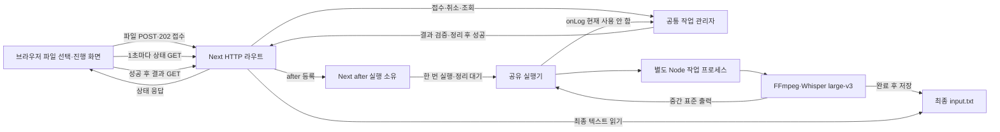
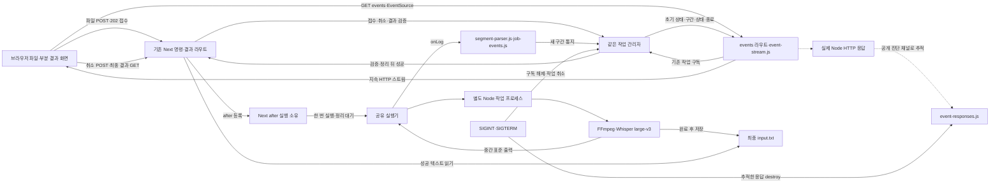
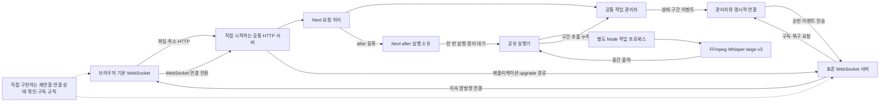
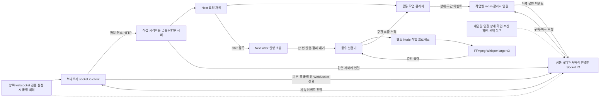

# CLI와 웹의 전사 아키텍처를 인수인계한다

이 문서는 CLI와 Next 웹 서버가 공유 전사 기능을 호출하는 구조, 자료와 프로세스의 소유권, 실행·복구·검증 방법을 설명하는 영구 인수인계 문서다. 구현한 SSE 흐름과 채택 근거, 대안별 구조도와 실제 검증 범위를 보존한다. 명령별 사용법은 기존 기능 문서에 두고, 여기에는 유지보수할 때 보존해야 할 책임과 경계를 남긴다.

## 현재 상태와 문서의 범위

2026년 10월 3일 운영자는 스트리밍 비교·결정·구조도를 임시 이슈와 영구 인수인계 문서에 먼저 기록하도록 지시했고, 절차 반영 뒤 후속 구현을 승인했다. SSE 구현과 소스 검증 뒤 세 애니메이션의 확장·파일별 무작위 표시를 승인하고 4단계 운영 반영을 지시했다. 승인된 화면을 새 3998 운영 빌드에 반영하고 실제 large-v3 전사·운영 화면을 검증했다. 이후 「기능 단위로 커밋을 컨벤션에 맞춰서 진행하고 다음 남은 작업이 있다면 진행하자. 문서화 해야지」라는 지시에 따라 구현을 다섯 기능으로 커밋하고 설치·실행 절차와 영구 문서를 대조했다. 같은 날 운영자의 「문서 수명까지 마무리 정리를 해야지. 문서까지 완전히 마무리해야지.」라는 지시에 따라 유지보수 근거를 이 문서에 보존하고 임시 이슈와 참조를 삭제해 5단계를 완료했다.

| 단계 | 상태 | 산출물 · 커밋 |
|---|---|---|
| 1단계, CLI와 공유 패키지 분리 | 완료·커밋 | `069bf51`, 계획 문서 보강 `b273433` |
| 2단계, 전사 전체를 별도 프로세스에서 실행 | 구현·검증·커밋 완료 | `2fa022e`, 실행기·작업·정리 모듈과 CLI 신호 처리를 기록했다. |
| 3단계, pnpm 기반 Next 서버 준비 | 구현·검증·커밋 완료 | `c764394`, 웹 패키지·루트 웹 명령·서버 전용 원본 모듈 로더를 기록했다. |
| 4단계, 웹 파일 전사와 화면 | 구현·운영 반영·검증·커밋 완료 | `e7e717c` 접수 API, `c39d713` 파일 화면·SSE, `92643e3` 세 애니메이션. 새 3998 운영 빌드에서 실제 large-v3와 처리 중·완료 화면을 검증했다. |
| 4단계 후속, 중간 전사 스트리밍 | 구현·소스 검증·커밋 완료 | `c39d713`, 이벤트 경로·누적 복구·원출력 보존·브라우저 재연결·느린 HTTP 응답 종료를 기록했다. |
| 5단계, 최종 인수인계와 임시 문서 정리 | 절차 대조·영구 문서·수명 정리 완료 | 실제 구조·명령·근거·미확인 범위를 이 문서와 실행 안내에 남겼다. 임시 이슈의 유지보수 근거를 보존하고 해당 문서와 참조를 삭제했다. |

현재 브랜치는 `feat/cli-web-separation`이며 다섯 기능 커밋은 다음과 같다. 로컬 커밋만으로 다른 기기의 소스가 바뀌지는 않으므로 받은 소스가 해당 구현을 포함하는지 확인한다. 인수인계 시점의 문서·소스 상태는 `git status --short --branch`와 `git log --oneline`으로 확인한다.

| 커밋 | 묶음 | 내용 | 파일 |
|---|---|---|---|
| `2fa022e` | 전사 프로세스 실행 | 전사 전체 격리, 모델·결과 잠금, 자손·부모 종료, CLI 취소 | `packages/transcription/src/runner.js`·`worker.js`·정리 모듈, `apps/cli/src/index.js`, 관련 검사와 `전사-프로세스-실행.md` |
| `c764394` | Next 서버 작업 공간 | pnpm 웹 명령, 서버 전용 원본 로더, 상태 API, Node 실행 범위와 웹 린트 | `apps/web/package.json`·`next.config.mjs`·`src/server/transcription.js`·`src/app/api/health/route.js`, 루트 설정·잠금 파일 |
| `e7e717c` | 업로드·작업 API | 실제 512MiB 상한, 단일 작업 접수·조회·취소·결과, `after()`와 종료 정리 | `apps/web/src/server/job-manager.js`·`upload.js`·`responses.js`, 전사 API, 개발 시작·종료 연결과 관리자 검사 |
| `c39d713` | 파일 화면·SSE | 업로드 피드백, 부분 전사·순번·복구·느린 응답 종료, 취소·복사·다운로드 | `apps/web/src/app`·`client`·`components`, `server/segment-parser.js`·`job-events.js`·`event-stream.js`·`event-responses.js`와 관련 검사 |
| `92643e3` | 전사 애니메이션 | 작업마다 무작위 선택, 같은 작업 유지, 처리 중 중앙 표시·종료 후 숨김 | `apps/web/public/animations`의 SVG 3개, `src/components/result-panel.jsx`·`src/app/globals.css` |

| 기능 문서 | 맡는 내용 | 이 문서에서 다루는 연결 |
|---|---|---|
| [저장소 안내](../README.md) | 의존성·엔진 설치와 루트 실행 명령 | 작업 공간과 앱 진입점 |
| [명령줄 입력 경로 지정](명령줄-입력-경로-지정.md) | `--input`·`-i`, 파일·폴더 선택, 결과 이름 | CLI 경로 해석과 공유 실행기 호출 |
| [전사 프로세스 실행](전사-프로세스-실행.md) | 공개 함수, 입력·결과·오류·취소 규칙 | 자식 프로세스·잠금·정리 책임 |
| [웹 서버 실행](웹-서버-실행.md) | 설치·LAN 접속·화면·HTTP·오류 처리 | 업로드부터 정리까지 작업 수명 |
| [위스퍼 대형 모델 업그레이드](위스퍼-대형-모델-업그레이드.md) | 엔진 빌드·large-v3 준비·한국어 인식 확인 | 모델 파일과 원본 의존성 경로 |

## 디렉터리와 책임을 이해한다

`pnpm-workspace.yaml`은 `apps/*`와 `packages/*`를 함께 설치·관리한다. 앱은 `@stt/transcription`을 `workspace:*`로 연결하며 저장소의 공유 코드를 사용한다.

```text
stt/
├─ apps/
│  ├─ cli/
│  │  ├─ package.json
│  │  └─ src/index.js
│  └─ web/
│     ├─ package.json
│     ├─ public/animations/     # 파일별 전사 대기 SVG 세 종류
│     ├─ scripts/dev.mjs
│     ├─ next.config.mjs
│     └─ src/
│        ├─ app/                 # 화면과 HTTP 경로
│        ├─ client/              # 업로드·상태 수신·화면 상태
│        ├─ components/          # 파일·작업·결과 표시
│        ├─ server/              # 작업 관리자·업로드·서버 전용 로더
│        └─ instrumentation.js  # Next의 Node 종료 연결
├─ packages/
│  └─ transcription/
│     ├─ package.json
│     ├─ src/                    # 실행기·작업 프로세스·변환·정리
│     ├─ test/
│     └─ test-support/
├─ assets/                      # CLI 기본 입력, web-jobs는 업로드 사본
├─ output/                      # CLI 결과, web-jobs는 웹 성공 결과
├─ docs/
├─ package.json
├─ pnpm-workspace.yaml
└─ pnpm-lock.yaml
```

| 위치 | 책임 | 유지할 경계 |
|---|---|---|
| [CLI 진입점](../apps/cli/src/index.js) | 옵션 해석, 콘솔 안내, 모델 환경 변수, 종료 코드 | 전사 알고리즘과 웹 상태를 소유하지 않는다. 기본 자료 경로는 저장소 기준, 상대 입력은 CLI 실행 위치 기준이다. |
| [웹 화면](../apps/web/src/app/page.jsx)과 [브라우저 전사 처리](../apps/web/src/client/use-transcription.js) | 파일 선택·전송·SSE 수신·중간·최종 결과 표시 | Node 전사 패키지를 브라우저에 가져오지 않는다. 업로드 전송률과 전사 상태를 구분한다. |
| [웹 작업 관리자](../apps/web/src/server/job-manager.js) | 접수 슬롯, 작업 상태, 실행·취소·자료 정리 | 한 서버 프로세스에서 업로드·전사·정리를 포함해 한 작업만 실행한다. |
| [웹 관리자 연결](../apps/web/src/server/transcription-jobs.js) | HTTP 경로와 종료 처리기가 같은 관리자를 사용하도록 연결 | `globalThis`와 `Symbol.for()`로 개발 모듈 재평가에도 같은 관리자를 참조한다. |
| [구간 추출](../apps/web/src/server/segment-parser.js)과 [작업 이벤트](../apps/web/src/server/job-events.js) | 출력 줄 해석·원출력 보존·순번·누적 상태·최근 재전송 | 일반 엔진 로그·표준 오류·라이브러리 재출력 블록을 구간으로 보내지 않는다. 전사 실행은 시작하지 않는다. |
| [SSE 스트림](../apps/web/src/server/event-stream.js)과 [HTTP 응답 추적](../apps/web/src/server/event-responses.js) | 프레임·역압력 상한·연결 유지·논리 구독과 실제 응답 종료 | 느린 구독 오류를 전사로 전달하지 않는다. 종료 신호 때 자신의 SSE HTTP 응답만 닫는다. |
| [서버 전용 로더](../apps/web/src/server/transcription.js) | 공유 패키지를 원본 CommonJS 모듈로 읽음 | 엔진·모델·`worker.js`의 실제 설치 경로를 유지한다. |
| [공유 공개 진입점](../packages/transcription/src/index.js)과 [실행기](../packages/transcription/src/runner.js) | 공개 함수·입력 확인·자원 예약·프로세스 실행·정리 | CLI와 웹이 같은 실행·취소·저장 규칙을 사용한다. |
| [작업 프로세스](../packages/transcription/src/worker.js)와 [변환기](../packages/transcription/src/converter.js) | 모델 준비, 사본 변환, FFmpeg·Whisper 실행, 결과 저장 | 호출한 앱의 작업 폴더와 환경 변수를 바꾸지 않는다. 입력 원본을 보존한다. |
| [자원 관리](../packages/transcription/src/resources.js)·[프로세스 종료](../packages/transcription/src/process-tree.js)·[부모 수명 처리](../packages/transcription/src/parent-lifecycle.js) | 잠금, 작업 자료 삭제, 자손 종료, 부모 중단 | 자손 종료를 확인하지 못하면 잠금과 자료를 보존해 중복 실행을 막는다. |

## 현재 실행 구조와 경로를 보존한다

현재 SSE 구조, 이전 폴링 구조와 미채택 대안은 아래 「전사 결과 스트리밍의 결정과 구조」에서 구분한다. 공통 전사 프로세스와 원본 로더는 이 절의 흐름을 따른다.

### 공통 전사 흐름

1. 앱이 `runTranscription()`에 절대 입력·결과 폴더와 선택 입력 경로를 전달한다. 입력 선택 오류는 모델 준비와 `fork` 전에 확인한다.
2. 실행기가 결과 이름과 모델 준비 자원을 예약한다. 모델 파일과 결과 파일이 충돌하면 구조화된 오류를 반환한다.
3. 실행기가 자신의 임시 작업 폴더를 만들고 별도 Node 프로세스로 `worker.js`를 실행한다. Unix에서는 별도 프로세스 그룹을 사용한다.
4. 작업 프로세스가 모델을 준비하고 입력 사본을 FFmpeg·Whisper에 전달한다. 모델 준비 확인 메시지를 부모가 받은 뒤 모델 준비 잠금을 해제한다.
5. 실행 중 진행은 IPC로, 표준 출력·오류는 출력 파이프로 부모에 전달한다. CLI는 이 출력을 콘솔에 표시한다. 웹은 `onLog`로 받은 UTF-8 표준 출력의 완성된 시간 구간을 해석해 같은 작업의 SSE로 보낸다. 표준 오류는 공개 구간으로 보내지 않는다.
6. 결과를 확인·저장하고 프로세스 종료와 출력 파이프 닫힘을 확인한다. 자손과 자신의 임시 파일·잠금을 정리한 뒤 공개 Promise가 완료된다.

`runTranscription()`은 입력별 결과 배열을 반환한다. 성공 항목은 `{ success: true, inputFile, outputFile }`, 실패 항목은 `{ success: false, inputFile, error }`다. 결과 이름 충돌과 개별 전사 실패는 배열의 실패 항목일 수 있고, 입력·준비·프로세스·콜백 오류는 Promise 거부일 수 있다. 웹은 결과가 정확히 한 성공 항목이고 최종 텍스트가 비어 있지 않을 때만 성공으로 처리한다.

macOS 검증에서는 좀비만 남은 프로세스 그룹에 신호를 보낼 때 `EPERM`이 발생하는 사례를 재현하고 [XNU의 신호 처리](https://github.com/apple-oss-distributions/xnu/blob/xnu-11417.140.69/bsd/kern/kern_sig.c#L1608-L1617)를 확인했다. 따라서 신호 반환값만으로 자손의 생존을 판단하지 않고 `ps`로 해당 PGID의 비좀비 구성원을 조회해 종료를 확인한다. 조회 실패나 실행 중 자손 잔존은 정리 실패로 반환하고 해당 잠금과 자료를 보존한다. 종료·취소의 공개 규칙은 [전사 프로세스 실행](전사-프로세스-실행.md)에 둔다.

### 원본 CommonJS 로더를 유지하는 이유

`nodejs-whisper`는 실제 패키지 설치 경로를 기준으로 모델과 실행 엔진을 찾으며, 공유 실행기는 자신의 원본 `worker.js`를 `fork`한다. Next가 이 코드를 서버 생성물에 묶으면 `__dirname`이 `.next` 내부로 달라져 모델·작업 프로세스를 찾는 경로가 어긋날 수 있다.

[서버 전용 로더](../apps/web/src/server/transcription.js)는 `server-only`로 브라우저 접근을 막고, `process.getBuiltinModule('node:module')`에서 얻은 `createRequire()`로 원본 공개 모듈을 읽는다. 제공하는 pnpm 웹 명령이 `apps/web`에서 실행하므로 이 위치의 `package.json`을 기준으로 공유 의존성을 해석한다. 이 내장 API 때문에 Node 실행 범위를 `^20.16.0 || >=22.3.0`으로 지정했다.

초기 정적 import와 `serverExternalPackages: ['@stt/transcription']`를 적용한 개발 서버에서는 가져온 함수가 원본 Node 함수와 달랐다. 내장 API를 통한 원본 로더로 바꾼 뒤 개발·운영에서 모두 `originalFunction: true`와 원본 실행기 경로를 확인했고, 원본 `worker.js`·엔진·모델 파일의 존재도 확인했다. 경로 검사용 임시 API는 제거했다. 이 검증은 원본 경로와 함수의 연결을 확인한 기록이며, `.next` 단독 배포나 자동 자산 복사를 검증한 기록으로 확대하지 않는다.

공유 CommonJS 소스를 수정하면 Node 모듈 캐시에 남은 이전 코드를 읽을 수 있으므로 해당 개발 서버를 다시 실행한다. 웹 HTTP 모듈의 개발 재평가와 공유 원본 모듈의 캐시 수명은 구분한다. 실제 배포는 전체 저장소·pnpm 의존성·엔진·모델을 유지한 `next start`이며, `.next`만 복사하는 배포와 `standalone` 출력은 구성하지 않았다.

## 웹 접수·상태·취소·자료 수명을 유지한다

### 접수와 실행 소유

1. `POST /api/transcriptions?name=<파일 이름>`가 파일 이름·확장자·본문·길이를 검사한다. 원래 이름은 표시와 다운로드 이름에만 쓰고 저장 경로에는 UUID와 `input.<확장자>`를 사용한다.
2. 첫 비동기 처리 전에 작업 슬롯을 예약하고 공식 Next `after()` 완료 함수를 등록한다. 그 뒤 업로드 폴더와 결과 폴더를 만들고 바이너리 본문을 저장한다.
3. 파일 저장을 마치면 `202`와 작업 정보를 반환한다. `after()`는 업로드 완료 여부를 받은 뒤 실행기 호출과 자료 정리까지 기다린다.
4. 진행·종료는 같은 작업 관리자에 반영한다. 추가 접수는 업로드·전사·정리가 끝나기 전까지 `409`이며 대기열과 자동 재접수는 없다.

전사 실행과 정리는 이 `after()` 흐름이 소유한다. SSE 연결은 같은 작업을 구독하며 작업을 시작하거나 새 실행 객체를 만들지 않는다. 접수 응답 전 요청 중단도 작업 중단에 연결하고, 성공 접수 때 요청 리스너는 `after()` 시작까지 유지한 뒤 해제한다.

### 입력 상한과 업로드 피드백

| 항목 | 현재 규칙 | 유지보수할 때 확인할 지점 |
|---|---|---|
| 파일 수·형식 | 한 파일, `.mp3`, `.wav`, `.m4a`, `.flac`, `.ogg`, `.mp4`, `.avi`, `.mov` | 브라우저 [파일 검사](../apps/web/src/client/file-input.js)와 서버 [업로드 검사](../apps/web/src/server/upload.js)를 함께 대조한다. |
| 모델 | 웹은 `large-v3` 고정 | CLI의 `WHISPER_MODEL`을 웹 모델 선택으로 간주하지 않는다. |
| 파일 크기 | 최대 512MiB, 정확히 `536870912`바이트 | 헤더와 실제 수신량을 모두 검사한다. |
| 상한 초과 | 길이 헤더 초과는 저장 전 `413`, 실제 스트림 초과는 쓰기를 중단하고 나머지를 버린 뒤 `413` | 요청 수신이 끝날 때까지 슬롯을 유지한다. 전체 파일을 메모리에 모으지 않는다. |
| 선택 반영 대기 | 파일 선택 대기 문구와 시작 비활성 | 대용량 파일이 입력에 반영되기 전에도 기다림을 표시한다. |
| 전송 중 | XHR 업로드 이벤트의 실제 바이트·비율·경과 시간·취소 | 업로드 100%와 서버 접수 완료를 구분한다. 전사율로 표시하지 않는다. |

### 작업 상태와 단계를 구분한다

| 분류 | 값 | 의미 |
|---|---|---|
| 상태 | `accepted` | 파일을 접수했다. |
| 상태 | `running` | 공유 전사 실행과 결과 확인을 진행한다. |
| 상태 | `succeeded` | 결과 확인과 정상 정리를 마쳤다. |
| 상태 | `failed` | 전사·결과·정리에 실패했다. |
| 상태 | `cancelled` | 취소에 따른 정상 정리를 마쳤다. |
| 단계 | `preparing` | 모델·입력 준비 중이다. |
| 단계 | `transcribing` | 음성 전사 중이다. |
| 단계 | `cleaning` | 자손·임시 자료·업로드 사본을 정리한다. |
| 단계 | `complete` | 종료 처리를 마쳤다. 정리 성공 여부는 `cleanupRequired`도 확인한다. |

웹은 모델·전사 진행률을 임의로 만들지 않는다. 엔진 출력의 중간 구간이 도착하면 읽기 전용 텍스트에 이어 붙이지만 작업 완료 백분율로 바꾸지 않는다. 성공과 실제 정리 뒤 최종 파일을 GET으로 읽어 전체 결과로 교체한다. 실패·취소 때는 받은 부분을 「미완료 전사 결과」로 보존하고 다운로드를 제공하지 않는다.

브라우저 [SSE 수신 모듈](../apps/web/src/client/transcription-stream.js)은 작업 UUID와 `seq`를 검사한다. 자동 재연결은 `Last-Event-ID`로 누락 구간을 복구하며, 같은 순번의 재전송은 다시 반영하지 않는다. 완료 상태를 받으면 연결을 닫는다. 완전히 닫힌 연결은 상태 GET으로 한 번 진단하고, 「같은 작업 다시 조회」는 같은 UUID에 새 구독을 만들어 현재 누적 상태와 성공 파일을 다시 읽는다. 반복 상태 조회나 자동 재전사는 하지 않는다.

### 파일별 전사 애니메이션

운영자는 2026년 10월 3일 세 시안을 승인하고 파일 단위 전사마다 무작위로 표시하도록 지시했다. [결과 영역](../apps/web/src/components/result-panel.jsx)은 서버의 `randomUUID()`로 정해진 작업 ID 첫 8자리의 16진수를 세 종류에 대응해 애니메이션을 결정한다. 렌더에서 난수를 다시 만들거나 선택 상태를 따로 저장하지 않는다. 같은 작업을 재연결·조회·새로고침해도 같은 종류가 표시되고, 새 파일 작업에서 다시 결정된다. 무작위 선택이므로 연속 작업에서 같은 종류가 나올 수 있다.

| 항목 | 현재 동작 | 유지보수 기준 |
|---|---|---|
| SVG 원본 | `apps/web/public/animations/transcription-wave.svg`, `transcription-segments.svg`, `transcription-echo.svg` | 음성 파형·구간 이어 붙이기·소리의 잔향 세 종류를 제공한다. 삭제한 변형 SVG를 다시 참조하지 않는다. |
| 표시 상태 | `accepted`·`running`일 때 결과 텍스트 영역 위에 가운데 표시 | 성공·실패·취소 후 숨긴다. 취소 요청 뒤 정리 중에는 기존 활성 상태를 따른다. |
| 접근성 | 설명 문장은 화면 읽기 프로그램용으로 유지하고 장식 이미지는 빈 대체 텍스트를 사용 | SVG의 `prefers-reduced-motion`을 유지하고 완료율로 해석할 숫자를 추가하지 않는다. |
| 이미지 표시 | `next/image`, 120 × 40, `unoptimized` | SVG를 래스터 이미지로 바꾸지 않고 원본의 CSS 동작을 보존한다. 사용자 선택 메뉴는 없다. |
| 애니메이션 개발 검증 | 엄격한 린트와 실제 Next 개발 화면·모형 엔진의 중간 구간·새로고침·성공·취소 | 기존 SSE 회귀·실제 large-v3 검증과 애니메이션 검증을 구분한다. |
| 운영 빌드·서버 | 2026년 10월 3일 운영 반영 지시에 따라 `pnpm build` 성공 후 `PORT=3998 pnpm web:start`로 시작. Next PID `97138`, 빌드 ID `ZmSztl1Np6gFOlamIzjb-` | 재시작 전에 등록된 완료 작업 3개·입력 임시 디렉터리 0개를 확인했다. `0.0.0.0:3998`에서 상태 API와 SVG 세 경로가 200이며 SVG는 원문과 같다. |
| 실제 운영 전사 | 180초 한국어 WAV `5,760,078`바이트, 작업 `a853e709-8d44-427f-a7bc-8fdaae885e23`, large-v3, 첫 구간 `9,392ms`, 성공 `37,711ms`, SSE 구간 20개 | 최종 API와 디스크는 UTF-8 `3,681`바이트로 일치하고 브라우저 표시 1,487자, `cleanupRequired: false`이다. 반복 합성 한국어 샘플이며 일반 강의 정확도·성능 평가가 아니다. |
| 운영 화면·자료 | 처리 중 정상 SVG 로드·중앙 배치·겹침 없음, 완료·완료 후 새로고침에서 로딩 요소 0개·전체 결과·다운로드 경로 확인 | 진행 중 새로고침 유지는 앞의 개발 검사로 확인했다. 이번 운영 검증에서 재확인했다고 쓰지 않는다. 새 검증 결과는 보존하고 업로드 사본은 정리됐다. |
| 운영 반영의 보존 범위 | 기존 저장소 파일 70개·입력과 결과 44개의 SHA-256·크기·수정 시각 일치. 모델 3개·엔진 9개 경로의 메타데이터 일치 | 기존 파일 변경·삭제 0개, 새 검증 결과 한 개 추가. 모델 해시는 새로 계산하지 않았다. 소스가 바뀌지 않아 통과한 린트·100개 회귀 검사를 반복하지 않았다. |

### 취소와 서버 종료

| 상황 | 처리 | 완료 기준 |
|---|---|---|
| 업로드 중 브라우저 취소 | XHR를 중단하고 서버가 받은 부분 파일을 정리한다. | 쓰기 핸들 닫기·부분 파일 삭제·HTTP 연결 종료 뒤 슬롯을 해제한다. |
| 접수 뒤 취소 | 취소 API가 작업 `AbortController`를 중단하고 단계를 `cleaning`으로 바꾼다. | 실행기 자손·잠금·임시 자료와 웹 업로드·실패 출력 정리 뒤 `cancelled`가 된다. |
| SSE 연결 중단·탭 종료 | 구독·요청 리스너·연결 유지 타이머만 해제한다. | 전사와 파일 저장은 계속한다. 작업 중단은 취소 POST가 담당한다. |
| SIGINT·SIGTERM | Node instrumentation의 단일 처리기가 열린 SSE HTTP 응답을 닫고 관리자를 종료 상태로 바꾼 뒤 현재 작업에 중단을 전달한다. | Next `after()`가 실행·정리 완료를 추적하며 직접 `process.exit()`를 호출하지 않는다. |
| 정리 확인 실패 | `cleanupRequired: true`, 새 접수 차단 | 운영자가 해당 자손과 남은 자료를 확인한다. 자동 해제 API는 없다. |

개발 서버는 [개발 환경 파일](../apps/web/.env.development)의 `NEXT_EXIT_TIMEOUT_MS=10000`을 사용한다. [개발 진입점](../apps/web/scripts/dev.mjs)이 Node의 `loadEnvFile()`로 개발 부모에 값을 적용한 뒤 Next CLI를 읽는다. 설치된 개발 CLI의 기본 대기가 100ms라 정리 전에 자식이 강제 종료될 수 있었던 문제를 해결한 설정이다. `--env-file`을 직접 전달하면 Next가 이를 `NODE_OPTIONS`로 넘겨 시작에 실패했으므로 같은 방식으로 바꾸지 않는다.

미완료 Node HTTP 본문의 `body.cancel()` Promise가 끝나지 않는 경계를 실제로 확인했다. 부분 파일 정리 후 `Connection: close` 응답으로 입력 연결을 정리하고 `after()` 경계까지 슬롯을 유지한다. 끝나지 않는 취소 Promise를 정리 완료 근거로 기다리지 않는다.

SSE의 종료 알림 뒤에도 남은 프레임을 읽을 때까지 요청 중단과 관리자 종료가 구독을 닫을 수 있어야 한다. 다만 읽기 큐가 모두 전달된 시점도 실제 HTTP 쓰기 완료와 같지 않다. 설치된 Next는 큰 `ServerResponse.write()`가 역압력을 받으면 `drain`을 기다리며, 그 쓰기가 대기 중이면 `ReadableStream.error()`만으로 소켓을 종료하지 못한다.

[HTTP 응답 추적](../apps/web/src/server/event-responses.js)은 공개 `node:diagnostics_channel`의 `http.server.request.start`에서 SSE GET의 실제 `ServerResponse`만 보관한다. 평상시 `finish`·`close`에 추적과 자신의 리스너를 해제한다. SIGINT·SIGTERM에는 자신의 응답을 `destroy()`하고 채널 구독을 해제한 뒤 기존 작업 정리를 이어 간다. 다른 HTTP 응답을 일괄 종료하지 않으며 후속 신규 구독의 `503` 응답은 정상 전달한다. 채널 콜백이나 한 응답의 종료 오류는 나머지 연결과 음성 전사로 전파하지 않는다.

HTTP 진단 채널은 [공식 문서](https://nodejs.org/api/diagnostics_channel.html#built-in-channels)에서 실험 기능으로 분류한다. Node·Next 변경 때 채널 정보·등록 시점·느린 실제 응답 종료를 다시 검증할 유지보수 위험이 있다. 채널 생성과 HTTP 정보 발행은 [Node 20.16.0 공식 소스](https://raw.githubusercontent.com/nodejs/node/v20.16.0/lib/_http_server.js)와 [Node 22.3.0 공식 소스](https://raw.githubusercontent.com/nodejs/node/v22.3.0/lib/_http_server.js)에서 확인했고 두 버전에서의 앱 실행은 확인하지 않았다. `destroy()`가 연결된 소켓도 닫는 동작은 [공식 HTTP 문서](https://nodejs.org/api/http.html#outgoingmessagedestroyerror)에 있다.

### 자료와 상태의 수명

| 자료 | 위치 | 수명과 소유권 |
|---|---|---|
| CLI 입력 원본 | 기본 `assets/`, 또는 `--input` 경로 | 원본을 덮어쓰거나 삭제하지 않는다. |
| CLI 성공 결과 | `output/<입력 기본 이름>.txt` | 성공 저장 뒤 보존한다. 새 처리 실패 시 기존 결과를 보존한다. |
| 웹 업로드 사본 | `assets/web-jobs/<UUID>/input.<확장자>` | 접수 실패·성공·실패·취소 후 정상 정리하면 삭제한다. 브라우저 원본은 그대로 둔다. |
| 웹 성공 결과 | `output/web-jobs/<UUID>/input.txt` | 성공 뒤 보존한다. 서버 재시작에도 파일은 남는다. |
| 웹 실패·취소 출력 | 해당 UUID의 결과 폴더 | 정상 정리하면 삭제한다. |
| 모델 | `nodejs-whisper` 실제 설치 경로의 모델 폴더 | 준비가 끝난 모델은 전사 실패·취소에도 보존한다. large-v3는 검증 후 교체한다. |
| 모델·결과 잠금 | 모델 옆 `.stt-lock`, 결과 자원 예약 위치 | 자신이 확보한 잠금만 해제한다. 자손 종료를 확인하지 못하면 보존한다. |
| 작업 임시 자료 | 운영체제 임시 폴더의 해당 작업 폴더 | 자신의 작업 자료만 정리한다. |
| 작업 기록 | 단일 Next Node 프로세스의 메모리 | 서버 수명 동안 조회한다. 재시작 후 이전 UUID는 `404`다. |
| 중간 구간·최근 이벤트 | 같은 작업의 서버 메모리 | 작업별 UTF-8 중간 텍스트 16MiB, 최근 공개 이벤트 1000개를 보관한다. 중간 텍스트 상한에 닿으면 `streamNotice`로 안내하고 전사와 최종 파일 저장은 계속한다. 서버 재시작에는 사라진다. |

현재 구성에는 작업 이력 데이터베이스·여러 서버 인스턴스의 상태 공유가 없다. 작업을 조회하지 못했다고 자동으로 다시 전사하지 않는다. `web-jobs` 두 폴더와 `.next`는 Git에서 제외하므로 다른 기기에 소스만 전달해도 기존 자료와 작업 상태가 따라가지는 않는다.

## 현재 HTTP 경로를 확인한다

각 Route Handler는 Node 실행 환경을 사용한다. 파일 본문은 `application/octet-stream`이며 파일 이름은 URL 인코딩한 `name` 질의 값으로 보낸다. UUID 형식과 존재를 검사하고 상태·결과 응답은 `Cache-Control: no-store`를 사용한다.

| 경로 | 역할 | 응답 |
|---|---|---|
| `POST /api/transcriptions?name=<파일 이름>` | 업로드·접수 | `202` 작업 정보. 입력 `400`, 크기 `413`, 형식 `415`, 사용 중 `409`, 종료 중 `503`. |
| `GET /api/transcriptions/<UUID>` | 직접 상태 조회와 닫힌 연결의 단회 진단 | `200`. 잘못된 UUID `400`, 없는 작업 `404`. 브라우저는 진행 중 반복 호출하지 않는다. |
| `GET /api/transcriptions/<UUID>/events` | 현재 상태·중간 구간·종료 SSE 구독 | `200` UTF-8 `text/event-stream`, 잘못된 UUID `400`, 없는 작업 `404`, 종료 중 `503`. |
| `POST /api/transcriptions/<UUID>/cancel` | 중단·정리 요청 | 진행 중 `202`, 이미 종료된 작업 `200`. |
| `GET /api/transcriptions/<UUID>/result` | 성공 텍스트 다운로드 | `200` UTF-8 `text/plain`. 성공 전·실패·취소 `409`, 없는 작업 `404`, 읽기 실패 `500`. |
| `GET /api/health` | HTTP 응답 확인 | `200`, `{"status":"ok"}`. 모델 준비와 전사는 실행하지 않는다. |

작업 정보는 `id`, `name`, `size`, `model`, `status`, `stage`, `createdAt`, `updatedAt`, `statusUrl`, `cancelUrl`, `eventsUrl`, `resultUrl`, `error`, `cleanupRequired`, `streamNotice`를 포함한다. `eventsUrl`은 같은 작업의 구독 주소이고 `streamNotice`는 중간 보관 상한 안내 또는 `null`이다. `resultUrl`은 성공 때만 채운다. 오류 응답은 `{ "error": { "code": "...", "message": "..." } }`이며 서버 경로와 원시 엔진 로그를 보내지 않는다. 실제 SSE 이벤트와 복구 명세는 다음 공통 절에 기록한다.

## 전사 결과 스트리밍의 결정과 구조

### 결정 상태와 근거

기준일은 2026년 10월 3일이다. 운영자는 대화에서 「SSE로 최종 결정한 이유까지 적도록 하자」라고 지시했다. **전사 상태와 중간 텍스트를 SSE로 전달하는 구현과 검증을 완료했다.** 문서 정리 뒤 같은 날 운영자가 「반영했다면 다음 단계 작업을 진행해줘」라고 지시했다. 작업 절차와 수치를 먼저 기록한 뒤 서버·브라우저를 구현하고 실제 large-v3·HTTP·종료·화면을 검증했다. 아래 SSE 경로·이벤트·구조도는 현재 소스를 설명한다. WebSocket·Socket.IO 구조도는 미채택 비교안이다. 이후 승인된 애니메이션의 운영 반영·화면 검증은 앞의 「파일별 전사 애니메이션」에 기록했고, 5단계에서 스트리밍 근거를 포함한 영구 문서와 문서 수명 정리를 완료했다.

| 상태 | 대상 | 근거와 처리 |
|---|---|---|
| 대체한 이전 구현 | 1초 상태 조회와 성공 후 결과 읽기 | 브라우저의 반복 상태 GET을 제거했다. 이전 폴링 구조도와 과거 검사 기록은 당시 구현을 설명한다. |
| 구현·검증 완료 | SSE로 상태와 중간 전사 구간 전달 | `events` 라우트와 같은 작업 관리자의 구독을 연결했다. 브라우저 요청 기록에서 진행 중 상태 GET 0회·SSE 1회·최종 결과 GET 1회를 확인했다. |
| 유지 | 파일 업로드·한 작업 실행·취소·결과 저장 | 기존 HTTP 명령과 작업 관리자·공유 실행기의 소유권을 유지한다. SSE 접속이 전사를 새로 시작하지 않는다. |
| 비교 후 미채택 | 표준 WebSocket과 Socket.IO | 아래 비용·기능·운영 경계 비교를 근거로 이번 파일 전사에는 채택하지 않는다. 향후 재검토 근거로 구조도를 보존한다. |
| 승인·실행 완료 | 절차 반영 후 소스 구현·검증·기록 | 운영자의 2026년 10월 3일 진행 지시에 따라 명세 기록→독립 구현→통합 검증→문서 기록 순서로 진행했다. |

기존 폴링 추천은 SSE 선택으로 대체했다. 폴링이 불가피하다는 기술적 근거는 확인되지 않았다. 과거 폴링 구현·검증 기록은 당시 상태를 설명하며 SSE 완료 근거로 사용하지 않는다.

### 현재 코드에서 확인한 사실

다음 경로는 저장소 루트를 기준으로 한다. 설치 의존성의 파일은 모델과 엔진을 실행하는 연결 라이브러리의 원문이며 저장소 소스 수정 대상은 아니다.

| 위치 | 확인한 사실 | 구현에 미치는 영향 |
|---|---|---|
| `packages/transcription/src/runner.js`의 `monitorChild()` | 자식 표준 출력·오류를 UTF-8로 해석하고 `onLog({ stream, text })`에 전달한다. | 이미 해석된 문자열 조각을 줄 단위로 조립한다. 로그 전체를 그대로 결과 영역에 보내지 않는다. |
| `packages/transcription/node_modules/nodejs-whisper/cpp/whisper.cpp/examples/cli/cli.cpp`의 `whisper_print_segment_callback()` | 설치된 Whisper 엔진은 구간 콜백에서 시간과 텍스트를 출력하고 `fflush(stdout)`를 호출한다. | 모델을 교체하거나 입력 파일을 인위적으로 분할하지 않고 중간 구간을 받을 수 있다. 첫 구간의 실제 대기 시간은 별도로 측정해야 한다. |
| `packages/transcription/node_modules/nodejs-whisper/dist/whisper.js` | 전사 호출은 `async: true`, `silent: false`이며 종료 시 모은 표준 출력을 `logger.debug('Stdout:', stdout)`로 다시 기록한다. | 출력 조각 경계·일반 로그·종료 시 재출력을 처리해 같은 전사 구간이 중복되지 않게 한다. |
| `apps/web/src/server/job-manager.js`, `segment-parser.js`, `job-events.js` | `onLog`의 표준 출력을 구간으로 해석하고 같은 작업에 누적·순번·구독 통지를 연결한다. | 종료 시 `Stdout:` 재출력 블록만 제외한다. 원래 출력의 시간·문장이 같아도 각각 보존하고 최종 텍스트와 정리 결과로 성공을 정한다. |
| `apps/web/src/app/api/transcriptions/route.js`와 `job-manager.js`의 `acceptUpload()` | POST가 공식 Next `after()`에 실행과 정리를 등록한다. | SSE GET은 기존 작업을 구독한다. 구독·재연결마다 실행을 다시 등록하지 않는다. |
| `apps/web/src/server/transcription-jobs.js`, `event-responses.js`, `src/instrumentation.js` | 단일 관리자와 종료 신호를 사용한다. 공개 Node 진단 채널로 실제 SSE HTTP 응답을 추적한다. | 종료 때 추적한 SSE 응답을 파괴하고 구독·작업을 정리해 운영 Next의 HTTP 응답 대기가 끝나도록 한다. |
| `apps/web/src/client/use-transcription.js`, `transcription-stream.js`, `src/app/page.jsx` | `EventSource` 이벤트로 상태와 부분 텍스트를 반영하며 성공 후 최종 결과를 한 번 읽는다. | 재연결 중 텍스트를 보존한다. 닫힌 연결의 진단 GET은 한 번이며 수동 재시도는 같은 UUID를 구독한다. |

### 이전 폴링 구조도 - SSE로 대체

아래 그림은 SSE로 대체하기 전의 폴링 구조다. 당시에는 엔진 출력 전달이 존재했지만 웹이 중간 구간을 사용하지 않았다.



### 대안 비교와 비용 판단

SSE는 열린 HTTP 응답에서 서버가 UTF-8 텍스트 이벤트를 보내는 방식이다. 표준 WebSocket은 한 연결에서 양쪽이 텍스트·바이너리를 보내는 프로토콜이다. Socket.IO는 WebSocket 등의 전송 수단 위에 자체 이벤트 형식과 연결 관리 기능을 제공하는 라이브러리다.

| 비교 항목 | SSE | 표준 WebSocket | Socket.IO |
|---|---|---|---|
| 지속 전달 방향 | 서버에서 브라우저로 전사 구간·상태를 전달한다. 명령은 HTTP로 처리한다. | 양방향 텍스트·바이너리 전송을 제공한다. | 양방향 이름 붙인 이벤트·바이너리 전송을 제공한다. |
| 브라우저·서버 의존성 | 브라우저 `EventSource`와 Next `ReadableStream` 응답을 사용할 수 있다. | 브라우저 기본 API와 서버의 `ws` 등 공개 서버 구현을 연결한다. | 서버 `socket.io`와 브라우저 `socket.io-client`를 추가한다. |
| 현재 Next 통합 비용 | 기존 라우트·관리자에 구독을 연결하고 기본 실행 명령을 유지한다. 느린 HTTP 응답의 종료를 보장하기 위한 추적도 추가했다. | 공개 통합안 기준으로 직접 HTTP 서버를 시작하고 연결 전환을 처리한다. 실행·종료·개발 갱신·관리자 연결을 조정한다. | 같은 HTTP 서버에 라이브러리를 붙이며 표준 WebSocket과 같은 서버 실행 경계 변경이 필요하다. |
| 재연결 | 기본 수신 기능이 재연결하며 마지막 이벤트 식별자를 보낸다. | 재연결 간격·연결 상태 확인을 직접 구현한다. | 재연결·연결 상태 확인을 라이브러리가 제공한다. |
| 누락 복구 | 구간 보관·재전송·중복 제거를 앱이 구현한다. | 구간 식별자·보관·재전송·중복 제거를 앱이 구현한다. | 기본 설정은 누락 재전송을 보장하지 않는다. 선택 복구 기능의 보관 기간·실패 시 재동기화를 정해야 한다. |
| 수신 확인·구독 그룹 | 필요한 명령의 확인은 HTTP 응답으로, 작업 구독 분배는 앱에서 처리한다. | 메시지 규칙·수신 확인·구독 분배를 직접 구현한다. | 수신 확인과 작업별 `room` 같은 구독 그룹 기능을 제공한다. |
| 자원·유지보수 비용 | 지속 HTTP 연결·구독자·전송 대기량·구간 보관과 실험적 Node 진단 채널을 관리한다. | 지속 소켓과 같은 자원을 관리하며 연결 정책의 직접 구현 비용이 더해진다. | 자체 메시지 처리·연결 관리·전용 패키지 관리가 더해지고 직접 구현할 연결 코드가 줄어든다. |
| 외부 도구 호환 | 표준 HTTP 스트림을 읽는 도구로 접근할 수 있다. | 표준 WebSocket 클라이언트로 접근할 수 있다. | Socket.IO 프로토콜을 지원하는 클라이언트가 필요하다. |

이 표의 비용은 현재 코드와 공식 제공 기능에 따른 구조적 판단이다. 세 방식을 구현해 CPU·메모리·지연을 비교 측정한 결과가 아니며 작업 시간·금액·성능 배수를 산정하지 않았다. 세 방식 모두 기존 장비에서 운영할 수 있고, WebSocket·Socket.IO도 Next와 같은 프로세스·포트를 공유할 수 있다. 별도 프로세스를 선택하면 상태 공유와 프로세스 간 전달 비용이 추가되지만 이번 비교에서 필수 비용으로 계산하지 않는다.

구간 추출·순번·누적 텍스트·최종 결과 검증은 세 방식의 공통 비용이다. SSE를 골라도 이 작업은 필요하다. 전송량을 줄이려면 매 이벤트에 누적 전문을 보내는 대신 새 구간을 보내고, 초기 연결·복구 때 필요한 누적 상태를 제공한다. 느린 구독자의 전송 대기량과 보관 기간도 제한해야 한다. 스트리밍을 추가한다고 연결 라이브러리가 모으는 전체 출력의 메모리 사용과 상한 문제가 자동으로 없어지지는 않는다.

SSE의 HTTP/1 연결은 같은 브라우저·도메인의 일반 연결 제한에 영향을 받는다. Chrome·Firefox의 제한은 6개이며 HTTP/2에서는 스트림 수를 협상한다. 기본 `EventSource`는 임의 요청 헤더 지정도 제공하지 않는다. 이 요구가 생기면 한 연결로 구독을 합치기, HTTP/2 제공, `fetch` 스트림 수신, WebSocket을 비용과 함께 재검토한다. `fetch` 스트림은 HTTP 응답을 직접 읽는 수신 방법이며 스트림 해석·재연결 정책을 직접 구현해야 한다. [MDN SSE 안내](https://developer.mozilla.org/en-US/docs/Web/API/Server-sent_events/Using_server-sent_events), [EventSource 생성자 표준](https://html.spec.whatwg.org/multipage/server-sent-events.html#the-eventsource-interface)

Socket.IO의 기본 연결은 HTTP 롱 폴링 뒤 WebSocket 전환을 시도한다. 이 롱 폴링은 이전 구현의 1초 상태 조회와 별개의 전송 방식이다. 양쪽을 `transports: ["websocket"]`으로 제한하면 폴링을 제외할 수 있지만 WebSocket이 연결되지 않는 환경에서 HTTP로 연결하는 대안도 사라진다. 라이브러리의 자체 메시지 형식·연결 상태 확인·전용 클라이언트는 유지된다. [Socket.IO 전송 구조](https://socket.io/docs/v4/how-it-works/), [클라이언트 전송 설정](https://socket.io/docs/v4/client-options/#transports), [서버 전송 설정](https://socket.io/docs/v4/server-options/#transports)

재연결은 연결을 다시 여는 일이고, 누락 복구는 빠진 전사 구간을 채우는 일이며, 수신 확인은 상대의 처리를 확인하는 일이다. Socket.IO는 기본 설정에서 서버가 놓친 이벤트를 재전송하지 않는다. 선택 기능인 연결 상태 복구도 명시적으로 켜야 하며 실패 시 누적 상태 재동기화가 필요하다. [Socket.IO 전달 보장](https://socket.io/docs/v4/delivery-guarantees/), [연결 상태 복구](https://socket.io/docs/v4/connection-state-recovery/)

### SSE 채택안 구조도 - 실제 구현

브라우저의 업로드·취소·최종 결과 요청과 SSE 구독을 분리한다. `segment-parser.js`는 출력에서 구간을 추출하고, `job-events.js`는 누적·순번·구독을 관리한다. `event-stream.js`는 SSE 프레임과 응답 수명을 관리하며, `event-responses.js`는 서버 종료 때 실제 HTTP 응답을 닫는다.



### 표준 WebSocket 대안 구조도 - 미채택

이 그림은 Next와 WebSocket을 같은 HTTP 서버·프로세스·포트에 배치하는 비교안이다. 직접 작성하는 서버 진입점이 애플리케이션 경로의 `upgrade`를 담당하고 Next 개발 갱신 경로와 구분한다. 현재 Next 서버 라우트만으로 연결 전환을 처리하는 공개 API를 확인하지 못했으며 비공개 API를 전제로 삼지 않는다.



같은 프로세스에 배치해도 서버 진입점과 Next 번들 모듈이 같은 작업 관리자를 참조하는지 확인해야 한다. 현재 `server-only` 모듈을 일반 Node 진입점에서 그대로 가져오는 안은 사용하지 않는다. 작업 조회·구독 기능을 명시적으로 연결하고 기존 `apps/web` 기준 작업 폴더 또는 원본 로더 기준 경로를 유지해야 한다. 서버 진입점은 Next 컴파일 밖이므로 별도 재시작 처리가 필요하며 Next의 `standalone` 출력 방식과 함께 사용하는 제한도 검토한다. [Next 사용자 정의 서버](https://nextjs.org/docs/app/guides/custom-server), [ws의 HTTP 서버 공유 예제](https://github.com/websockets/ws#multiple-servers-sharing-a-single-https-server)

### Socket.IO 대안 구조도 - 미채택

이 그림도 Next와 Socket.IO를 같은 서버·프로세스·포트에 배치하는 비교안이다. 라이브러리가 이벤트 이름·재연결·수신 확인·구독 그룹을 제공하지만 전사 상태와의 연결 및 최종 정리 책임은 앱에 남는다.



수신 확인·재시도·여러 구독 그룹 요구가 많아지면 Socket.IO가 직접 작성할 연결 코드를 줄일 수 있다. 이 이득과 패키지·서버 통합·전용 클라이언트 비용을 함께 계산한다. 단일 서버인 현재 구성에 분산 전달 어댑터나 여러 서버의 세션 고정 비용을 필수로 넣지 않는다. [Socket.IO Next 통합](https://socket.io/how-to/use-with-nextjs), [구독 그룹](https://socket.io/docs/v4/rooms/), [여러 서버 운영](https://socket.io/docs/v4/using-multiple-nodes/)

### SSE로 최종 결정한 이유와 재검토 기준

| 결정 기준 | 현재 제품의 사실 | SSE 선택에 미친 영향 |
|---|---|---|
| 지속 전달의 방향·내용 | 업로드한 파일의 전사 구간과 상태가 서버에서 생성된다. | 서버에서 브라우저로 보내는 텍스트 이벤트가 현재 요구를 충족한다. |
| 기존 명령 흐름 | 업로드·취소·최종 결과 읽기를 HTTP로 제공한다. | 명령 경로와 실행 소유권을 유지하고 수신만 바꿀 수 있다. |
| 서버 통합·운영 | 현재 Next 기본 서버·Node 라우트·단일 작업 관리자를 사용한다. | 별도 서버 진입점과 HTTP 연결 전환 처리를 추가하는 비용을 줄인다. |
| 현재 필요한 연결 기능 | 한 작업 구독과 구간 복구가 필요하다. 여러 구독 그룹이나 연속 바이너리 입력은 현재 확정 범위에 없다. | Socket.IO가 제공하는 기능의 현재 이득보다 추가 통합 비용이 크다고 판단한다. |
| 표준 호환 | 결과를 다른 프로그램에 전달하는 사용 목적이 있다. 실제 다른 AI 연동 기능은 구현 범위에 없다. | 표준 HTTP 수신 경계를 유지한다. 다른 AI가 SSE를 지원한다고 가정하지 않는다. |
| 비용 판단의 범위 | 실제 세 안의 부하 비교 측정값은 없다. | 현재 구조의 통합·검증 비용을 근거로 선택한다. SSE의 CPU·메모리·지연이 항상 우월하다고 기록하지 않는다. |

| 재검토 조건 | 비교할 안 | 달라지는 판단 |
|---|---|---|
| 음성 바이너리와 텍스트를 양방향으로 계속 주고받는 요구를 운영자가 채택한다. | 표준 WebSocket·Socket.IO | 같은 연결에서 입력·출력을 처리하는 이득과 서버 통합 비용을 비교한다. |
| 수신 확인·재시도·여러 구독 그룹 관리 요구가 늘어난다. | Socket.IO | 직접 구현할 연결 코드의 절감이 패키지·통합·복구 검증 비용을 넘는지 확인한다. |
| 여러 탭·구독에서 HTTP/1 연결 제한이 실제로 발생한다. | 한 SSE 연결로 구독 통합·HTTP/2·WebSocket | 추가 운영 구성과 연결 정책 비용을 비교한다. |
| 임의 인증 헤더 또는 외부 도구의 특정 프로토콜 지원이 필요해진다. | `fetch` 스트림·표준 WebSocket·Socket.IO | 실제 호출 도구의 명세와 재연결·전용 클라이언트 비용을 확인한다. |
| 서버 재시작 후 구간·작업 복구 또는 여러 서버 운영을 채택한다. | 세 안 모두 | 현재 메모리 상태를 넘어 저장·상태 공유·재전송 소유권을 먼저 정한다. 프로토콜만 바꿔 해결된다고 보지 않는다. |

### SSE 구현 명세

아래 명세는 2026년 10월 3일 구현·검증한 동작이다. 상태·결과 API는 직접 확인과 다운로드에 유지하며 브라우저의 반복 상태 GET은 제거했다. 공개 작업 정보에 `eventsUrl`과 `streamNotice`를 추가했다.

| 대상 | 구현 동작 | 유지할 실패·소유 경계 |
|---|---|---|
| 경로 | `GET /api/transcriptions/<UUID>/events`, Node 라우트의 `ReadableStream` 응답, `Content-Type: text/event-stream`, `Cache-Control: no-store` | 연결 전에 UUID와 작업을 검사한다. 입력 `400`, 없는 작업 `404`, 서버 종료 중 새 구독 `503`. 이미 열린 스트림의 오류는 이벤트·연결 종료로 처리한다. |
| 구독 | 같은 관리자의 기존 작업에 등록하고 초기 상태·누적 구간·현재 순번을 보낸다. | 초기 상태 확인과 구독 등록 사이에 구간이 빠지지 않게 처리한다. 구독은 전사를 접수·재실행하지 않는다. |
| 구간 추출 | 표준 출력 조각을 완전한 줄로 모으고 검증한 시간·문장만 전사 구간으로 만든다. | 한글 조각·줄바꿈·구간 경계·일반 로그·종료 시 중복 출력·빈 텍스트를 검사한다. 원시 로그·서버 절대 경로는 전송하지 않는다. |
| 이벤트 순번 | 한 작업의 공개 이벤트에 증가하는 `seq`를 부여하고 SSE `id`에 같은 값을 넣는다. | `Stdout:` 재출력 블록을 제외한다. 원래 출력에서 같은 시간·문장이 다시 나오면 별도 구간으로 보존한다. 작업 식별자가 바뀌면 이전 작업의 수신 내용을 반영하지 않는다. |
| 복구 | 재연결의 `Last-Event-ID` 이후 보관 이벤트를 재전송한다. 새로고침·새 연결·보관 범위를 벗어난 경우 누적 상태로 다시 맞춘다. | 브라우저는 반영한 순번을 기준으로 중복을 제거한다. 복구는 조회·구독이며 새 POST를 만들지 않는다. 서버 재시작의 기존 작업 `404` 규칙은 유지한다. |
| 중간 화면 | 첫 구간 전에는 준비·전사 상태를 표시하고 구간 도착 후 읽기 전용 텍스트 필드에 추가한다. | 중간 결과는 최종 성공 텍스트와 구분한다. 승인된 시안의 복사·다운로드·초기화 상태와 처리 중 중앙 애니메이션을 유지한다. |
| 화면 반영 주기 | 이벤트가 도착하면 부분 텍스트를 반영한다. 별도 표시 지연 타이머를 두지 않는다. | 화면 갱신 타이머가 상태 GET을 만들지 않는다. 모델 출력 간격을 일정한 전사 진행률로 표시하지 않는다. |
| 성공 확정 | 기존 실행 결과·비어 있지 않은 최종 텍스트·자손과 자료 정리를 확인한 뒤 최종 이벤트를 보낸다. | 중간 구간이나 `file-completed`만으로 성공을 표시하지 않는다. 최종 파일을 한 번 읽어 중간 표시를 최종 결과와 맞춘다. |
| 실패·취소 | 최종 상태와 공개 오류를 보낸다. 부분 결과가 남으면 미완료임을 분명히 표시한다. | 실패·취소 부분 결과를 성공 결과나 다운로드 가능한 완료 파일로 취급하지 않는다. |
| 연결 중단 | `request.signal` 중단·`ReadableStream.cancel()`에서 같은 정리 함수를 호출해 해당 구독·리스너·유지용 타이머만 해제한다. | SSE 연결 종료가 작업 `AbortController`를 중단하지 않는다. 실제 작업 취소는 기존 취소 POST가 담당한다. |
| 느린 수신자 | 구독별 전송 대기량을 제한하고 전송 실패·상한 초과 연결을 닫아 재연결로 복구한다. | 브라우저의 처리 지연이나 전송 예외가 `onLog`를 막거나 전사 작업 전체를 실패시키지 않게 한다. |
| 작업·서버 종료 | 최종 상태에서 브라우저 `EventSource`를 닫고 서버는 남은 프레임을 전달한 뒤 닫는다. 서버 종료는 실제 SSE HTTP 응답을 먼저 닫고 새 구독을 막으며 기존 작업을 정리한다. | 자동 재연결이 끝난 작업을 계속 구독하지 않게 한다. 운영 서버가 열린 SSE를 기다리며 종료되지 않는 경계를 검증한다. |

| 이벤트 | 데이터와 역할 | 반영 규칙 |
|---|---|---|
| `snapshot` | `{ job, segments, seq }`, 현재 상태와 누적 구간 | 처음 연결하거나 복구 기준이 맞지 않을 때 누적 표시와 순번을 다시 맞춘다. |
| `state` | `{ job, seq }`, 상태·단계 변화 | 기존 상태·공개 오류·정리 필요 표시를 갱신한다. |
| `segment` | `{ jobId, seq, startMs, endMs, text }`, 새 전사 구간 | 작업 식별자와 순번을 검사한 뒤 추가한다. 시간은 음성의 구간 위치이며 전사 완료 백분율이 아니다. |
| `terminal` | `{ job, seq }`, 정리 후 최종 성공·실패·취소 | 연결을 닫고 성공일 때만 최종 결과 주소를 읽는다. 이미 끝난 작업에 연결해도 누적 상태와 최종 이벤트 뒤 닫는다. |

연결 유지용 주석은 15초마다 보내며 이벤트 순번을 올리거나 상태 GET을 만들지 않는다. 최근 이벤트는 작업별 1,000개, 누적 중간 텍스트는 UTF-8 바이트 기준 16MiB, 한 출력 줄은 64KiB, 진행 중 구독 전송 대기량은 1MiB로 제한한다. 16MiB는 텍스트 상한이며 구간 객체·JSON·프로세스 전체 메모리의 상한이 아니다. 초기 snapshot은 누적 자료 상한 안에서 한 번 대기량 제한을 예외로 적용한다. 재전송할 프레임 합계가 1MiB를 넘으면 snapshot 한 번으로 맞춰 재접속과 초과 종료가 반복되지 않게 한다. 중간 텍스트 상한에 닿으면 보관한 텍스트와 `streamNotice`를 유지하며 전체 전사는 계속해 최종 파일로 제공한다.

구독 등록과 초기 상태·재전송 선택은 동기적으로 처리해 그 사이 구간이 빠지지 않게 한다. 작업 이벤트 순번은 0에서 시작하며 최초 snapshot은 연결 시 현재 순번을 담는다. 순번 0의 snapshot도 유효하며, 종료된 작업의 snapshot과 terminal은 같은 현재 순번을 사용할 수 있다. 브라우저는 종료 상태 snapshot을 받으면 즉시 연결을 닫고 성공 결과를 한 번 읽는다. 이전 작업의 늦은 콜백과 이미 반영한 이벤트 순번은 무시한다. 최종 결과 요청은 요청이 끝날 때까지 살아 있고 작업 변경·화면 정리 때만 중단한다.

일시적 연결 오류에서는 `EventSource`의 자동 재연결 동안 부분 텍스트를 유지한다. 연결이 완전히 닫히면 상태 API로 한 번 진단하며 수동 재시도는 같은 UUID에 새 구독을 만든다. 결과 재조회와 경과 시간 표시도 주기적인 상태 GET을 만들지 않는다. 경과 시간 화면의 1초 타이머는 HTTP 요청을 하지 않는다.

### 종료와 구간 보존에서 확인한 경계

| 관측한 실패 | 원인 | 수정과 검증 |
|---|---|---|
| terminal 전송 뒤 읽지 않은 프레임이 남은 연결의 종료 소유권이 먼저 해제됨 | 최종 이벤트를 보냈다는 이유로 구독·요청 중단 리스너를 먼저 제거했다. | 큐를 비우고 스트림을 닫을 때까지 구독과 중단 리스너를 유지한다. 읽지 않은 최종 응답의 서버 종료·요청 중단 검사를 추가했다. |
| 약 6MiB 완료 응답의 TCP 수신을 멈춘 상태에서 운영 서버가 SIGINT 뒤 20초 안에 끝나지 않음 | Next가 `res.write(false)` 뒤 drain을 기다리는 동안 Web 스트림 중단만으로 실제 HTTP 쓰기가 끝나지 않았다. | `event-responses.js`에서 해당 SSE 응답만 추적·파괴한다. 최종 운영 빌드의 같은 조건에서 SIGINT 340ms·SIGTERM 319ms 안에 응답 EOF·자손·잠금·자료 정리를 확인했다. |
| 180초 실제 전사에서 최종 파일 20구간 중 부분 결과가 19구간으로 줄어듦 | 엔진 원래 출력에 같은 시간·문장의 정상 구간 두 개가 있었고 내용 기준 제거가 하나를 지웠다. | 시간·문장 중복 제거를 없애고 연결 라이브러리의 `Stdout:` 재출력 블록만 제외했다. 실제 large-v3 20구간과 최종 텍스트 일치를 확인했다. |

실제 HTTP 응답 추적은 공개 `node:diagnostics_channel`의 `http.server.request.start`를 사용한다. `GET /api/transcriptions/<UUID>/events`만 추적하고 응답 `finish`·`close` 때 제거한다. 서버 종료 때 채널 구독을 해제하고 추적한 `ServerResponse.destroy()`로 소켓을 닫는다. SSE 연결 단절은 전사 취소로 전달하지 않으며 취소 POST·서버 종료만 기존 작업의 취소 신호를 사용한다. Next 사용자 정의 서버·비공개 종료 훅·새 의존성은 추가하지 않았다. [Node 내장 진단 채널](https://nodejs.org/api/diagnostics_channel.html#built-in-channels), [HTTP 응답 파괴 API](https://nodejs.org/api/http.html#outgoingmessagedestroyerror)

Node의 내장 HTTP 진단 채널은 실험적 API다. Node 업그레이드 때 채널의 요청·응답 필드와 Next의 실제 HTTP 쓰기·종료 경계를 재검증한다. 선언된 최소 Node 20.16.0·22.3.0의 공식 소스에서 채널 존재를 확인했지만 이번 실행 검증은 Node 24.18.0에서 수행했다. 채널을 사용하는 비용과 유지보수 위험도 SSE 선택의 실제 비용에 포함한다.

| 완료 근거 | 방법 | 확인 결과와 한계 |
|---|---|---|
| SSE 수정 당시 코드 검사 | `pnpm lint`, `pnpm test`, `pnpm build` | 오류·경고 0개, 총 100개 검사, Next 페이지·API·events 경로 빌드 통과. 이후 애니메이션과 운영 반영의 검사와 구분한다. |
| 실제 large-v3 | 약 11.34초 합성 한국어 샘플을 반복한 180초 WAV 5,760,078바이트, 접수부터 시각 기록 | 첫 구간 11,372ms, 성공 39,988ms, 원래 출력 구간 20회. 의도적 단절 1.5초 후 같은 작업의 Last-Event-ID 재연결에서 누락·중복 순번 없이 이어졌다. 구간 수는 시간·문장이 서로 다르다는 뜻이 아니다. |
| 최종 결과 대조 | 부분 구간 합·API·디스크·브라우저 표시 대조 | 정규화한 부분 텍스트가 최종 결과와 같고 API와 디스크의 UTF-8 3,681바이트가 정확히 일치했다. 브라우저 표시도 파일 해시와 같았다. 실제 구간은 약 3.3~5.5초 간격의 묶음으로 도착했으며 이 관측에는 의도적 단절이 포함된다. 고정 간격·진행률을 보장하지 않는다. |
| 실제 브라우저 | 모형 엔진의 약 42.5초 전사와 실제 Next 요청 로그 | 상태 GET 0회·SSE 1회·최종 결과 GET 1회. 부분 텍스트가 늘어도 스크롤 위치 유지, 390px 가로 넘침 없음·버튼 겹침 검사·키보드 초점·실패·취소의 미완료 표시와 다운로드 없음 확인. |
| 실패·종료 | 실제 손상 MP4, 모형 엔진과 실제 자손·HTTP 응답 | 실패 terminal 뒤 연결 종료와 업로드·실패 출력 정리. 멈춘 큰 완료 응답을 포함한 최종 운영 종료에서 자손·잠금·임시 파일 정리와 기존 자료·모델 보존 확인. |
| SSE 검증 당시 미확인 범위 | 시안 최종 승인·추가 환경·대안 비교 | 이 표는 SSE 검증 시점의 기록이다. 이후 시안 승인·운영 반영 결과는 「파일별 전사 애니메이션」을 따른다. Linux·Windows·별도 물리 기기와 세 프로토콜 성능 비교는 현재도 미확인이다. |

표준 이벤트 식별자·재연결 헤더는 [HTML의 Last-Event-ID 명세](https://html.spec.whatwg.org/multipage/server-sent-events.html#the-last-event-id-header)를 따른다. Next는 일반 Web API로 스트림 응답을 제공할 수 있다. [Next 스트림 응답](https://nextjs.org/docs/app/api-reference/file-conventions/route#streaming)

## 다른 기기에서 설치와 실행을 재현한다

다른 기기는 최신 소스·`pnpm-lock.yaml`·공유 패키지 파일까지 갖춰야 한다. 의존성·엔진·모델은 기기에 맞게 준비하고, 기존 기기의 `.next`나 가상 저장소 내부 빌드만 복사해 설치 완료로 간주하지 않는다.

1. 저장소 최상위에서 `git status --short --branch`와 `git log --oneline`으로 받은 소스 상태를 확인한다. 앞의 다섯 기능 커밋이나 그 변경을 포함한 소스가 있어야 현재 구현을 재현할 수 있다. 로컬 커밋만으로 다른 기기에 전달됐다고 판단하지 않는다.
2. `node --version`과 `pnpm --version`을 확인한다. 지정 범위는 Node `^20.16.0 || >=22.3.0`, pnpm `12.5.1`이다.
3. `pnpm install --frozen-lockfile`로 잠금 파일의 의존성을 설치한다. 설정·잠금 파일 불일치는 해결한 뒤 실행한다.
4. [모델 업그레이드 문서](위스퍼-대형-모델-업그레이드.md)에 따라 FFmpeg·make·CMake·실행 엔진·large-v3를 준비한다. 실제 설치 경로의 `whisper-cli --help`가 정상 종료하는지 확인한다. 최초 모델 준비에는 다운로드와 SHA1 검증이 포함된다.
5. `pnpm start --input /absolute/path/recording.wav`로 보존 가능한 입력 한 개를 CLI에서 확인한다. 기대 결과는 비어 있지 않은 `output/recording.txt`와 성공 안내이며 원본은 바뀌지 않는다.
6. 웹 개발은 `PORT=3998 pnpm dev`, 운영은 `pnpm build` 뒤 `PORT=3998 pnpm web:start`로 실행한다. 사용 중인 포트가 있으면 빈 포트를 지정하고 접속 주소도 함께 바꾼다.
7. `curl --fail --include http://127.0.0.1:3998/api/health`에서 HTTP `200`과 `{"status":"ok"}`를 확인한다. 이 확인만으로 실제 전사 엔진 준비를 검증한 것으로 기록하지 않는다.
8. 브라우저에서 한 파일을 선택해 업로드·중간 구간·최종 파일을 확인한다. 개발자 도구의 Network에서 진행 중 상태 GET이 반복되지 않고 `events` 연결이 유지되는지 확인한다. 서버 네트워크 주소로 같은 네트워크 기기에서도 상태 응답과 화면을 확인한다.
9. 해당 서버의 Ctrl+C로 진행 작업 정리와 종료를 확인한다. 종료 검증은 자신의 PID를 대상으로 하며 다른 개발 서버를 함께 종료하지 않는다.

CLI의 `--input` 상대 경로는 명령을 실행한 폴더 기준이다. 기본 `assets/`·`output/`은 CLI 진입점이 계산한 저장소 루트 기준이다. 웹 명령은 `apps/web`을 작업 폴더로 삼아 원본 로더와 웹 자료 루트를 계산한다.

2026년 10월 3일 인수인계를 정리하면서 위 절차를 실제 코드와 아래 기능 문서에 대조했다. 모델·엔진 준비나 다른 기기의 실제 실행을 다시 수행한 기록은 아니다. 개별 기능을 제공하기 시작한 Node 버전과 현재 저장소의 실행 조건을 구분하고, 설치·실행에는 루트 `package.json`의 `^20.16.0 || >=22.3.0`을 적용한다.

| 대조 대상 | 실제 코드·설정 | 확인한 연결 |
|---|---|---|
| 의존성·웹 실행 | 루트·`apps/web/package.json`, `pnpm-workspace.yaml`, `next.config.mjs`, `scripts/dev.mjs` | pnpm `12.5.1`, Node 실행 범위, 개발·운영 명령, 앱 작업 폴더와 `0.0.0.0` 수신을 README·웹 실행 안내와 맞췄다. |
| 모델·엔진 준비 | `packages/transcription/src/index.js`·`converter.js`·`model-preparation.js` | 공개 `SpeechToTextConverter.initialize()`의 모델 준비·폴더 생성, large-v3 SHA1 검증, `large` 이름과 실제 설치 경로를 모델 문서의 절차와 대조했다. 도움말 확인과 빌드 명령은 실행하지 않았다. |
| CLI 입력·결과·취소 | `apps/cli/src/index.js`, `packages/transcription/src/runner.js`와 정리 모듈 | `--input`·기본 입력·결과 경로, 부모 환경 보존, 취소·자손·잠금 정리를 입력 경로·프로세스 실행 문서와 대조했다. |
| 웹 파일·상태·스트림·애니메이션 | `apps/web/src/app/api`·`server`·`client`, `components/result-panel.jsx`와 SVG 3개 | 접수·취소·결과, SSE의 이벤트·복구·상한·종료, 파일별 종류 유지와 처리 중 표시를 웹 실행 안내 및 이 문서와 맞췄다. |

| 명령 | 실행 대상 | 실패 조건과 확인할 결과 |
|---|---|---|
| `pnpm start`, `pnpm convert` | CLI 기본 입력 전사 | `assets/` 지원 파일 처리. 실패 항목이 있으면 종료 코드 `1`. |
| `pnpm start --input <경로>` | CLI 선택 파일·폴더 전사 | 경로 오류는 모델 준비 전 안내. 원본 보존과 결과 파일 확인. |
| `WHISPER_MODEL=base pnpm start --input <경로>` | CLI 모델 지정 | 웹 모델을 바꾸는 명령은 아니다. |
| `PORT=3998 pnpm dev` | Next 개발 서버 | 해당 포트의 HTTP와 개발 화면 갱신 확인. |
| `pnpm build` | Next 운영 빌드 | 빌드 성공. ESLint와 실제 전사 검사는 별도다. |
| `PORT=3998 pnpm web:start` | Next 운영 서버 | 현재 소스를 빌드한 뒤 사용. `0.0.0.0` 수신과 상태 확인. |
| `pnpm lint` | 엄격한 ESLint | 오류·경고 모두 0이어야 통과한다. |
| `pnpm test` | CLI·공유·실행기·웹 회귀 검사 | 현재 기준 공유·프로세스 28개, CLI 15개, 웹 57개, 총 100개. 모형 엔진 검사를 실제 인식 정확도 평가와 구분한다. |

## 검증 근거와 미확인 범위를 구분한다

아래는 2026년 10월 3일 SSE 수정 당시의 소스 검증과 기존 4단계 검증을 구분한 기록이다. 환경은 macOS·Apple Silicon·Node `24.18.0`·pnpm `12.5.1`이었다. SSE 결과를 문서에 옮긴 당시에는 코드·설정·서버를 변경하거나 검사·빌드를 다시 실행하지 않았다. 이후 애니메이션의 개발·운영 빌드·실제 전사 검증은 앞의 「파일별 전사 애니메이션」 절에 기록한다. 이번 기능별 커밋에서는 실행 소스를 바꾸지 않고 API 커밋의 중간 상태를 재구성한 작업 관리자 검사 17개만 새로 실행해 통과했다. 인수인계 문서 대조를 위해 전체 린트·회귀 검사·빌드·모델 준비·실제 전사를 반복하지 않았다.

| 검증 | 확인한 결과 | 적용 범위 |
|---|---|---|
| SSE 수정 당시 전체 회귀 | 공유·프로세스 28개·CLI 15개·웹 57개, 총 100개 통과 | 파일 접수·결과·취소·정리와 SSE 구간·재연결·응답 수명·브라우저 수신 검사. 이번 커밋 때 새로 실행한 검사와 구분한다. |
| 정적 검사·운영 빌드 | `pnpm lint` 오류·경고 0, `pnpm build` 성공 | SSE 검증 시점의 소스와 Next 구성. 이후 애니메이션 변경의 새 운영 빌드·화면 검증은 「파일별 전사 애니메이션」에 기록한다. |
| 최종 실제 large-v3 | 약 11.34초 합성 한국어 샘플을 반복한 180초 WAV `5,760,078`바이트, 첫 구간 `11,372ms`, 성공 `39,988ms`, 원출력 구간 20회 | 해당 반복 한국어 입력의 관측이다. 일반 강의 정확도·장시간 처리 성능 평가는 아니다. |
| 최종 실제 재연결·결과 | 1.5초 단절 후 `Last-Event-ID` 복구 1회, 상태 `running` 유지, 누락·중복 순번 없음 | 부분 합과 최종 정규화 텍스트 일치. 최종 API와 디스크가 UTF-8 `3681`바이트로 정확히 같고 문자열은 1487자였다. |
| 기존 전사 중 HTTP | 이전 4단계의 한국어 전사 동안 상태 확인 35회, 응답 2~16ms | 당시 기기·입력에서 HTTP 응답 유지. 현재 SSE의 지연이나 세 전송 방식의 비교 측정값은 아니다. |
| 대용량 브라우저 업로드 | 128MiB 검증 WAV에서 실제 전송량·62% 피드백·접수·결과 확인 | 작은 음성 뒤 빈 바이트를 붙인 전송 자료. 긴 강의 인식 시간 측정은 아니다. |
| 실제 수신 상한 | 길이 헤더 없는 513MiB 입력 거절 | 디스크 쓰기 중단·나머지 입력 수신·`413`·정리 확인. |
| 오류·취소 | 잘못된 영상·빈 결과·실패 배열·조회 오류·사용 중 `409`, 실제 브라우저 취소 | 성공 오표시 방지와 취소 후 자료 정리. |
| 개발 재평가 | 같은 Next PID에서 모듈 본문 재평가, 같은 UUID·상태·접수 제한 유지 | 웹 작업 관리자 단일 연결 유지. 공유 원본 소스의 캐시 자동 갱신까지 확인한 것은 아니다. |
| 최종 소스의 운영 종료 | 진행 SSE와 약 6MiB 완료 스냅샷의 첫 조각만 읽고 멈춘 연결을 함께 둔 상태에서 SIGINT `340ms`·SIGTERM `319ms` | 응답 EOF, 해당 자손·잠금·임시 자료·업로드 정리를 확인했다. |
| 수정 전 종료 기록 | HTTP 응답 추적 추가 전 개발 SIGINT `368ms`·SIGTERM `461ms`, 운영 SIGINT `329ms`·SIGTERM `317ms` | 해당 시점 소스의 진행 SSE 정리 확인이다. 최종 소스에서 6개 종료 조합을 모두 재검증한 기록으로 합치지 않는다. |
| 기존 개발 부분 업로드 종료 | 미완료 HTTP 본문에 SIGINT, `131ms`·종료 코드 `0` | SSE 추가 전 웹 파일 전사 소스에서 부분 파일·작업 슬롯·개발 자식 정리를 확인했다. 최종 SSE 소스의 재검증과 구분한다. |
| 기존 운영 부분 업로드 종료 | 갱신 소스·새 운영 빌드의 미완료 본문에 SIGTERM, `10ms`·종료 코드 `143`·13개 조건 통과 | SSE 추가 전 검증 서버 `3997`, 당시 PID `6692`의 기록이다. 해당 서버와 부분 자료를 정리했으며 현재 운영 서버의 검증과 구분한다. |
| 원본·모델 보존 | `.DS_Store` 두 개를 제외한 기존 음성·텍스트·자리 표시 파일 31개, 기존 모델·엔진 정보 유지 | 실제 자료를 대조한 결과다. |
| 최종 브라우저 모형 | 42.5초 전사에서 상태 GET 0회·이벤트 GET 1회·결과 GET 1회, 부분 스크롤 위치 0 유지 | 이벤트 기반 반영과 최종 파일 교체를 확인했다. 실제 large-v3 인식 시간 측정과 구분한다. |
| 최종 브라우저 오류·화면 | 실패 83자·취소 1538자를 미완료로 유지, 다운로드 0개, 없는 작업 `404`와 같은 UUID 재시도, 새 POST 없음. 390px 가로 넘침·버튼 중심 겹침 없음, Tab 초점 확인 | SSE 검증 당시의 시안·상호작용 기록이다. 이후 시안 승인·운영 반영은 「파일별 전사 애니메이션」에 기록했다. |
| LAN 접속 | 같은 서버의 네트워크 주소로 HTTP·업로드 확인 | 별도 물리 기기·Linux·Windows 실제 실행은 미확인이다. |

SSE 수정 당시 실제 전사 작업은 `456411ea-75b6-41f4-8468-8c0e78683338`이다. 당시 실제 large-v3 작업의 브라우저 최종 화면과 파일 SHA-256은 모두 `002eff5de2b1e479f151e85edf917d4baf45b56ce39bb4dfae15dc8272f92866`이었다. 핵심 입력·시간·순번·결과 일치 근거를 위 표에 남겼고, 이후 운영 반영 작업 `a853e709-8d44-427f-a7bc-8fdaae885e23`의 결과와 보존 범위는 「파일별 전사 애니메이션」 절에 별도로 남겼다.

유지보수에 필요한 결정·구조·실패 원인·검증 수치와 한계는 이 문서와 기능 문서에 보존한다. 삭제한 임시 이슈의 단계별 상세 기록은 삭제 전 커밋 `e9f00c5`의 Git 이력에서 확인할 수 있다. 검증 기기의 `/private/tmp`에 둔 도구와 JSON은 Git 산출물이 아니며 설치·실행의 선행 조건도 아니다. 다른 기기의 재현에는 앞 절의 명령과 저장소에 보존한 `apps/web/test/*.test.js`의 구간 분리·복구·느린 구독·종료 검사를 사용한다.

현재 Node `24.18.0`·pnpm `12.5.1`만 실행 검증했다. Node `20.16.0`·`22.3.0`의 HTTP 채널 존재는 공식 소스 확인이며 앱 실행 검증과 구분한다. Linux·Windows·별도 물리 기기와 SSE·WebSocket·Socket.IO의 실제 성능 비교는 미확인이다. 승인된 시안의 운영 반영·검증과 문서 수명 정리는 완료했으며, 문서 정리를 새 실행 검증으로 기록하지 않는다.

## 유지보수할 위치와 복구 기준

| 바꾸거나 진단할 대상 | 먼저 읽을 파일 | 보존할 동작 |
|---|---|---|
| CLI 옵션·콘솔·종료 코드 | [CLI 진입점](../apps/cli/src/index.js), [CLI 검사](../apps/cli/test/cli.test.js) | 경로 해석, 원본 보존, 개별 실패 후 계속 처리, 신호 종료 코드. |
| 공개 실행 입력·결과·진행 | [공유 공개 진입점](../packages/transcription/src/index.js), [실행기](../packages/transcription/src/runner.js), [프로세스 실행 문서](전사-프로세스-실행.md) | 반환·오류·콜백·정리 시점과 CLI·웹의 공통 호출. |
| 모델 준비·파일 매핑 | [모델 준비](../packages/transcription/src/model-preparation.js), [변환기](../packages/transcription/src/converter.js), [모델 문서](위스퍼-대형-모델-업그레이드.md) | large-v3 SHA1 검증, 실제 모델 이름과 설치 경로, 엔진 준비 확인. |
| 자손 종료·잠금·임시 파일 | [프로세스 종료](../packages/transcription/src/process-tree.js), [자원 관리](../packages/transcription/src/resources.js), [부모 수명 처리](../packages/transcription/src/parent-lifecycle.js) | 자신의 PID·자료만 정리, 종료 미확인 때 자료 보존. |
| 접수 제한·상태·취소·결과 | [웹 작업 관리자](../apps/web/src/server/job-manager.js), [관리자 검사](../apps/web/test/job-manager.test.js) | 첫 비동기 처리 전 예약, `after()` 실행 소유, 실제 정리 뒤 최종 상태. |
| 업로드 형식·크기·중단 | [업로드 처리](../apps/web/src/server/upload.js), [브라우저 업로드](../apps/web/src/client/upload-file.js), [파일 검사](../apps/web/src/client/file-input.js) | 스트림 저장, 실제 수신 상한, 부분 파일 정리, 실제 전송률. |
| 출력 구간과 공개 이벤트 | [구간 추출](../apps/web/src/server/segment-parser.js), [작업 이벤트](../apps/web/src/server/job-events.js), [구간 검사](../apps/web/test/segment-parser.test.js), [이벤트 검사](../apps/web/test/job-events.test.js) | 원출력 발생을 각각 보존, `Stdout:` 재출력 제외, 순번·최근 1000개·중간 텍스트 상한과 복구. |
| 구독·느린 전송·실제 HTTP 종료 | [SSE 스트림](../apps/web/src/server/event-stream.js), [응답 추적](../apps/web/src/server/event-responses.js), [스트림 검사](../apps/web/test/event-stream.test.js), [응답 검사](../apps/web/test/event-responses.test.js) | 초기 스냅샷 예외·후속 1MiB 대기·타이머·리스너 해제, 느린 HTTP 쓰기의 실제 소켓 종료. |
| 브라우저 복구·부분·최종 표시 | [SSE 수신](../apps/web/src/client/transcription-stream.js), [브라우저 전사 처리](../apps/web/src/client/use-transcription.js), [수신 검사](../apps/web/test/transcription-stream.test.js) | UUID·순번 검사, 자동 복구와 같은 작업 재시도, 단회 상태 진단, 성공 후 최종 파일 읽기, 읽던 위치 유지. |
| 원본 패키지·작업 파일 경로 | [서버 전용 로더](../apps/web/src/server/transcription.js), [Next 설정](../apps/web/next.config.mjs), [웹 패키지](../apps/web/package.json) | 실제 설치 경로·원본 `worker.js`, 앱 기준 작업 폴더. |
| 서버 시작·종료·개발 갱신 | [instrumentation](../apps/web/src/instrumentation.js), [관리자 연결](../apps/web/src/server/transcription-jobs.js), [개발 진입점](../apps/web/scripts/dev.mjs), [개발 환경](../apps/web/.env.development) | 단일 신호 등록, 정리 완료 대기, LAN 개발 갱신 허용. |

| 관측 | 원인 분리 | 복구 기준 |
|---|---|---|
| `EADDRINUSE` | 기존 서버가 지정 포트를 사용 중인지 확인 | 기존 서버를 유지하고 빈 포트와 접속 주소를 함께 지정한다. |
| 공유 패키지·엔진 파일을 못 찾음 | 고정 설치, Node 버전, 제공한 웹 명령, 원본 로더 경로 확인 | 실제 설치 경로의 엔진·공유 파일을 확인한 뒤 해당 서버를 실행한다. |
| 업로드 100% 뒤 대기 | 브라우저 전송 완료와 서버 저장·접수 완료를 구분 | 접수 대기 안내를 유지하고 사용자가 취소할 수 있게 한다. |
| 이전 작업 `404` | 서버 재시작 또는 없는 UUID 확인 | 디스크에 보존한 성공 텍스트를 확인한다. 자동 재전사는 하지 않는다. |
| 중간 전사 연결 중단 | 복구 가능한 연결인지 완전히 닫힌 연결인지 확인 | 받은 부분을 유지하고 자동 복구를 기다린다. 완전 종료는 상태를 한 번 진단하며 같은 UUID 재시도로 구독을 다시 연다. |
| 중간 구간 보관 상한 | `streamNotice`와 성공 여부 확인 | 전체 전사는 계속한다. 중간 보관값을 전체 결과로 취급하지 않고 성공 최종 파일을 읽는다. |
| 성공 결과 파일 읽기 실패 | 서버 상태 성공과 결과 GET·디스크 오류를 구분 | 받은 부분을 유지하고 같은 작업 재시도로 최종 파일을 다시 읽는다. |
| 느린 SSE가 운영 종료를 막음 | HTTP 채널 등록과 추적한 응답의 `finish`·`close`·`destroy` 확인 | 읽기 큐 종료만으로 판단하지 않는다. Node·Next 변경 후 실제 느린 소켓 종료와 자손 정리를 다시 확인한다. |
| `cleanupRequired: true` | 해당 자손 생존·남은 업로드·결과·잠금 확인 | 자손 종료를 확인하기 전 파일과 잠금을 강제로 지우지 않는다. 자동 해제 기능은 없다. |
| 공유 소스 수정이 반영되지 않음 | 원본 Node 모듈 캐시와 Next 모듈 재평가를 구분 | 해당 개발 서버를 다시 실행한다. 운영은 현재 소스를 다시 빌드한다. |

## 문서 수명 정리 결과를 기록한다

2026년 10월 3일 운영자가 문서 수명까지 마무리하도록 지시해, 구축 중에만 유지하기로 한 임시 이슈를 삭제하고 최종 상태를 영구 문서에 반영했다. 삭제 전에 두 문서를 대조해 임시 이슈에만 남아 있던 유지보수 근거를 보존했다.

| 정리 대상 | 완료 상태 | 보존한 결과 |
|---|---|---|
| 영구 인수인계 | 완료 | 1~5단계의 상태, 실제 구조·명령·자료 수명·복구 기준·기능 커밋과 검증 한계를 이 문서와 기능 문서에 보존했다. |
| 스트리밍 결정 | 완료 | SSE를 선택한 이유와 비용·트레이드오프, 이전 폴링·현재 SSE·표준 WebSocket·Socket.IO의 Mermaid 구조도 네 개를 유지했다. |
| 삭제 전 근거 이관 | 완료 | 부분 업로드 중 개발·운영 종료 수치, macOS `EPERM` 관측과 자손 종료 판단, 원본 모듈 로더의 실패·해결·개발 및 운영 대조 근거를 보존했다. |
| 임시 이슈와 참조 | 삭제 완료 | 구축 중 절차 문서를 삭제하고 기능 문서 목록·완료 대기 문구·실행 안내를 현재 상태에 맞췄다. 과거의 상세 기록은 삭제 전 커밋 `e9f00c5`에서 확인한다. |
| Git 기록 | 기능별 구현·영구 문서 작성 기록 보존 | 다섯 구현 커밋은 앞의 표, 최초 영구 문서 정리는 `e9f00c5`에 남았다. 문서 수명 정리의 커밋은 `git log --oneline`으로 확인한다. |

문서 수명 정리로 실행 코드·자료·모델·서버 설정은 변경하지 않았다. 설치·실행 방법과 유지보수 근거는 영구 문서로 이어지며, main 병합과 이슈 닫기는 운영자가 수행한다.
